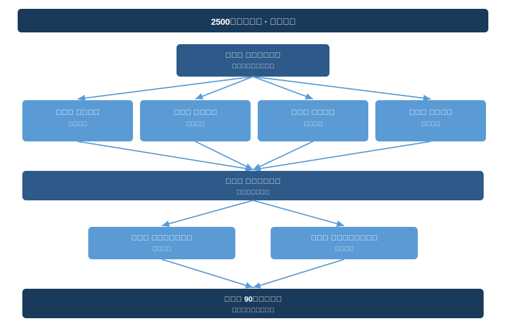

# 前言

> 上古之人，其知道者，法于阴阳，和于术数，食饮有节，起居有常，不妄作劳，故能形与神俱，而尽终其天年，度百岁乃去。
>
> — 《黄帝内经·素问·上古天真论》

两千五百年前，一位帝王向他的医官提了一个问题：

> **「上古之人，春秋皆度百岁，而动作不衰；今时之人，年半百而动作皆衰者，时世异耶？人将失之耶？」**
>
> — 《素问·上古天真论》

古人能活过百岁而身体不衰，为什么现在的人五十岁就开始走下坡路？是时代变了，还是人自己搞砸了？

这是《黄帝内经》的第一个问题，也是整部书的起点。岐伯的回答开门见山：不是时代的问题，是人的问题。古人"法于阴阳，和于术数，食饮有节，起居有常，不妄作劳"，所以能"尽终其天年，度百岁乃去"。今人"以酒为浆，以妄为常，醉以入房"，以过度消耗为日常，提前透支了先天的生命资本。

《内经》认为人的自然寿命（天年）是多少？素问·上古天真论给出了一个数字框架。它把人的生命力按阶段描述：女子以七年为一周期，男子以八年为一周期。女七七（49岁）天癸竭，男八八（64岁）天癸竭——"天癸"是先天赋予的生殖精气，它的消退标志着身体从成长转为衰退。但天癸竭不等于寿命终点，它只是身体开始"走下坡"的转折点。《内经》认为，真正"尽终天年"的人可以"度百岁乃去"，甚至更长。后世注家（如唐代王冰）将"天年"解读为一百二十岁上下。

一百二十年，是生物学给人体设定的上限。现代端粒（telomere）研究和 Hayflick 极限理论也指向类似的数字：人类细胞的分裂次数上限大约支撑 120 年的生命周期。两千五百年前的经验观察，和 21 世纪的细胞生物学，在同一个数字上交汇。

但《内经》真正关心的不是你能不能活到 120 岁。它关心的是：为什么大多数人远远达不到这个上限？答案是四个字：**后天消耗**。饮食无节、作息紊乱、情绪内耗、运动过量或不足、纵欲无度——这些后天的行为模式，像漏水的管道一样持续流失先天的生命储备。你不是"老了"，你是"漏了"。

养生的本质，不是往身体里添加什么神奇的东西，而是堵住那些不必要的消耗。这本书做的就是这件事：帮你找到漏点，逐一修复。

这不是一本"中医对抗西医"的论战书。我们无意证明古人比现代人聪明，也无意用科学为传统背书。我们做的事情更朴素：把一个古老的健康框架和一个现代的健康框架摆在同一张桌子上，看看它们在哪里握手、在哪里争论、在哪里互相补充。然后提取出真正能让你生活变好的东西。

不过先要澄清一件事。这不是"中医对抗西医"的论战书。我们无意证明古人比现代人聪明，也无意用科学为传统背书。我们做的事情更朴素：把一个古老的健康框架和一个现代的健康框架摆在同一张桌子上，看看它们在哪里握手、在哪里争论、在哪里互相补充。然后提取出真正能让你生活变好的东西。

---

## 本书特点

**一座桥，不是一本翻译。**

市面上的《黄帝内经》读本大致分两类：学术译注和养生鸡汤。前者严谨但门槛高，你需要古汉语功底和中医理论基础才能入门。后者好读但失真，把"阴阳"说成万能灵药，把"气"包装成超自然能量。本书走第三条路：以原典为锚点，以现代科学为验证工具，把养生智慧转化为 21 世纪的生活方式指南。你不需要任何中医基础，也不需要相信"气"是一种神秘力量。你只需要对"怎么活得更好"保持好奇。

**每一条原则都接受现代研究检验。**

《黄帝内经》说"子午流注"——人体脏腑功能随时辰盛衰交替。2017 年诺贝尔生理学或医学奖颁给了昼夜节律（circadian rhythm）的分子机制研究，证实人体几乎每个细胞都内置一座 24 小时生物钟。它说"怒伤肝"。精神神经免疫学（psychoneuroimmunology, PNI）揭示了情绪如何通过下丘脑-垂体-肾上腺轴（HPA axis）触发皮质醇级联反应，长期愤怒状态确实与肝脏炎症指标升高相关。它说"五味调和"，酸苦甘辛咸不可偏废。肠道微生物组（gut microbiome）研究证实，饮食多样性是肠道菌群健康的首要预测指标。

本书不做"老祖宗说的都对"的信仰式宣传。每一条内经原则，我们诚实标注：已被现代研究证实（✓）、仍是合理假说（?）、或已被证伪（✗）。

**每章给你可以立即执行的日常方案。**

理解原理固然重要，但本书的终极目标是改变你的日常习惯。每章结尾提供两个实用工具：一份"今日行动"清单（三件你读完就能做的事）和一个"21 天微实验"（用最小成本验证一条养生原则是否对你有效）。

**尊重原典，拒绝神秘化。**

《黄帝内经》是一部严肃的医学著作，不是玄学手册。本书不会告诉你"打通任督二脉可以延年益寿"。但会告诉你，现代物理治疗中的脊柱深层稳定肌激活训练，与古人所说的"通督脉"在解剖学上高度重叠，然后给你看证据。古人的洞察力值得尊重，你的判断力同样值得尊重。

---

## 你将获得什么

| 维度 | 你将获得 | 对应章节 |
|------|---------|---------|
| **知识** | 理解昼夜节律、情绪-免疫通路、食物性味与肠道菌群的关系，掌握一套比希波克拉底更早的预防医学框架 | Ch 01–08 |
| **实践** | 一套可个性化定制的晨间流程、五味饮食原则、柔性运动方案、情绪调节工具箱和睡眠优化协议 | Ch 02–11 |
| **认知升级** | 从"生病了找医生"转向"我是自己健康的第一责任人"；从追逐单一健康潮流转向构建个人的养生操作系统 | Ch 06–11 |

知识让你理解原理，实践让你体验变化，认知升级让你不再依赖任何单一的健康权威（包括这本书）。

最终目标不是让你成为《黄帝内经》的信徒，而是让你成为自己身体的合格管理者。你能自主判断什么适合自己，能辨别一条健康建议的证据强度，能在海量信息中保持清醒。

这才是两千五百年前那场对话真正想传递的东西：健康不是一个终点，而是一种持续的、主动的经营。

---

## 章节总览

| 章 | 标题 | 核心命题 |
|----|------|---------|
| 01 | 最古老的健康对话 | 黄帝与岐伯的对话为什么在两千五百年后仍然重要 |
| 02 | 顺时而活 | 子午流注与现代昼夜节律科学的深层对应 |
| 03 | 食养之道 | 五味理论、食疗原则，以及肠道菌群的现代印证 |
| 04 | 情志与身体 | 七情如何通过神经-内分泌-免疫网络影响健康 |
| 05 | 动如流水 | 内经运动哲学：不是更多、更猛，而是更柔、更久 |
| 06 | 治未病 | "上医治未病"——预防医学的东方源头 |
| 07 | 阴阳之道 | 阴阳不是玄学，而是动态平衡的生存策略 |
| 08 | 睡眠大药 | 内经的睡眠观与现代睡眠科学的交汇 |
| 09 | 看不见的网络 | 经络、筋膜与针灸——你身体比你想象的更聪明 |
| 10 | 呼吸与姿态 | 行走坐卧皆养生——每天两万次呼吸的正确方式 |
| 11 | 当AI遇上中医 | 用现代工具激活古老智慧，向AI问对健康问题 |

全书结构遵循一条清晰的逻辑链。先认识内经（Ch 01），然后逐一拆解四大生活维度：时间（Ch 02）、饮食（Ch 03）、情绪（Ch 04）、运动（Ch 05）。这四个维度汇聚到预防医学的总纲（Ch 06），再由两个深层系统（平衡原则 Ch 07、睡眠修复 Ch 08）提供底层支撑。Ch 09 揭示身体的连接网络（经络与筋膜）。Ch 10 回归最基础的日常动作（呼吸与姿态）。Ch 11 展望未来，教你用 AI 工具把整本书的原则变成个性化的养生方案。

Ch 02 到 Ch 05 之间没有严格的先后依赖，它们是并列的四大生活维度，可以根据兴趣调整顺序。但 Ch 06（治未病）建议在四大维度之后再读，因为它是对前四章的综合提炼。

---

## 如何阅读

### 目标读者

这本书写给三类人。

**对健康有主动意识的人。** 你可能已经在追踪睡眠数据、尝试过间歇性断食（intermittent fasting）、读过几本健康类畅销书。你不缺信息，你缺的是一个把散落的健康知识串成体系的框架。

**对东方智慧好奇但不想被忽悠的人。** 你对中医感兴趣，但受不了"上火""排毒""打通经络"这类含混说法。每次有人用"祖传秘方"结束讨论，你都想追问一句"证据呢？"。本书用数据回答这个问题，不用信仰。有的概念经得起检验，有的经不起，我们如实告诉你。

**想重新理解自己身体的人。** 你可能正经历亚健康（sub-health）状态：睡不好、容易累、情绪波动大、肠胃隐隐不适，但体检报告一切正常。西医告诉你"没问题"，可你知道有问题。内经的养生框架专门处理这片现代医学的灰色地带，那些指标正常但体感异常的状态。

### 推荐路径

你不必从第一页读到最后一页。根据目标选择路径。

**路径 A · 快速起步（3 章，约 2 小时）**

Ch 01 → Ch 06 → Ch 09。先了解内经基本框架，理解"治未病"的核心理念，再进入身体的连接网络（经络与筋膜）。执行过程中遇到问题，再回头查看对应的专题章节。先行动，再理解。

**路径 B · 科学探索（4 章，约 3.5 小时）**

Ch 01 → Ch 02 → Ch 04 → Ch 08。覆盖三大现代研究前沿：昼夜节律生物学（为什么你在下午三点总犯困，如何利用这个规律而非对抗它）、精神神经免疫学（情绪如何通过生化通路影响免疫系统）、睡眠神经科学（深度睡眠期间大脑的淋巴清洗系统如何运作）。你会看到两千五百年前的观察与 21 世纪实验室数据之间的深层对应，也会看到它们分歧的地方。

**路径 C · 完整旅程（11 章，约 8 小时）**

Ch 01 → Ch 02 → Ch 03 → … → Ch 11。适合想系统重建健康认知框架的读者。按顺序阅读，每一章的实践建议叠加在前一章基础上，逐步形成完整的养生方案。

### 跳读指南

不是每个人都需要从零开始。根据你的背景，可以这样节省时间：

- 熟悉昼夜节律科学（读过 Matthew Walker 的 *Why We Sleep*）→ Ch 02 直接跳到"今日行动"部分
- 已有稳定的冥想或情绪管理练习 → Ch 04 略读，重点看"七情与 HPA 轴"一节
- 对中医有基础了解 → Ch 01 快速浏览，从 Ch 02 开始精读
- 健身爱好者但对"柔性运动"持怀疑态度 → Ch 05 可能会改变你的看法
- 正经历失眠或睡眠质量问题 → 优先阅读 Ch 08

---

## 本书约定

**原典引用。** 引用《黄帝内经》原文时，采用"文言原文 + 现代中文释义"的双层格式。英文版同步提供 Classical Chinese + English translation。所有引用标注出处篇章（如"素问·上古天真论"），方便查阅原典。

**术语处理。** 关键中医术语首次出现时标注拼音和英文对照，例如：气、阴阳。后续直接使用中文。本书不发明新术语，使用已有的学术共识译法。

**SVG 图表。** 复杂的养生系统关系（五行与脏腑的对应、昼夜节律与经络流注的映射、情绪-神经-免疫的反馈回路）以 SVG 图表呈现，中英文各一份。这些图表不是装饰，是帮助你把文字描述转化为空间结构理解的工具。

**双语设计。** 本书同时提供中文版和英文版。两个版本独立写作，各自保持母语表达的自然流畅。中文版面向华语读者，在文化语境和表达习惯上更贴近中文母语者。英文版面向国际读者，特别是对东方养生智慧感兴趣的西方受众。两个版本共享同一套证据基础和章节结构，但叙事风格和文化参照各有侧重。

**证据标注。** 引用现代科学研究时，标注研究类型和证据等级：

- **Meta 分析 / 系统综述**：最高等级，综合多项研究结论
- **RCT（随机对照试验）**：金标准实验设计
- **队列研究 / 横断面研究**：观察性证据，提示相关性
- **动物实验 / 体外实验**：初步证据，不可直接外推至人体

我们不会把一项小鼠实验等同于大规模临床试验。你有权知道证据的强度。

**实践标记。** 每章的实践建议按难度分三级：

- ⚡ 零成本即刻行动（如调整起床时间、改变进食顺序）
- 🔄 需要 1-2 周养成的习惯（如建立晨间流程、学习基础太极动作）
- 🎯 需要持续练习的深层技能（如情绪觉察、直觉饮食）

从 ⚡ 级开始，积累信心后逐步升级。不要试图同时改变所有习惯——这恰恰是内经最核心的教导之一："不妄作劳"，不要做超出身体承受能力的事。

**免责声明。** 本书提供健康生活方式建议，不构成医疗诊断或治疗方案。如果你有已确诊的疾病或正在接受治疗，请在尝试任何新方案前咨询医生。养生和治病是两件事——内经自己也是这么说的。

---

> 是故圣人不治已病治未病，不治已乱治未乱。
> 夫病已成而后药之，乱已成而后治之，譬犹渴而穿井，斗而铸锥，不亦晚乎。
>
> — 《黄帝内经·素问·四气调神大论》

两千五百年过去了。人类发明了抗生素、CT 扫描和基因编辑。我们可以在纳米尺度上操纵 DNA，用 AI 在几小时内预测蛋白质结构。

但那个最根本的问题（怎样才能活得好、活得久）从未过时。那个最古老的答案（顺应自然节律、调和饮食情志、动静结合、防患未然）也从未失效。

翻开下一页，从那场最古老的健康对话开始。
