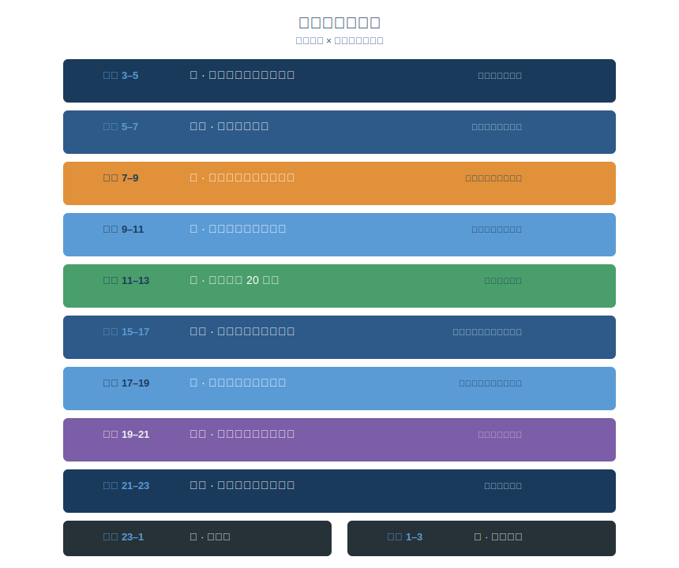

# 第二章：顺时而活

> 春三月，此谓发陈。天地俱生，万物以荣。夜卧早起，广步于庭……此春气之应，养生之道也。
>
> — 《黄帝内经·素问·四气调神大论》

## 2.1 发现时钟的人

2017年10月2日，瑞典卡罗林斯卡学院宣布，杰弗里·霍尔（Jeffrey Hall）、迈克尔·罗斯巴什（Michael Rosbash）和迈克尔·扬（Michael Young）三人获得当年的诺贝尔生理学或医学奖。获奖理由只有一句话：发现了控制昼夜节律（circadian rhythm）的分子机制。

霍尔在布兰迪斯大学的实验室里研究了三十年果蝇。他找到的东西很简单：果蝇体内有一个叫 *period* 的基因，编码一种蛋白质，白天降解，夜间积累，每二十四小时完成一次循环。这套机制从果蝇到人类高度保守——我们每一个细胞里，都藏着同样一座时钟。

十年前，另一个消息同样震动了医学界。2007年，国际癌症研究机构（International Agency for Research on Cancer, IARC）审查了来自丹麦、瑞典等国的大规模护士队列研究，宣布将"涉及昼夜节律紊乱的轮班工作"列为2A类致癌因素——"对人类很可能致癌"。数据显示，连续夜班超过三十年的护士，乳腺癌风险接近翻倍。丹麦随后成为全球第一个向因长期夜班患乳腺癌的女性提供国家赔偿的国家。

一边是诺贝尔奖告诉我们：每个细胞都有时钟。另一边是流行病学数据警告：违反这座时钟的代价可能是癌症。

两千五百年前，《黄帝内经》用八个字说了同一件事：**「食饮有节，起居有常。」**（《素问·上古天真论》）

你做了什么很重要，你什么时候做更重要。人体不是一台随时可以运转的机器。它是一座与天地同频的时钟——你可以喂它最好的燃料，但如果在错误的时间点火，引擎照样报废。

---

## 2.2 子午流注：你体内的十二小时时钟

黄帝内经描述了一个精妙的系统：气在二十四小时内依次流经十二条经脉，每条经脉对应一个脏腑，每个脏腑有两个小时的"当值时间"。这就是**子午流注**（zǐ wǔ liú zhù），字面意思是"子时和午时的气血流转"，实际描述的是一个完整的昼夜循环。

这不是玄学。现代时间生物学（chronobiology）发现，几乎每个器官都有自己的分子时钟——一组基因按24小时周期规律性地开启和关闭。肝脏的代谢峰值、胃的酶分泌高峰、肾上腺的皮质醇节律，都精确地跟随昼夜节律运转。这些分子时钟像交响乐团的乐手，各自演奏自己的声部，但必须听从同一个指挥——大脑视交叉上核（suprachiasmatic nucleus, SCN）发出的光信号。

把古今智慧并排对照：

| 时辰 | 脏腑 | 《内经》养生要义 | 现代科学验证 |
|------|------|----------------|------------|
| 寅时 3-5 | 肺 | 深呼吸，身体开始苏醒 | 皮质醇开始上升，气道扩张 |
| 卯时 5-7 | 大肠 | 最佳排便时间 | 结肠蠕动达到峰值 |
| 辰时 7-9 | 胃 | 吃一天中最丰盛的一餐 | 消化酶分泌达到高峰 |
| 巳时 9-11 | 脾 | 运化水谷，专注工作 | 胰岛素敏感性最高 |
| 午时 11-13 | 心 | 午间小憩 | 血压自然下降，午睡有益心血管 |
| 未时 13-15 | 小肠 | 吸收营养 | 餐后吸收活跃期 |
| 申时 15-17 | 膀胱 | 多饮水，最适合运动 | 体温峰值，体能表现最佳 |
| 酉时 17-19 | 肾 | 藏精纳气，晚餐宜轻 | 肌肉力量和柔韧性达峰 |
| 戌时 19-21 | 心包 | 放松身心，与人交流 | 褪黑素开始分泌 |
| 亥时 21-23 | 三焦 | 安静收心，准备入睡 | 核心体温下降 |
| 子时 23-1 | 胆 | 务必进入深睡眠 | 生长激素分泌达到峰值 |
| 丑时 1-3 | 肝 | 肝血归经，排毒修复 | 肝脏代谢活动峰值，解毒功能最活跃 |

想想看，现代都市人的常见作息是什么样的？晚上十一点还在健身房——正是三焦收敛、身体准备入睡的时间。剧烈运动让核心体温升高、皮质醇飙升，直接对抗了入睡信号。凌晨两点刷手机——正是肝经当令、肝脏排毒修复的黄金时段。蓝光抑制褪黑素分泌，肝脏在本该沉睡的时间被迫加班。

问题往往不是做得不够多，而是每一个好习惯都被安排在了错误的时间槽里。

---

## 2.3 四时养生：活在四季的节拍里

子午流注管一天，四时养生管一年。《素问·四气调神大论》用四段精炼的文字，为每个季节开出了完全不同的生活处方。

**春（发陈）**：「夜卧早起，广步于庭，被发缓形，以使志生。」晚睡早起，散开头发，穿宽松衣物，在庭院中散步。让身体像万物一样舒展、生发。春天的关键词是"生"——生长、生发、生机。压抑这股力量，内经警告"伤肝"。

**夏（蕃秀）**：「夜卧早起，无厌于日。使志无怒，使华英成秀。」拥抱阳光，不要因为热就躲起来。保持情志舒畅，不要动怒。夏天的关键词是"长"——生长达到极致。违背它，"伤心"。

**秋（容平）**：「早卧早起，与鸡俱兴。使志安宁……收敛神气。」早睡早起，和鸡同步。情绪开始收敛，不再外放。秋天的关键词是"收"——从扩张到收缩的转折。违背它，"伤肺"。

**冬（闭藏）**：「早卧晚起，必待日光。使志若伏若匿……去寒就温。」早睡晚起，等太阳出来再起床。减少消耗，保存能量，远寒就温。冬天的关键词是"藏"——把一年积累的精华封存起来。违背它，"伤肾"。

这不是诗意的比喻，是生存策略。现代研究从多个维度证实了季节对人体的影响：

- **免疫系统**：冬季免疫功能下降，流感和上呼吸道感染高发。内经要求冬天"闭藏"、避免消耗，正是应对之道。
- **维生素 D**：冬季日照不足导致维生素 D 合成减少，与骨密度下降、情绪低落直接相关。
- **季节性情感障碍（Seasonal Affective Disorder, SAD）**：高纬度地区冬季抑郁发病率显著上升，光照疗法是一线治疗手段。
- **死亡率**：北半球心血管死亡在冬季达到峰值，夏季最低。

> 逆之则灾害生，从之则苛疾不起。

违背季节节律，疾病就来。顺应它，重病不生。两千五百年后依然成立。

---

## 2.4 分子时钟：从果蝇到你的每一个细胞

回到霍尔发现的那个 *period* 基因。它的工作原理并不复杂：*period* 基因编码 PER 蛋白，PER 蛋白在夜间积累到一定浓度后，会反过来抑制自身基因的转录。等蛋白质降解到足够低，基因重新启动表达。如此往复，周期恰好是24小时。

后续研究揭示了更多参与其中的基因——*timeless*、*cryptochrome*、*clock*——它们共同构成了一个精密的分子振荡器（molecular oscillator）。这座时钟不只存在于大脑。身体的每一个细胞都有它。肝细胞有肝脏时钟，心肌细胞有心脏时钟，肠壁细胞有肠道时钟。

打乱这个时钟会怎样？动物实验给出了明确答案。让小鼠持续暴露在不规则光照下，它们会患上肥胖、糖尿病、免疫功能障碍，甚至肿瘤生长加速。不需要改变饮食，不需要减少运动——仅仅是扰乱了光暗周期，健康就全面崩溃。

人类数据同样严峻。长期上夜班的人群患二型糖尿病的风险增加40%，心血管疾病风险增加30%，女性乳腺癌风险增加50%以上。

黄帝内经早就指出了这条规律的核心：

> 「阳气者，一日而主外。平旦人气生，日中而阳气隆，日西而阳气已虚。」
>
> — 《素问·生气通天论》

阳气在日出时升起，正午达到顶峰，日落后衰退。这和皮质醇（cortisol）曲线几乎完全吻合——皮质醇在清晨6-8点急剧上升（"平旦人气生"），中午达到高值（"日中而阳气隆"），夜间降至低谷（"日西而阳气已虚"）。

两千五百年前的中国医者没有质谱仪，却画对了那条曲线。

---

## 2.5 何时吃，比吃什么更重要

萨钦·潘达（Satchin Panda）是索尔克生物研究所的昼夜节律专家，《昼夜节律密码》（*The Circadian Code*）一书的作者。他做了一个颠覆常识的实验。

两组小鼠吃完全相同的高脂饮食——相同的卡路里，相同的脂肪比例。一组随时可以吃，另一组只在8-10小时窗口内进食。结果？限时进食的小鼠体重正常、代谢健康。随意进食的小鼠严重肥胖，出现脂肪肝和胰岛素抵抗。

卡路里完全一样。营养成分完全一样。区别只在于——什么时候吃。

这就是**时间限制性进食**（Time-Restricted Eating, TRE）的科学基础。消化系统不是24小时营业的餐厅，它有开门时间和打烊时间。胃酸分泌、胆汁释放、胰岛素响应——这些功能在白天活跃，在夜间关闭。违反营业时间强行进食，后果是代谢紊乱、血糖失控、脂肪堆积。

黄帝内经在两千五百年前就给出了同样的处方。子午流注告诉我们，辰时（7-9点）胃经当令，是消化能力最强的时段。中国民间谚语"早吃好，午吃饱，晚吃少"并非凭空想象——它是千百年来身体经验的朴素总结。

2022年发表在 *JAMA Internal Medicine* 上的一项大型临床试验进一步证实：将每日热量摄入集中在早间窗口（早8点到下午2点），受试者的胰岛素抵抗、血压和氧化应激指标显著改善——即使总热量摄入相同。

早上的身体准备好了消化，深夜的身体准备好了修复。在修复时间塞进消化任务，就像在高速公路施工时强行通车——工程完不成，通行也出事故。

---

## 2.6 日常实践：你的昼夜节律生活表

理论到此为止。下面是一张你明天就可以开始执行的作息表——融合了黄帝内经的智慧和现代昼夜节律科学。不需要购买任何设备，不需要服用任何补剂。你只需要重新安排已经在做的事情的顺序。

**三条核心原则：**

**第一，管理光线。** 早晨第一件事是晒太阳——至少10分钟无滤镜的自然光，不是隔着玻璃窗。这会向视交叉上核发送"白天开始"的信号，启动皮质醇的正常上升曲线。晚上9点后只用暖色灯光，远离所有高亮度屏幕。光是体内时钟最强大的校准器，专业术语叫 *Zeitgeber*（德语，意为"时间给予者"）。

**第二，设定进食窗口。** 把一天的食物集中在10小时内摄入（比如早7点到晚5点），给消化系统留出14小时的完整休息。在这个窗口内，遵循"早丰午饱晚轻"的原则。窗口外不吃任何含热量的食物——黑咖啡、水和无糖茶除外。

**第三，锚定睡眠。** 每天同一时间入睡和起床，包括周末。"周末补觉"是一个被广泛传播的误解——它制造的"社交时差"（social jet lag）需要整整一周才能修复。与其周六睡到中午再愧疚，不如每天固定在十点半关灯。规律性比时长更重要。

---

## 2.7 反思时刻：你的作息有多"顺时"？

在继续阅读之前，用以下清单诚实地给自己打个分。每符合一条得一分：

- [ ] 我每天在固定时间起床（误差不超过30分钟，包括周末）
- [ ] 我起床后30分钟内会接触自然光（不是隔着窗户）
- [ ] 我的早餐是一天中最丰盛或最有营养的一餐
- [ ] 我在下午5点之前完成最后一次正餐
- [ ] 我在下午3-5点之间安排主要运动
- [ ] 我在晚上9点后停止使用电子屏幕（或全面开启夜间模式）
- [ ] 我每天在同一时间入睡（误差不超过30分钟）

**0-2分**：你的生物钟正在向你抗议。不必恐慌——从任意一条开始改变，坚持两周，你会感受到差异。
**3-4分**：中间地带。你已经有了基础，找出最薄弱的环节优先攻克。
**5-7分**：你已经在顺时而活。保持节奏，留意季节变化带来的微调需求——春天可以晚睡一点，冬天应该早睡晚起。

不要试图一夜之间从0分跳到7分。选一条最容易执行的，把它变成习惯，然后再加第二条。

---

## 今日行动

三件你读完这章就能做的事：

⚡ 今晚设一个22:30的"关屏提醒"闹钟，提醒自己开始睡前准备。

⚡ 明天起床后30分钟内走到窗外晒10分钟太阳（不隔玻璃）。

🔄 从明天开始，把早餐升级为一天中最丰盛的一餐，连续做7天观察精力变化。

---

## 21天微实验

**"进食窗口实验"**——连续21天将所有进食集中在10小时内（如 7:00-17:00）。记录每天的精力水平（1-5分）和睡眠质量（1-5分）。不改变食物内容，只改变进食时间。21天后对比前后数据。

---

## 证据强度标注

本章涉及的内经原则与现代科学验证对照：

| 内经原则 | 证据等级 | 说明 |
|---------|---------|------|
| 子午流注（脏腑有时辰节律） | ✓ 已证实 | 2017诺贝尔奖证实细胞分子时钟；器官功能的昼夜波动已被广泛记录 |
| 四时养生（季节调整作息） | ✓ 已证实 | 季节性免疫变化、SAD、死亡率季节波动均有大量流行病学证据 |
| 进食时间影响代谢 | ✓ 已证实 | Satchin Panda 的 TRE 研究 + 2022 *JAMA Internal Medicine* 临床试验 |
| 阳气日出而生、日落而衰 | ✓ 已证实 | 皮质醇昼夜曲线与"阳气"描述高度吻合 |
| 子时入睡最关键 | ? 合理假说 | 生长激素确实在前半夜峰值分泌，但"23:00"这个精确时间点因个体差异而异 |

---

## 2.8 总结：校准你的时钟

这一章只讲了一个道理：**你不是在与时间赛跑，而是要与时间同行。**

黄帝内经在两千五百年前就发现，人体不是孤立系统——它是天地运转的一部分。日升则阳气生，日落则阳气收。春天要生发，冬天要闭藏。辰时要进食，子时要深眠。

2017年的诺贝尔奖证明了这一点。潘达的实验证明了这一点。丹麦护士的癌症数据证明了这一点。现代人最大的健康悲剧不是吃得不够好或运动不够多——而是用人造光和电子屏幕，摧毁了几十亿年进化形成的昼夜节律。

修复它不需要任何药物、补剂或昂贵的设备。四件事就够了：

- 早晨晒太阳
- 该吃饭时吃饭
- 该睡觉时睡觉
- 随季节调整节奏

就是这么简单。也就是这么难。

你已经校准了**何时生活**的节拍。下一章，我们进入**吃什么**的智慧。《黄帝内经》的食疗体系不谈卡路里，不列食谱，却精确描述了五种味道如何调控五个脏腑系统。酸、苦、甘、辛、咸——每一种味道都是一把钥匙，打开一扇通往健康的门。

---

## 参考文献

1. **《黄帝内经·素问》** 第一篇《上古天真论》、第二篇《四气调神大论》、第三篇《生气通天论》 — 本章核心经典来源。
2. **Nobel Prize Committee.** (2017). "The Nobel Prize in Physiology or Medicine 2017: Jeffrey C. Hall, Michael Rosbash and Michael W. Young." *nobelprize.org*. — 昼夜节律分子机制获诺贝尔奖。
3. **Panda, S.** (2018). *The Circadian Code: Lose Weight, Supercharge Your Energy, and Transform Your Health from Morning to Midnight.* Rodale Books. — 时间限制性进食的科学基础与实践指南。
4. **Jamshed, H., et al.** (2022). "Early Time-Restricted Eating for the Prevention of Diabetes." *JAMA Internal Medicine*, 182(9), 953–963. DOI: 10.1001/jamainternmed.2022.3050 — 早间进食窗口改善胰岛素敏感性和代谢指标的临床试验。
5. **Scheer, F. A., et al.** (2009). "Adverse Metabolic and Cardiovascular Consequences of Circadian Misalignment." *Proceedings of the National Academy of Sciences*, 106(11), 4453-4458. DOI: 10.1073/pnas.0808180106 — 昼夜节律错位导致代谢和心血管损害。
6. **Refinetti, R.** (2016). *Circadian Physiology* (3rd ed.). CRC Press. — 昼夜节律生理学综合教材。
7. **IARC.** (2010). "Painting, Firefighting, and Shiftwork." *IARC Monographs on the Evaluation of Carcinogenic Risks to Humans*, Vol. 98. — 将轮班工作列为2A类致癌因素的评估报告。
8. **Vetter, C., et al.** (2018). "Night Shift Work, Genetic Risk, and Type 2 Diabetes in the UK Biobank." *Diabetes Care*, 41(4), 762-769. DOI: 10.2337/dc17-1933 — 夜班工作与二型糖尿病风险的大规模队列研究。
