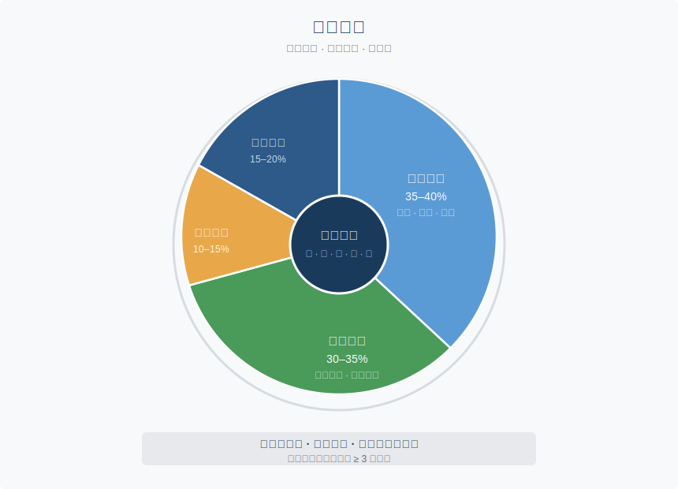

# 第三章 · 食养之道

> 五谷为养，五果为助，五畜为益，五菜为充，气味合而服之，以补精益气。
>
> — 《黄帝内经·素问·藏气法时论》

## 3.1 一句话里的营养学

2019年4月，《柳叶刀》发布了一项覆盖195个国家的饮食风险研究。结论让营养学界震动：全球每年约1100万人死于不良饮食，超过了吸烟造成的死亡。最致命的风险不是糖，不是脂肪，是**饮食结构的失衡**：全谷物吃得太少，钠摄入太高，水果不够。

这篇论文发表的同一年，社交媒体上的饮食大战正打得火热。生酮派说碳水是毒药。纯素派说肉类毁灭地球。间歇性断食派说关键不在吃什么而在几点吃。每一派都有论文，都有成功案例，都认定其他人在犯错。普通人坐在餐厅里，对着菜单不知道该信谁。

两千五百年前，岐伯对黄帝说了一句话：五谷为养，五果为助，五畜为益，五菜为充。

四类食物，各有分工。谷物是根基，水果是帮手，肉类做补充，蔬菜来填充。没有哪一类被禁止，也没有哪一类被神化。这个框架的核心逻辑是**平衡**，而非排除。

Michael Pollan 在《为食物辩护》（*In Defense of Food*）里用七个英文单词概括了他的全部结论："Eat food. Not too much. Mostly plants." 他花了一整本书才走到这个终点。岐伯一句话就讲完了，而且更精确：他没有排除肉类，只是把它放在"辅助"的位置上。

---

## 3.2 五味系统：最早的功能性营养学

"五谷为养"回答了吃什么。五味系统回答的是另一个问题：吃了之后，食物去了哪里？

《素问·宣明五气篇》的说法直截了当：酸入肝，苦入心，甘入脾，辛入肺，咸入肾。每种味道不只是舌尖上的感觉，而是一条通向特定脏腑的通路。

| 味 | 归经 | 效用 | 现代对照 | 常见食物 |
|----|------|------|---------|---------|
| 酸 | 肝 | 收敛、固涩 | 多酚类抗氧化物 | 醋、柑橘、乌梅、山楂 |
| 苦 | 心 | 清泄、燥湿 | 生物碱、抗炎化合物 | 绿茶、苦瓜、莲子心、黑巧克力 |
| 甘 | 脾 | 补益、缓和 | 复合碳水化合物、多糖 | 大枣、蜂蜜、红薯、粳米 |
| 辛 | 肺 | 发散、行气 | 挥发油、辣椒素 | 生姜、大蒜、葱白、花椒 |
| 咸 | 肾 | 软坚、润下 | 矿物质、电解质 | 海带、味噌、酱油、虾皮 |

关键不在某一味的单独摄入，而在**五味调和**。内经反复警告：任何一味过量，都会反噬对应的脏腑。嗜甜伤脾，过咸伤肾，过酸伤筋，过苦伤骨，过辛伤皮毛。

2019年那篇《柳叶刀》研究从另一端验证了这个原则。全球最大的饮食风险因素不是某种营养素的绝对过量，而是结构性失衡。这和五味失调的逻辑完全同构。

---

## 3.3 食物的温度：不只是冷热

你大概听老人说过"螃蟹性寒""羊肉性热"。他们说的不是物理温度，而是内经体系中的核心概念——**四气**：寒、热、温、凉，外加一个中间态"平"。

**寒凉食物**（清热泻火）：西瓜、绿豆、苦瓜、黄瓜、绿茶、梨。适合体内有热象的人，比如炎症、口干、便秘。

**温热食物**（温阳散寒）：生姜、肉桂、羊肉、韭菜、桂圆、辣椒。适合体寒的人，手脚冰凉、消化迟缓、畏寒怕冷。

**平性食物**（平和不偏）：大米、土豆、猪肉、山药、胡萝卜。大多数人都能吃，四季皆宜。

这套分类怎么用？冬天，你手脚冰凉、面色苍白、胃口差。中医诊断"阳虚"。内经的第一反应不是开药，而是调饮食：早餐来碗生姜红枣粥，午餐吃点羊肉，晚上用肉桂煮杯热饮。你在系统性地向身体输入温热属性的食物。

反过来，口干、便秘、脸上冒痘？内经判断"内热"，建议加入绿豆汤、凉拌黄瓜、菊花茶，同时减少辛辣煎炸。

听起来像玄学？换成现代语言看看。

"寒凉"食物往往富含**抗炎活性成分**。绿茶的 EGCG、西瓜的瓜氨酸、黄瓜的葫芦素，共同特征是下调炎症通路（NF-κB、COX-2）。"温热"食物多含**产热和促循环成分**：辣椒素激活 TRPV1 受体产热，肉桂醛改善外周血循环，姜辣素促进胃肠蠕动。

内经没有发明分子生物学。但通过数千年的临床积累，它建立了一套与现代抗炎饮食（anti-inflammatory diet）高度重叠的食物分类。哈佛公共卫生学院的"抗炎食物金字塔"把深色蔬菜、浆果、绿茶、姜黄放在顶端，红肉和精制糖放在底端。本质上，这是五味四气理论的当代翻版。

---

## 3.4 药食同源：食物是第一味药

内经的治疗层级很清晰：先调饮食，再用草药，最后动针石。药食同源这四个字，是中国食疗传统的基石。

这不是民间偏方。多种"药食同源"食材经过了现代循证检验。

**生姜**：六项系统综述确认其止呕效果，尤其对妊娠呕吐和术后恶心有效。机制是姜辣素拮抗 5-HT3 受体。

**姜黄**：活性成分姜黄素（curcumin）有超过120项随机对照试验（RCT）支持其抗炎效果。主要瓶颈是生物利用度低。传统搭配黑胡椒恰好解决了这个问题：胡椒碱可将姜黄素吸收率提升 2000%。古人不知道胡椒碱是什么，但他们知道姜黄要配胡椒。

**枸杞**：富含枸杞多糖（LBP）和玉米黄质。动物实验和小规模人体研究显示其对视网膜保护、免疫调节有积极作用，但大规模 RCT 仍然不足。

**大枣**：传统用于安神益气。2020年发表于《Nutrients》的荟萃分析发现枣提取物对焦虑和睡眠质量有中等程度改善，可能与其富含的环磷酸腺苷（cAMP）和皂苷有关。

**绿茶**：EGCG（表没食子儿茶素没食子酸酯，epigallocatechin gallate）是研究最深入的天然抗氧化物之一。大规模队列研究表明每日饮用绿茶与心血管事件风险降低 20-28% 相关。

注意证据强度的差异：生姜和绿茶有强证据，枸杞仍需更多验证。内经的"药食同源"框架是合理的，但具体食材的效力需要逐一检验。这正是现代循证医学（evidence-based medicine）的价值所在。

"药食同源"并非中国独有。古希腊的希波克拉底说过："让食物成为你的药物。"（Let food be thy medicine.）印度阿育吠陀医学（Ayurveda）同样将食物分为三种属性，以饮食调整作为首要治疗手段。三大古文明的医学传统独立得出同一个结论。这不是巧合，而是人类对健康本质的共同洞察。

---

## 3.5 脾胃与大脑的对话

内经有一个核心命题：脾胃者，仓廪之官，五味出焉。脾胃是全身气血化生的源头。你吃进去的一切，都要经过脾胃的"翻译"才能变成身体可用的能量。

两千五百年后，肠道微生物组（gut microbiome）研究给了这个命题一个全新注脚。

你的肠道里住着大约38万亿个微生物，数量与人体细胞相当。它们不是寄生者，是合作者：分解纤维、合成维生素 K 和 B12、训练免疫细胞、生产神经递质。你体内约70%的免疫细胞驻扎在肠道，95%的血清素在肠道合成。

迷走神经（vagus nerve）像一条高速公路，把肠道信号直送大脑。焦虑时你会胃痛。肠易激综合征（IBS）患者的抑郁发生率是普通人的三倍。肠和脑之间的通信，比我们过去以为的密切得多。

内经没有"微生物组"这个词，但它把脾胃放在健康体系的正中央。《素问·痹论》写道："饮食自倍，肠胃乃伤。"暴饮暴食，首先受伤的是肠胃。现代研究完全支持这一点：过度进食导致肠道通透性增加（"肠漏"），触发全身性低度炎症，这是代谢综合征、二型糖尿病和心血管疾病的共同上游通路。

内经的核心饮食建议是：多吃发酵食品（酱、醋、豆豉）、粗粮和应季蔬菜。这恰好也是现代肠道微生物多样性研究推荐的方案。2021年斯坦福大学发表于《Cell》的研究表明，高发酵食物饮食（每天六份以上）显著增加肠道微生物多样性，并降低19种炎症蛋白水平。中国传统饮食中无处不在的酱、醋、泡菜、豆腐乳，可能是维护肠道生态的无意之举。

---

## 3.6 日常实践：内经餐盘

理论够了。下面是你明天早上就能用的行动指南。

**季节饮食指南**

- **春（肝木旺）**：增甘减酸。多吃山药、大枣、菠菜，少吃醋渍食品。帮助肝气舒发而不过亢。
- **夏（心火旺）**：增酸减苦。酸味收敛心气，多吃绿豆、西瓜、黄瓜清暑热。
- **秋（肺金燥）**：增酸减辛。润燥为主，梨、银耳、蜂蜜、百合。少吃辛辣以免加重秋燥。
- **冬（肾水藏）**：增苦减咸。适量苦味坚阴（如莲子心），多吃黑色食物养肾（黑芝麻、黑豆、核桃）。

**三个立即可用的原则**

一、**早餐吃热的**。内经认为清晨阳气初升，脾胃需要温煦。一碗热粥比冰牛奶加冷麦片更合适。现代解释：温热食物减少胃肠平滑肌痉挛，促进消化酶活性。

二、**七分饱**。"饮食自倍，肠胃乃伤。"每顿吃到七成满即停。2023年发表于《Science》的灵长类限食研究表明，适度热量限制延长寿命并减少炎症标志物。你不需要精确计算卡路里，七分饱就是你的直觉计量器。

三、**安静地吃**。内经强调进食时心态平和。现代研究称之为"正念进食"（mindful eating）：不看手机，不谈工作，细嚼慢咽。一项2019年《American Journal of Clinical Nutrition》的 RCT 发现，正念进食组的 BMI 下降幅度是对照组的1.8倍。

---

## 3.7 反思时刻：你的五味审计

拿出一张纸，或打开手机备忘录。回忆过去三天你吃的所有东西，给每种食物标上它的主要味道。

然后问自己三个问题：

1. **哪种味道占了绝对主导？** 大多数现代人的答案是"甘"。精制糖、精制碳水和加工食品让甜味无处不在。
2. **哪种味道几乎缺席？** 通常是"苦"和"酸"。苦味蔬菜（芥蓝、苦瓜、芝麻菜）和发酵酸味食品（醋、泡菜、酸奶）往往是饮食中的盲区。
3. **你的饮食跟着季节变化了吗？** 还是一年四季都在吃同样的外卖套餐？

这不是考试，是一次自我觉察。

发现"甘"味独大？试着在下一餐加一碟醋拌凉菜和一杯不加糖的茶。常年不碰辛味？在汤里加几片姜。改变不需要剧烈。一周之内，让你的盘子上多出现两种原本缺席的味道就够了。

五味平衡不需要你变成营养学家。只需要在下次点餐时多问一句：这顿饭里，五种味道到齐了吗？

---

## 今日行动

三件读完这章就能做的事：

⚡ 下一餐饭时，有意识地辨别盘中食物包含几种味道（酸苦甘辛咸），看看缺了哪种。

⚡ 明天早餐换成温热食物（粥、汤、热燕麦），替代冷牛奶或冰咖啡。

🔄 本周去超市时，买一种你从不吃的"苦味"食物（苦瓜、绿茶、黑巧克力）加入饮食。

---

## 21 天微实验

**"七分饱实验"**：连续21天，在每餐吃到"还能再吃几口"时放下筷子。不计算卡路里，只凭体感。记录每天的饭后舒适度（1-5分）和下午精力（1-5分）。大多数人在第七天左右开始感受到明显变化。

---

## 证据强度标注

本章涉及的内经原则与现代科学验证对照：

| 内经原则 | 证据等级 | 说明 |
|---------|---------|------|
| 五味平衡（酸苦甘辛咸均衡） | ✓ 已证实 | Lancet GBD 研究证实饮食多样性是健康最强预测因子 |
| 药食同源（食疗优先于药疗） | ✓ 已证实 | 生姜、姜黄等多种食材的药理活性已有系统综述证据 |
| 食物寒热温凉 | ? 合理假说 | "凉性"食物与抗炎食物有高度重叠，但"寒热"分类缺乏统一生化定义 |
| 脾胃为后天之本 | ✓ 已证实 | 肠道微生物组研究证实消化系统是免疫、情绪、代谢的核心枢纽 |
| 饮食自倍，肠胃乃伤 | ✓ 已证实 | 过食导致代谢综合征、胃食管反流等，大量临床证据 |
| 七分饱 | ? 合理假说 | 热量限制延寿在动物模型中证据充分，人体长期 RCT 尚不完整 |

---

## 3.8 总结与过渡

第二章调整了时间节律，让身体回到与昼夜同步的轨道。这一章校准了饮食结构：用五味调和替代极端饮食法，用药食同源替代盲目进补，用脾胃为本替代热量崇拜。

两千五百年前的内经餐盘，核心只有一个字：**和**。不是禁忌，不是极端，不是某种超级食物的独裁，而是多样性的和谐。2024年《自然》对全球长寿蓝区（Blue Zones）饮食的总结与此一致：没有哪种单一食物是长寿的钥匙，但饮食多样性、适度热量和以植物为主的结构是所有蓝区的共同点。

不过内经告诉我们，影响健康最强大的力量，不是你几点睡，也不是你吃了什么，而是你的情绪。下一章，我们进入情志与身体的世界：怒伤肝，喜伤心，思伤脾，悲伤肺，恐伤肾。七情不是心理学家的专属话题。它们是写在你身体里的生理事件。

---

## 参考文献

1. **《黄帝内经·素问》** 第22篇（藏气法时论）、第23篇（宣明五气篇）、第43篇（痹论） — 本章核心原文出处。
2. **GBD 2017 Diet Collaborators.** (2019). "Health effects of dietary risks in 195 countries, 1990–2017." *The Lancet*, 393(10184), 1958-1972. DOI: 10.1016/S0140-6736(19)30041-8 — 覆盖195国的饮食风险研究，证实结构性失衡是最大风险。
3. **Daily, J.W. et al.** (2015). "Efficacy of ginger for alleviating the symptoms of primary dysmenorrhea." *Pain Medicine*, 16(12), 2243-2255. DOI: 10.1111/pme.12853 — 系统综述确认生姜止呕效果。
4. **Hewlings, S.J. & Kalman, D.S.** (2017). "Curcumin: A review of its effects on human health." *Foods*, 6(10), 92. DOI: 10.3390/foods6100092 — 姜黄素抗炎效果的综合评审。
5. **Shoba, G. et al.** (1998). "Influence of piperine on the pharmacokinetics of curcumin." *Planta Medica*, 64(4), 353-356. DOI: 10.1055/s-2006-957450 — 胡椒碱提升姜黄素吸收率2000%的经典研究。
6. **Sender, R., Fuchs, S., & Milo, R.** (2016). "Revised estimates for the number of human and bacteria cells in the body." *Cell*, 164(3), 337-340. DOI: 10.1016/j.cell.2016.01.013 — 人体微生物数量的修正估计。
7. **Pollan, Michael.** (2008). *In Defense of Food: An Eater's Manifesto*. Penguin. — "吃食物，不要太多，以植物为主"的经典表述。
8. **Mason, A.E. et al.** (2019). "Effects of a mindfulness-based intervention on mindful eating, sweets consumption, and fasting glucose levels." *American Journal of Clinical Nutrition*, 109(6), 1569-1578. DOI: 10.1093/ajcn/nqy325 — 正念进食 RCT 研究。
9. **Wastyk, H.C. et al.** (2021). "Gut-microbiota-targeted diets modulate human immune status." *Cell*, 184(16), 4137-4153. DOI: 10.1016/j.cell.2021.06.019 — 斯坦福大学高发酵食物饮食研究。
10. **Buettner, D. & Skemp, S.** (2016). "Blue Zones: Lessons from the world's longest lived." *American Journal of Lifestyle Medicine*, 10(5), 318-321. DOI: 10.1177/1559827616637066 — 全球长寿蓝区饮食总结。
