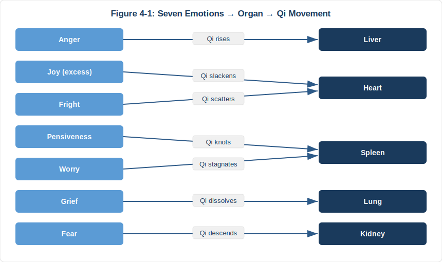

# Chapter 4 — The Emotional Body: Which Organ Are Your Emotions Destroying?

## 4.1 A Heart Deformed by Emotion

In 1990, Dr. Hikaru Sato at Hiroshima City Hospital encountered a cluster of unusual cardiac cases. Several elderly women arrived with crushing chest pain after experiencing bereavement, violent arguments, or sudden fright. Their ECGs mimicked acute myocardial infarction, yet coronary angiography showed perfectly clean arteries.

Echocardiography revealed the answer. The left ventricle had ballooned at its base while the apex contracted normally, producing a shape resembling a Japanese octopus trap — the *takotsubo*. Emotional shock had triggered a massive catecholamine surge that stunned the heart muscle directly.

In 2015, Templin et al. published the largest Takotsubo cardiomyopathy study to date in the *New England Journal of Medicine*, covering 1,750 patients across 26 countries. Emotional triggers accounted for roughly 28% of cases. Postmenopausal women were disproportionately affected. In-hospital mortality reached 4.1%. Pure emotion can deform a heart. Pure emotion can kill.

Twenty-five hundred years ago, the *Huangdi Neijing* (*Su Wen*, Chapter 5) stated:

> **「怒伤肝，喜伤心，思伤脾，忧伤肺，恐伤肾。」**
>
> "Anger injures the liver. Excess joy injures the heart. Overthinking injures the spleen. Grief injures the lungs. Fear injures the kidneys."

This is a complete psychosomatic medical map. Western medicine did not formally acknowledge that emotions affect physical health until the late twentieth century. The Neijing preceded that recognition by roughly 2,400 years.

---

## 4.2 The Seven Emotions Map: The Inner Landscape

The Neijing classifies fundamental human emotions into seven — the *qī qíng* (七情). Each maps to a specific organ, drives Qi in a characteristic direction, and produces observable physical symptoms.

| Emotion | Organ | Qi Movement | Physical Signs | Modern Validation |
|---------|-------|-------------|----------------|-------------------|
| **怒 Anger** | Liver 肝 | Qi rises | Headaches, hypertension, red eyes | Cortisol surge, cardiovascular stress |
| **喜 Joy** (excess) | Heart 心 | Qi slackens | Palpitations, insomnia, scattered focus | Takotsubo cardiomyopathy |
| **思 Pensiveness** | Spleen 脾 | Qi knots | Poor appetite, bloating, fatigue | Stress-related IBS, gut-brain axis disruption |
| **忧 Worry** | Spleen 脾 | Qi stagnates | Digestive issues, muscle tension | Anxiety–GI disorder comorbidity |
| **悲 Grief** | Lung 肺 | Qi dissolves | Shortness of breath, weak voice, crying | Post-bereavement immune suppression |
| **恐 Fear** | Kidney 肾 | Qi descends | Incontinence, lower back weakness | Chronic fear → adrenal fatigue |
| **惊 Fright** | Heart 心 | Qi scatters | Panic, confusion, heart palpitations | PTSD, acute stress response |

The *Su Wen*, Chapter 39, captures the entire Qi-movement model in a single sentence:

> **「怒则气上，喜则气缓，悲则气消，恐则气下，惊则气乱，思则气结。」**
>
> *Nù zé qì shàng, xǐ zé qì huǎn, bēi zé qì xiāo, kǒng zé qì xià, jīng zé qì luàn, sī zé qì jié.*
>
> "Anger makes Qi rise. Joy makes Qi slacken. Grief makes Qi dissolve. Fear makes Qi descend. Fright makes Qi scatter. Pensiveness makes Qi knot."

Chapter 39 also delivers a sweeping declaration:

> **「百病生于气也。」**
>
> "All diseases arise from Qi."

---

## 4.3 Fighting Fire with Fire: The Emotional Counter-System

The Neijing does not merely diagnose emotional illness. It prescribes treatment through a method called *yǐ qíng shèng qíng* (以情胜情): using one emotion to overcome another, based on the Five Elements controlling cycle.

**The Five-Element Emotional Therapies:**

- **Grief overcomes Anger** (Metal controls Wood) — Compassion dissolves rage
- **Fear overcomes excess Joy** (Water controls Fire) — Awe reins in manic elation
- **Anger overcomes Pensiveness** (Wood controls Earth) — Decisive action breaks the overthinking loop
- **Joy overcomes Grief** (Fire controls Metal) — Laughter lifts deep sorrow
- **Pensiveness overcomes Fear** (Earth controls Water) — Rational analysis calms panic

Modern psychology's cognitive reappraisal (changing how you interpret an event to shift its emotional impact) operates on the same underlying logic. The key difference: the Neijing does not pit reason against emotion. It redirects Qi by deploying another emotion to restore equilibrium.

A clinical case from the Ming dynasty physician Zhang Zihe illustrates the principle. He treated a woman whose chronic cough had resisted all herbal medicine. The illness traced back to the death of her son; grief had collapsed her Lung Qi. Zhang did not prescribe herbs. He hired a comedy troupe to perform until she laughed uncontrollably. The cough resolved. Joy overcame grief — Fire controlled Metal.

---

## 4.4 The Science Catches Up: Psychoneuroimmunology

In 1975, Robert Ader at the University of Rochester accidentally discovered that the immune system could be conditioned like a Pavlovian reflex. He paired saccharin-flavored water with an immunosuppressive drug in rats. Later, saccharin alone (no drug) still suppressed the animals' immune function. This finding launched psychoneuroimmunology (PNI), confirming bidirectional communication among the brain, nervous system, and immune system.

The Neijing's emotion-organ map aligns with PNI findings across multiple dimensions.

**Anger injures the Liver: chronic inflammation and liver damage.** Sustained anger activates the sympathetic nervous system, keeping cortisol and pro-inflammatory cytokines (IL-6, TNF-α) chronically elevated. Epidemiological data links trait hostility to significantly increased risk of non-alcoholic fatty liver disease.

**Grief injures the Lungs: respiratory vulnerability after loss.** Buckley et al. (2012) published a prospective study in *BMJ Open* showing that hospitalization rates for pneumonia and respiratory infections rise approximately 40% in the first year of bereavement. Grief suppresses natural killer (NK) cell activity, directly weakening the respiratory immune barrier.

**Fear injures the Kidneys: adrenal exhaustion.** Chronic fear drives relentless release of adrenaline and cortisol from the adrenal glands, which sit atop the kidneys (an anatomical coincidence the Neijing would find satisfying). Eventually, adrenal function deteriorates: profound fatigue, lower back pain, compromised immunity. These symptoms overlap extensively with the Neijing's description of Kidney deficiency from fear.

**Overthinking injures the Spleen: the gut-brain axis.** The gut houses over 100 million neurons, earning it the label "second brain." The vagus nerve connects brain and gut. Anxiety and rumination send signals through this nerve that directly disrupt intestinal motility and alter the gut microbiome. The "nervous stomach" is neurophysiology, not folklore.

A large-scale longitudinal study provides strong evidence for the emotion-disease link. Felitti et al. (1998) tracked 17,000 participants in the ACE Study (Adverse Childhood Experiences) and demonstrated that childhood emotional trauma (abuse, neglect, household dysfunction) translates into heart disease, cancer, diabetes, and autoimmune disorders decades later. Emotions do not merely hurt feelings. They damage organs.

---

## 4.5 Anger: The Liver's Enemy

Of the seven emotions, the Neijing devotes the most attention to anger. The reason: the Liver governs *shū xiè* (疏泄), the smooth flow of Qi throughout the body. When anger drives Qi upward, the Liver loses its regulatory function, and the disruption cascades into digestion, sleep, and mental clarity.

> **「怒则气上。」**
>
> *Nù zé qì shàng.* — "Anger makes Qi rise."

Modern life generates anger at low intensity but high frequency: commute traffic, passive-aggressive workplace dynamics, social media outrage, an endless scroll of bad news. You do not need to slam your fist on a table to qualify as angry. Chronic irritability, suppressed resentment, compulsive doomscrolling — all keep Qi surging upward.

The physiological toll is specific and measurable. Chronic anger holds the sympathetic nervous system in overdrive and blood pressure persistently elevated. Chida and Steptoe (2009) published a meta-analysis in the *Journal of the American College of Cardiology* showing that people with high trait hostility face 1.5 to 2 times the risk of coronary heart disease.

**The Neijing's prescription: use grief to overcome anger (以悲胜怒).** This does not mean wallowing in sadness. It means cultivating compassion — shifting perspective to see the suffering behind the situation that provoked your anger. Next time road rage strikes, imagine the other driver rushing to a hospital to see a dying parent. Your boss sends a harshly worded email and you want to fire back — consider that he may have just been torn apart by his own superior, that he too is a person under pressure. This perspective shift is *yǐ bēi shèng nù* applied to daily life: not suppressing anger, but allowing empathy to dissolve it from within.

Why does empathy work? Because anger is fundamentally a cognitive judgment: "I have been treated unfairly." When you shift to the other person's viewpoint, that judgment loosens automatically. Neuroimaging studies show that empathy activates the prefrontal cortex and temporoparietal junction — regions that directly inhibit the amygdala's aggressive response. You are not fighting anger. You are activating a higher-order brain circuit that makes anger unnecessary.

**A more practical method: allow the anger, but control its duration.**

The Neijing never says "don't get angry." Anger is one of the Seven Emotions, as natural as joy, grief, or fear. Suppressing anger (what TCM calls *yù nù*, 郁怒, "pent-up rage") is more damaging than expressing it — suppressed Qi does not disappear. It ricochets through the body and eventually erupts as headaches, insomnia, or stomach pain.

The key is not *whether* you get angry, but *how long* you stay angry.

Give yourself a rule: **the 90-second rule.** Neuroscientist Jill Bolte Taylor observed in her research that the physiological lifecycle of a single emotional reaction is approximately 90 seconds — from amygdala trigger to peak adrenaline and cortisol, and back down again. If you are still angry after 90 seconds, it is no longer a physiological response. It is your thinking mind feeding the anger through rumination.

How to apply this:
- When anger arises, don't suppress it. Acknowledge it: "I'm angry right now."
- Glance at the time or begin counting silently.
- Give yourself 90 seconds to 3 minutes of "permitted anger" — clench your fists, breathe deeply, curse in your head if you need to.
- When the 3 minutes are up, perform a physical "circuit breaker" — stand up and walk, drink a glass of water, wash your hands.
- If the anger is still intense after 3 minutes, go outside and walk for 10 minutes (怒则走: when angry, walk — disperse the upward-surging Qi).

This approach does not "manage" emotion. It gives emotion a safe container and a clear expiration time. Anger that has an outlet does not stagnate and injure the Liver. Anger that has a time limit does not spiral and injure the Heart.

---

## 4.6 The Overthinking Epidemic: Pensiveness Injures the Spleen

In an age of information overload, *sī shāng pí* (pensiveness injuring the spleen) may be the most widespread emotional injury of the seven.

The Neijing says *sī zé qì jié* (思则气结): overthinking knots the Qi, and the digestive system takes the first hit. Consider your own experience. When deep in a stressful project, you lose your appetite. Before an exam, your stomach bloats and cramps. Anxiety makes you either unable to eat or compulsively binge on junk food. These are not coincidences. This is Spleen Qi, knotted.

Modern research tells the same story at the molecular level. Irritable bowel syndrome (IBS) and anxiety disorders are comorbid in over 60% of cases. When you are anxious, the brain releases corticotropin-releasing factor (CRF), which signals through the vagus nerve to suppress gastric motility, increase intestinal permeability, and disrupt the microbiome.

**The Neijing's prescription: use anger to overcome pensiveness (以怒胜思).** Here, anger means decisiveness — the courage to act, the willingness to commit to a choice. When trapped in an endless loop of analysis paralysis, the medicine is not more thinking. Stand up and make a decision, even a small one.

**The Micro-Habit Strategy: break the Qi knot with actions too small to fail.**

The biggest trap for chronic overthinkers: you *know* you need to act, but you cannot start. The reason is straightforward — under high anxiety, the prefrontal cortex (responsible for decision-making and execution) is impaired while the amygdala (threat assessment) takes over. You are not "lazy." You are locked down by your own stress system.

Stephen Guise's "Mini Habits" theory (2013) offers a solution: shrink the action to an absurdly small size — so small that the brain's resistance system does not even activate.

Anxious about a work project and can't figure out the plan? Don't tell yourself "I need to finish the entire proposal." Tell yourself: "I'll write one sentence." Then actually write one sentence. The moment that sentence exists, Qi moves. The "knot" of *sī zé qì jié* loosens by a fraction — and that fraction is enough.

How to apply this:
- **The 2-Minute Rule**: For any task you are procrastinating on, commit to only 2 minutes. Open the document and write one line. Open your inbox and reply to one email. Stand up and walk to the door. After 2 minutes you are allowed to stop — but most of the time, you won't.
- **Body before mind**: When caught in anxious rumination, perform a physical action first — splash water on your face, tidy your desk, pour a cup of hot water. The moment the body moves, Qi shifts from "knotted" to "flowing."
- **Externalize your thoughts**: Write down the ideas circling in your head. Don't organize them, don't analyze them — just write. Words on paper are visible; words in your head are not. Turning invisible Qi knots into visible text loosens the knot by half.
- **The "Worst Version" method**: Perfectionism is the catalyst of *sī shāng pí*. Tell yourself: "I'll make the worst possible version first." The worst version has no quality requirement — only an existence requirement. Existence is victory.

What is the essence of micro-habits? They are the modern implementation of *yǐ nù shèng sī* — "use anger (decisiveness) to overcome pensiveness." Micro-habits lower the activation threshold of decisiveness to its absolute minimum. You don't need courage, inspiration, or a perfect plan. You just need one absurdly small action. Then Qi starts flowing on its own.

---

## 4.7 *Tián Dàn Xū Wú*: The Neijing's Highest Emotional Teaching

Everything discussed so far — emotional counter-regulation, the 90-second rule, micro-habits — is reactive strategy: what to do after an emotion has already destabilized your Qi. The *Neijing* has a more advanced path: reduce the destabilizing force of emotions at the source. This path is distilled into eight characters:

> **「恬淡虚无，真气从之，精神内守，病安从来。」**
>
> — *Su Wen*, Chapter 1
>
> "When the mind is calm and desires are few, true Qi flows naturally. When the spirit is guarded within, where can disease come from?"

This is the master principle of the entire *Neijing*'s wellness philosophy. It does not mean "think about nothing" — that describes a corpse. It describes a quality of inner state: you still experience the world, but the world does not drag you around by the nose.

**恬 Tián** — Tranquil. Not chasing the next stimulus.

**淡 Dàn** — Bland, understated. Not needing extreme pleasure to prove you are alive.

**虚 Xū** — Empty, spacious. Mind not stuffed with information. Schedule not stuffed with obligations. Emotions not stuffed with fixations.

**无 Wú** — Non-attachment to specific outcomes. When things come, you respond. When they pass, you let go.

In today's context, *tián dàn xū wú* is a precision antidote to information overload, emotional burnout, and FOMO (Fear of Missing Out).

Every day you unlock your phone and hundreds of notifications compete for your attention. Every one says "this is important," "you can't miss this," "everyone is talking about it." Your amygdala is bombarded by wave after wave of micro-stimulation, maintaining a permanent low-grade stress state. This is the exact opposite of *tián dàn xū wú* — it is **agitation, intensity, saturation, and attachment**.

Practical training for *tián dàn xū wú*:

- **Information fasting**: Reserve one hour each day with no phone, no news, no input. Let your brain experience emptiness. You will discover that every "must-know-immediately" item is, an hour later, not remotely urgent enough to have justified the anxiety.
- **Desire delay**: When you want to buy something, wait three days. If you still want it after three days, buy it. Most impulse purchases evaporate within 72 hours. This trains *dàn* (blandness, non-craving).
- **White space**: Leave at least one afternoon per week completely unscheduled. No learning, no socializing, no "self-improvement." Just exist. This trains *xū* (emptiness, spaciousness).
- **Outcome detachment**: When you do something, focus on the process, not the result. Send a message without compulsively checking whether the other person has replied. Submit a proposal without obsessively guessing your manager's reaction. This trains *wú* (non-attachment).

This state is not passivity. Laozi said *wéi wú wéi, zé wú bù zhì* — "act without forced action, and nothing remains ungoverned." Similarly, *tián dàn xū wú* is not a dead heart. It is a still lake — the surface calm, reflecting everything. When wind comes, ripples form. When wind passes, stillness returns.

The closest modern psychological concept is **flow state**. Mihaly Csikszentmihalyi described flow as: total absorption in the present, dissolution of self-consciousness, disappearance of time perception. Is this not *jīng shén nèi shǒu* — "the spirit guarded within"? Your attention stops scattering between anxiety (future) and regret (past) and gathers completely in the now.

The Seven Emotions injure the body because they destabilize Qi too intensely for too long. The training goal of *tián dàn xū wú* is to lower the baseline of destabilization — not to stop feeling emotions, but to let emotions arrive when they arrive and depart when they depart, without forming a lingering storm inside your body.

This is the *Neijing*'s ultimate answer to emotional health: the best emotional management is not managing emotions. It is reducing the number of emotions that need to be managed.

---

## 4.8 Reflection Moment

Close your eyes. Ask yourself one question:

**Over the past three months, which emotion has occupied the most space in your life?**

Persistent workplace anxiety (pensiveness)? Unresolved anger at someone or something? Sadness from a relationship that ended (grief)? Fear of an uncertain future?

Return to the Seven Emotions Map. Which organ does your dominant emotion target? Have you noticed physical symptoms in that system — digestive trouble, breathing difficulty, lower back pain, headaches, insomnia?

This is not self-diagnosis. It is an awareness exercise. The moment you see the connection between your emotional life and your physical body, you reclaim a measure of agency over your own health.

---

## Today's Actions

- ⚡ Close your eyes for 60 seconds right now. Ask: what emotion dominates me at this moment? Where do I feel it in my body?
- ⚡ Next time you feel anger rising, don't suppress or explode — walk for 10 minutes. (怒则走: when angry, walk, to disperse the upward-rushing Qi.)
- 🔄 Starting tonight, take 3 slow exhales before sleep, imagining the day's emotional residue leaving your body. Do this for 14 days.

---

## 21-Day Micro-Experiment: The Emotion Journal

Each morning, write down one word describing your emotional baseline (e.g., anxious, calm, irritable, low, energized). No analysis, no judgment — just record. After 21 days, review the pattern. Which emotion appears most often? Does it correlate with specific events or times?

---

## Evidence Strength Ratings

| Neijing Principle | Evidence Level | Notes |
|-------------------|---------------|-------|
| Anger injures the Liver | ✓ Confirmed | Chronic anger → elevated cortisol/inflammatory cytokines → liver metabolic damage; confirmed by JACC meta-analysis |
| Overthinking injures the Spleen (digestion) | ✓ Confirmed | Anxiety–IBS comorbidity >60%; bidirectional gut-brain axis communication is established science |
| Grief injures the Lungs | ✓ Confirmed | BMJ Open: respiratory infection hospitalization rises ~40% after bereavement |
| Excess Joy injures the Heart | ✓ Confirmed | Takotsubo cardiomyopathy: emotional shock directly deforms the ventricle; confirmed by NEJM study |
| Fear injures the Kidneys | ? Plausible hypothesis | Chronic fear → adrenal cortisol depletion observed clinically, but the Kidney–adrenal correspondence needs further validation |
| Emotional counter-regulation (以情胜情) | ? Plausible hypothesis | Consistent with cognitive reappraisal logic, but precise Five-Element pairings lack RCT evidence |
| All diseases arise from Qi | ? Plausible hypothesis | PNI confirms emotions affect immunity/metabolism, but the universal claim is overly absolute |

---

## 4.9 Summary and Bridge to Chapter 5

Emotions are not merely "in your head." They are physiological events that travel specific pathways and affect specific organs.

- Each of the Seven Emotions targets a particular organ and drives Qi in a characteristic direction
- The *yǐ qíng shèng qíng* counter-system is one of the world's earliest emotional regulation frameworks
- Modern psychoneuroimmunology has validated the Neijing's 2,500-year-old observations using the language of molecular biology
- Emotional hygiene is not an afterthought — it is a daily practice

> **「百病生于气也。」**
>
> "All diseases arise from Qi."

Every disease begins with disordered Qi, and emotions are Qi's most powerful movers. But there is another way to move Qi — not through emotion, but through the body itself. The next chapter explores the Neijing's philosophy of movement and vitality: not "fitness," but the art of nourishing life.

---

## References

1. *Huangdi Neijing Su Wen*, Chapter 5 (*Yīn Yáng Yìng Xiàng Dà Lùn*) and Chapter 39 (*Jǔ Tòng Lùn*).

2. **Templin, C., et al.** (2015). "Clinical Features and Outcomes of Takotsubo (Stress) Cardiomyopathy." *New England Journal of Medicine*, 373(10), 929–938. DOI: 10.1056/NEJMoa1406761 — Largest Takotsubo study to date: 1,750 patients across 26 countries.

3. **Ader, R., & Cohen, N.** (1975). "Behaviorally Conditioned Immunosuppression." *Psychosomatic Medicine*, 37(4), 333–340. DOI: 10.1097/00006842-197507000-00007 — Founding experiment of psychoneuroimmunology: immune system shown to be trainable via conditioning.

4. **Felitti, V. J., et al.** (1998). "Relationship of Childhood Abuse and Household Dysfunction to Many of the Leading Causes of Death in Adults." *American Journal of Preventive Medicine*, 14(4), 245–258. DOI: 10.1016/S0749-3797(98)00017-8 — ACE Study: childhood emotional trauma linked to major adult diseases across 17,000 participants.

5. **Buckley, T., et al.** (2012). "Prospective Study of Early Bereavement on Psychological and Behavioural Cardiac Risk Factors." *BMJ Open*, 2(6), e001842. DOI: 10.1136/bmjopen-2012-001842 — Prospective evidence for elevated cardiovascular and respiratory risk after bereavement.

6. **Mayer, E. A.** (2011). "Gut Feelings: The Emerging Biology of Gut–Brain Communication." *Nature Reviews Neuroscience*, 12(8), 453–466. DOI: 10.1038/nrn3071 — Comprehensive review of bidirectional gut-brain axis communication.

7. **Chida, Y., & Steptoe, A.** (2009). "The Association of Anger and Hostility with Future Coronary Heart Disease." *Journal of the American College of Cardiology*, 53(11), 936–946. DOI: 10.1016/j.jacc.2008.11.044 — Meta-analysis confirming anger/hostility as coronary heart disease risk factors.
