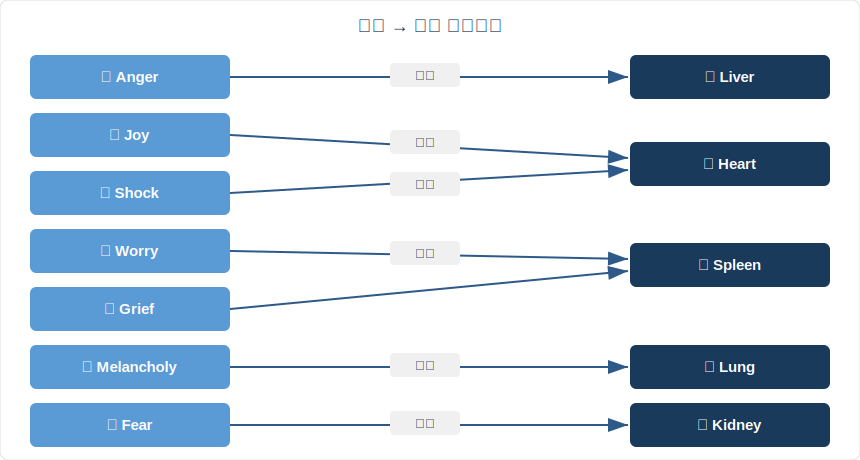

# 第四章 情志与身体：你的情绪正在伤害哪个器官？

## 4.1 一颗被情绪捏变形的心脏

1990年，日本广岛市立医院的佐藤光医生遇到一组罕见病例。几位老年女性在经历丧偶、剧烈争吵或突发惊吓后出现胸痛和呼吸困难，心电图酷似急性心肌梗死。冠状动脉造影却显示血管完全正常。

超声心动图揭示了原因。患者的左心室底部异常膨隆，顶端收缩正常，整体形状像日本渔民捕章鱼用的陶罐"蛸壶"（たこつぼ）。情绪冲击触发儿茶酚胺（catecholamine，一类应激激素）大量释放，直接"击晕"了心肌细胞。

2015年，Templin等人在《新英格兰医学杂志》发表了迄今最大规模的Takotsubo心肌病（Takotsubo cardiomyopathy）研究，涵盖26个国家1,750例患者。约28%的发作由情绪事件触发，患者以绝经后女性为主，院内死亡率达4.1%。纯粹的情绪，可以把心脏捏变形，可以致命。

两千五百年前，《黄帝内经·素问·阴阳应象大论》写道：

> **「怒伤肝，喜伤心，思伤脾，忧伤肺，恐伤肾。」**
>
> 愤怒伤害肝脏，过度兴奋伤害心脏，反复思虑伤害脾胃，忧愁伤害肺脏，恐惧伤害肾脏。

这是一张完整的心身医学（psychosomatic medicine）地图。西方医学在20世纪后半叶才正式承认"心理影响生理"，《内经》提前了大约两千四百年。

---

## 4.2 七情地图：你身体里的情绪版图

《内经》将人的基本情绪归纳为七种，称为"七情"（qī qíng）。每种情绪对应特定脏腑，驱动气的特定运动方向，并产生可观察的身体症状。

| 情绪 | 脏腑 | 气的运动 | 身体表现 | 现代医学印证 |
|------|------|---------|---------|------------|
| **怒** 愤怒 | 肝 | 气上 | 头痛、高血压、目赤 | 皮质醇飙升、心血管应激 |
| **喜** 过喜 | 心 | 气缓 | 心悸、失眠、心神涣散 | Takotsubo心肌病 |
| **思** 思虑 | 脾 | 气结 | 食欲不振、腹胀、乏力 | 应激性肠易激综合征（IBS）、肠脑轴 |
| **忧** 忧愁 | 脾 | 气滞 | 消化不良、肌肉紧张 | 焦虑与胃肠紊乱共病 |
| **悲** 悲伤 | 肺 | 气消 | 气短、声弱、易哭 | 丧亲后免疫抑制、呼吸道感染率升高 |
| **恐** 恐惧 | 肾 | 气下 | 遗尿、腰膝酸软 | 慢性恐惧导致肾上腺疲劳、皮质醇耗竭 |
| **惊** 惊吓 | 心 | 气乱 | 恐慌、意识模糊、心悸 | PTSD、急性应激反应 |

《素问·举痛论》用一句话概括了所有情绪的气机（qì jī，气的运行模式）模型：

> **「怒则气上，喜则气缓，悲则气消，恐则气下，惊则气乱，思则气结。」**
>
> *Nù zé qì shàng, xǐ zé qì huǎn, bēi zé qì xiāo, kǒng zé qì xià, jīng zé qì luàn, sī zé qì jié.*

在此基础上，《举痛论》给出了一个总纲：

> **「百病生于气也。」**（《素问·举痛论》）
>
> 一切疾病，都从气的失调开始。

---

## 4.3 以情胜情：古老的认知行为疗法

《内经》不仅诊断情绪疾病，还提出了治疗方案，叫"以情胜情"（yǐ qíng shèng qíng），用一种情绪克制另一种情绪。原理来自五行相克（Five Elements controlling cycle）。

**五行情志相克：**

- **悲胜怒**（金克木）：悲悯和同理心能化解愤怒
- **恐胜喜**（水克火）：敬畏之心能收敛狂喜散乱
- **怒胜思**（木克土）：果断的行动力能打破过度思虑
- **喜胜悲**（火克金）：欢乐能驱散深层悲伤
- **思胜恐**（土克水）：理性分析能平息恐惧

现代心理学中的认知重评（cognitive reappraisal）通过改变对事件的解读来调节情绪，与"以情胜情"的底层逻辑一致。关键区别在于：《内经》不用"理性思维"对抗情绪，而是用另一种情绪来调动气机，重建平衡。

一个经典临床案例可以说明这种方法。明代医家张子和治疗一位因丧子而久咳不愈的妇人。她的咳嗽源于深度悲伤压垮了肺气。张子和没有开药，请来戏班表演滑稽剧目，令她大笑。笑过之后，咳嗽渐止。喜胜悲，火克金。

---

## 4.4 现代科学的印证：心理神经免疫学

1975年，罗切斯特大学的Robert Ader在一项条件反射实验中偶然发现：大鼠的免疫系统可以像巴甫洛夫反射一样被训练。他让大鼠把糖精水和免疫抑制药物联系起来，之后只给糖精水（不给药），大鼠的免疫功能仍然下降。这一发现催生了心理神经免疫学（Psychoneuroimmunology, PNI），正式确认大脑、神经系统和免疫系统之间存在双向通信。

《内经》的情志-脏腑地图与PNI的发现在多个维度上吻合。

**怒伤肝：慢性炎症与肝损伤。** 持续的愤怒激活交感神经系统，皮质醇和炎症因子（IL-6、TNF-α）长期处于高水平。流行病学数据显示，高敌意特质（trait hostility）人群的非酒精性脂肪肝风险显著升高。

**悲伤肺：丧亲后呼吸道易感。** Buckley等人2012年在《BMJ Open》发表的前瞻性研究显示，丧偶后第一年内，肺炎和呼吸道感染的住院率升高约40%。悲伤抑制自然杀伤细胞（NK cell）活性，直接削弱呼吸道免疫屏障。

**恐伤肾：肾上腺耗竭。** 长期恐惧使肾上腺持续释放肾上腺素和皮质醇。肾上腺位于两侧肾脏上方（这个解剖关系让《内经》的"恐伤肾"多了一层物理层面的巧合）。功能失调后出现极度疲劳、腰痛、免疫低下，与《内经》描述的恐伤肾症状高度重叠。

**思伤脾：肠脑轴。** 肠道拥有超过一亿个神经元，被称为"第二大脑"（second brain）。迷走神经（vagus nerve）连接大脑和肠道。焦虑和过度思虑的信号通过迷走神经直接干扰肠道蠕动和微生物群落。"紧张就拉肚子"不是心理暗示，是神经生理学事实。

一项大规模纵向研究为情绪-疾病关联提供了有力证据。Felitti等人1998年发表的ACE研究（Adverse Childhood Experiences Study）追踪了17,000名受试者，结果显示：童年期的情绪创伤（虐待、忽视、家庭暴力）会在数十年后转化为心脏病、癌症、糖尿病等实体疾病。情绪伤害的不只是"心情"，而是整个身体。

---

## 4.5 怒与肝：现代人最大的情志危机

七情之中，《内经》对"怒"的论述最为详尽。原因在于肝主疏泄（shū xiè），负责全身气机的通畅流动。愤怒使气上冲，肝失疏泄，连带影响脾胃消化和心神安宁。

> **「怒则气上。」**
>
> *Nù zé qì shàng.*

现代生活充满了低烈度、高频率的愤怒来源：早高峰堵车、工作中的被动攻击、社交媒体上的戾气、刷不完的坏消息。你不需要拍桌子大骂才叫"怒"。持续的烦躁、压抑的不满、控制不住地刷负面新闻，都属于慢性的"怒则气上"。

生理层面的代价很具体。慢性愤怒让交感神经持续兴奋，血压居高不下，肝脏代谢负担加重。Chida和Steptoe 2009年在《美国心脏病学会杂志》发表的荟萃分析显示：高敌意人群的冠心病风险是低敌意人群的1.5至2倍。

**《内经》的处方：以悲胜怒。** 这里的"悲"不是让自己难过，而是唤起悲悯和同理心。下次因为路怒症想按喇叭时，试着想象对方可能正赶去医院看望病危的父母。你老板发了一封措辞尖锐的邮件，你想回怼——试着想想他可能刚被他的上级狠批过，他也是个普通人，也在承受压力。这种视角转换就是"以悲胜怒"的日常应用：不是压制愤怒，而是通过同理心让愤怒自行消解。

同理心为什么有效？因为愤怒的本质是"我被不公正地对待了"的认知判断。当你切换到对方的视角，这个判断会自动松动。神经影像学研究表明，共情激活前额叶皮层和颞顶联合区，这些区域恰好能抑制杏仁核的攻击性反应。你不是在对抗愤怒，你是在激活大脑中另一个更高级的回路。

**另一种更实际的方法：允许发怒，但控制时长。**

《内经》从来不说"不准生气"。怒是七情之一，和喜悲恐一样，是人的天性。压抑愤怒（中医称"郁怒"）比发泄愤怒更伤身——被压下去的气不会消失，它会在体内横冲直撞，最终以头痛、失眠、胃痛的形式爆发。

所以关键不是"能不能发怒"，而是"发怒持续多久"。

给自己一个规则：**90 秒法则**。神经科学家 Jill Bolte Taylor 在她的研究中指出，一次情绪反应的生理周期大约是 90 秒——从杏仁核触发到肾上腺素和皮质醇在血液中达到峰值再消退。如果 90 秒过后你还在生气，那不再是生理反应，而是你在用思维反刍喂养愤怒。

实操方法：
- 感到愤怒时，不压抑。承认它："我现在很生气。"
- 看一下时间或在心里开始默数。
- 给自己 90 秒到 3 分钟的"允许愤怒"时间：可以握拳、可以深呼吸、可以在心里骂人。
- 3 分钟一到，做一个物理动作来"切换"——站起来走动、喝一杯水、洗个手。
- 如果 3 分钟后愤怒仍然强烈，出门走 10 分钟（怒则走，消散上冲之气）。

这套方法不是"管理情绪"，而是"给情绪一个安全的容器和一个明确的截止时间"。怒气有出口就不会郁结伤肝，有时限就不会失控伤心。

---

## 4.6 思伤脾：知识工作者的职业病

在信息过载的时代，"思伤脾"可能是七情致病中最普遍的一种。

《内经》说"思则气结"，思虑过度使气凝滞不通，脾胃功能首当其冲。回想一下你自己的经历：赶项目时根本不饿，考试前一周胃胀难受，焦虑时不想吃东西或者疯狂吃垃圾食品。这不是巧合，是脾气被"结"住了。

现代医学给出了分子层面的解释。应激性肠易激综合征（IBS）与焦虑障碍的共病率超过60%。焦虑时大脑释放促肾上腺皮质激素释放因子（CRF），通过迷走神经抑制胃肠蠕动，改变肠道通透性和微生物组成。

**《内经》的处方：以怒胜思。** 这里的"怒"不是暴怒，而是果断、行动力、拍板的勇气。陷入无休止的内耗和反刍思维时，最好的药不是继续想，而是站起来做一个决定，哪怕很小。

**微习惯策略：用"小到不可能失败"的行动打破气结。**

思虑过度的人最大的困境是：知道要行动，但就是启动不了。原因很简单——大脑在高度焦虑时，前额叶皮层（负责决策和执行）的功能被削弱，杏仁核（负责威胁评估）占据主导。你不是"懒"，你是被自己的应激系统锁死了。

斯蒂芬·盖斯（Stephen Guise）在 2013 年提出的"微习惯"（Mini Habits）理论提供了一个解法：把行动缩小到荒谬的程度，小到大脑的阻力系统根本不会触发。

面对工作焦虑想不出方案？不要告诉自己"我要把整个方案写完"。告诉自己："我只写一句话。"然后真的只写一句话。一句话写完，气就动了。"思则气结"的"结"，被你用最微小的行动松开了一个角。

实操方法：
- **2 分钟法则**：任何你拖延的任务，承诺只做 2 分钟。打开文档写一行、打开邮箱回复一封、站起来走到门口。2 分钟后可以停，但大多数时候你不会停。
- **身体先于思维**：焦虑反刍时，先做一个物理动作——洗脸、整理桌面、倒一杯热水。身体一动，气就从"结"变成"行"。
- **外化思虑**：把脑子里转圈的想法写在纸上。不整理、不分析，只写。纸上的字看得见，脑子里的字看不见。把无形的"气结"变成有形的文字，结就松了一半。
- **"最差版本"法**：完美主义是"思伤脾"的催化剂。告诉自己："我先做一个最差的版本。"最差版本没有质量要求，只有存在要求。存在就是胜利。

微习惯的本质是什么？是"以怒胜思"的现代实现方式。"怒"是行动力。微习惯把行动力的启动门槛降到了最低——你不需要勇气，不需要灵感，不需要完美的计划。你只需要做一个极小的动作。然后，气自己就开始流了。

---

## 4.7 恬淡虚无：《内经》情志养生的最高境界

前面讲的"以情胜情"和微习惯，都是出了问题后的应对策略。《内经》还有一条更高级的路径：从源头减少情绪的冲击力。这条路径浓缩在八个字里：

> **「恬淡虚无，真气从之，精神内守，病安从来。」**
>
> — 《素问·上古天真论》
>
> 内心安宁恬淡，不被欲望和外界刺激搅动，真气就会自然顺畅运行；精神向内收守，不散逸于外物，疾病从何而来？

这是整部《黄帝内经》养生哲学的总纲。它不是在说"什么都不想"——那是死人。它说的是一种内在状态的品质：你依然感受世界，但不被世界牵着鼻子走。

**恬** — 安静，不躁动。不追逐下一个刺激。

**淡** — 清淡，不浓烈。不需要极端的快感来证明自己在活着。

**虚** — 留出空间。脑子不被信息塞满，时间不被日程塞满，情绪不被执念塞满。

**无** — 不执着于特定结果。事情来了就应对，过了就放下。

放在今天的语境里："恬淡虚无"是对信息过载、情绪内耗和 FOMO（Fear of Missing Out）的精准解药。

你每天打开手机，几百条推送在争夺你的注意力。每条都在说"这很重要""你不能错过""别人都在关注"。你的杏仁核被一轮接一轮的微刺激轰炸，始终处于低度应激状态。这就是"恬淡虚无"的反面——**躁动浓烈，实满有执**。

实操层面，"恬淡虚无"可以这样练习：

- **信息断食**：每天留出一个小时完全不看手机、不接收任何信息。让大脑体验一下"空"的感觉。你会发现，那些"必须立刻知道"的事情，一个小时后再看，一件都没有紧急到活不下去。
- **欲望延迟**：想买一样东西时，等三天。三天后还想买，再买。大多数冲动消费在三天后自行消退。这是"淡"的训练。
- **留白时间**：每周至少有一个下午不安排任何事项。不学习、不社交、不"自我提升"。只是存在。这是"虚"的训练。
- **结果松绑**：做一件事时，关注过程而非结果。发了一条消息不去反复查看对方有没有回复。提交了方案不去反复猜测领导的反应。这是"无"的训练。

这种状态不是消极。老子说"为无为，则无不治"，不是说什么都不做，而是说不被执念驱动地去做。同样，"恬淡虚无"不是心如死灰，而是心如止水——水面平静，倒映万物。风来了有波纹，风过了又平静。

现代心理学中最接近这个概念的是 **"心流"（flow state）**。Mihaly Csikszentmihalyi 描述的心流状态：全然投入当下，自我意识消融，时间感消失。这不就是"精神内守"吗？你的精神不再散逸在焦虑（未来）和后悔（过去）之间，而是完全收拢在此刻。

七情伤身，根源在于情绪对气机的扰动太大太久。"恬淡虚无"的训练目标是降低扰动的基线——不是让你不再感受情绪，而是让情绪来了能来、走了能走，不在你体内形成经久不散的风暴。

这是《内经》情志养生的最终答案：最好的情绪管理不是管理情绪，而是减少需要被管理的情绪。

---

## 4.8 日常实践：情志调养

> *编号说明：因新增 4.7 恬淡虚无小节，原 4.7-4.9 依次后移为 4.8-4.10。*

《内经》是实操手册。以下是从其原理出发的情志调养方法。

**晨间觉察。** 每天醒来后用一分钟感受自己的情绪基调。不评判，只觉察。今天是烦躁、焦虑、平静，还是低落？觉察本身就是调节的起点。

**六字诀呼吸（嘘呵呼呬吹嘻）。** 这是源自《内经》脏腑理论的古老吐纳法（Liù Zì Jué），每个字音对应一个脏器的振动频率：

- **嘘**（xū）：疏肝理气，化解愤怒
- **呵**（hē）：清心安神，平息躁动
- **呼**（hū）：健脾化湿，解除思虑
- **呬**（sī）：润肺宣气，释放悲伤
- **吹**（chuī）：补肾纳气，缓解恐惧
- **嘻**（xī）：调理三焦，通畅全身

**顺时调情。** 春季肝气升发，宜舒展身心，避免压抑。夏季心气旺盛，宜欢畅，避免过度亢奋。秋季肺气收敛，宜安宁，允许适度的感伤。冬季肾气封藏，宜静养，避免过度惊恐消耗。

**以动化情。** 身体的运动可以疏导情绪的气机。怒的时候去走路（消散上冲之气），悲的时候做扩胸运动（打开肺气），恐的时候站桩（稳固下沉之气），思虑过重的时候跑步或游泳（疏通结滞之气）。

**睡前清理。** 临睡前深呼吸三次，每次呼气时想象排出一天积累的情绪浊气。这是通过激活副交感神经来降低皮质醇水平，不是玄学。

---

## 4.9 反思时刻

闭上眼睛，问自己一个问题：

**在过去三个月里，哪种情绪在你生活中占据了最多的空间？**

是工作中的持续焦虑（思）？对某件事的愤怒和不满（怒）？一段关系结束后的悲伤（悲）？还是对未来不确定性的恐惧（恐）？

回看七情地图，找到你的主导情绪对应的脏腑。你是否在那个系统出现了不适：消化问题、呼吸不畅、腰痛、头疼、失眠？

这不是自我诊断。这是一次觉察练习。当你看见情绪与身体之间的连接，你就拿回了一部分对健康的主动权。

---

## 今日行动

- ⚡ 现在闭眼60秒，问自己：此刻主导我的情绪是什么？它在身体的哪个位置？
- ⚡ 下次感到愤怒时，不压抑也不发作，出门走10分钟（怒则走，消散上冲之气）
- 🔄 从今天开始，每晚睡前做3次深长呼气，想象排出一天的情绪浊气。坚持14天。

---

## 21天微实验：情绪日记

每天晨起时用一个词记录当下的情绪底色（如：焦虑、平静、烦躁、低落、兴奋）。不分析、不评判，只记录。21天后回顾，你会看到自己的情绪模式：哪种情绪出现最频繁？是否与特定事件或时间段相关？

---

## 证据强度标注

| 内经原则 | 证据等级 | 说明 |
|---------|---------|------|
| 怒伤肝 | ✓ 已证实 | 慢性愤怒导致皮质醇/炎症因子升高、肝脏代谢损伤，JACC荟萃分析证实 |
| 思伤脾（过度思虑伤消化）| ✓ 已证实 | 焦虑与IBS共病率超过60%，肠脑轴双向通信已成定论 |
| 悲伤肺 | ✓ 已证实 | BMJ Open研究：丧亲后呼吸道感染住院率升高约40% |
| 喜伤心 | ✓ 已证实 | Takotsubo心肌病：情绪冲击直接导致心室变形，NEJM大规模研究确认 |
| 恐伤肾 | ? 合理假说 | 慢性恐惧导致肾上腺皮质醇耗竭有临床观察，但"肾"与"肾上腺"的对应仍需更多验证 |
| 以情胜情（情绪相克调节）| ? 合理假说 | 与认知重评底层逻辑一致，但五行相克的精确对应缺乏RCT验证 |
| 百病生于气 | ? 合理假说 | PNI证实情绪影响免疫/代谢，但"百病"的全称命题过于绝对 |

---

## 4.10 总结与过渡

情绪不是"想出来的"，它们是真实的生理事件，沿着特定路径影响特定器官。

- 七情各有其脏腑归属和气机方向
- "以情胜情"是世界上最早的情绪调节系统之一
- 现代心理神经免疫学用分子生物学的语言，验证了《内经》两千五百年前的观察
- 情志调养不是事后补救，而是日常功课

> **「百病生于气也。」**

一切疾病从气的失调开始，而情绪是气最强大的推动者。不过，还有另一种方式可以主动推动气的运行：不是靠情绪，而是靠身体的运动。下一章将探索《内经》对运动与生命力的理解，不是"健身"，而是"养生"。

---

## 参考文献

1. 《黄帝内经·素问》第五篇《阴阳应象大论》，第三十九篇《举痛论》。

2. **Templin, C., et al.** (2015). "Clinical Features and Outcomes of Takotsubo (Stress) Cardiomyopathy." *New England Journal of Medicine*, 373(10), 929–938. DOI: 10.1056/NEJMoa1406761 — 全球最大规模Takotsubo心肌病研究，涵盖26国1,750例患者。

3. **Ader, R., & Cohen, N.** (1975). "Behaviorally Conditioned Immunosuppression." *Psychosomatic Medicine*, 37(4), 333–340. DOI: 10.1097/00006842-197507000-00007 — 心理神经免疫学奠基实验，证明免疫系统可被条件反射训练。

4. **Felitti, V. J., et al.** (1998). "Relationship of Childhood Abuse and Household Dysfunction to Many of the Leading Causes of Death in Adults." *American Journal of Preventive Medicine*, 14(4), 245–258. DOI: 10.1016/S0749-3797(98)00017-8 — ACE研究：追踪17,000人，揭示童年情绪创伤与成年重大疾病的关联。

5. **Buckley, T., et al.** (2012). "Prospective Study of Early Bereavement on Psychological and Behavioural Cardiac Risk Factors." *BMJ Open*, 2(6), e001842. DOI: 10.1136/bmjopen-2012-001842 — 前瞻性研究：丧亲后心血管及呼吸道疾病风险显著升高。

6. **Mayer, E. A.** (2011). "Gut Feelings: The Emerging Biology of Gut–Brain Communication." *Nature Reviews Neuroscience*, 12(8), 453–466. DOI: 10.1038/nrn3071 — 肠脑轴双向通信的综述性论文。

7. **Chida, Y., & Steptoe, A.** (2009). "The Association of Anger and Hostility with Future Coronary Heart Disease." *Journal of the American College of Cardiology*, 53(11), 936–946. DOI: 10.1016/j.jacc.2008.11.044 — 荟萃分析：愤怒/敌意人格与冠心病风险正相关。
