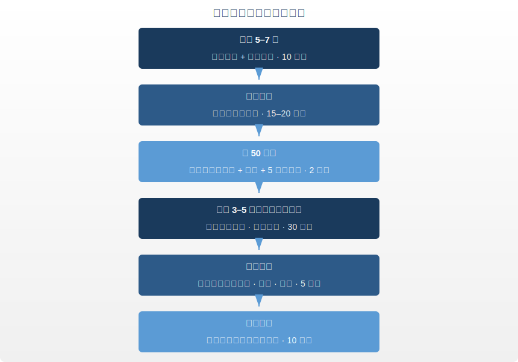

# 第五章 · 动如流水

> 形劳而不倦，气从以顺，各从其欲，皆得所愿。
>
> — 《黄帝内经·素问·上古天真论》

## 5.1 一项颠覆直觉的临床试验

2012年，《新英格兰医学杂志》发表了一项随机对照试验。195名帕金森病患者被分为三组，分别接受太极拳训练、抗阻力训练和拉伸训练，为期六个月。太极拳组在平衡控制、步态稳定和跌倒次数三项指标上全面优于另外两组。一种看起来"不费力"的运动，击败了看起来"更科学"的方案。

这项研究不是孤例。2020年12月17日，联合国教科文组织将太极拳列入人类非物质文化遗产代表作名录。评审词指出：太极拳"以中国传统哲学中的阴阳循环、天人合一理念为核心"。一项运动拿到文化遗产认证，靠的不是竞技成绩，而是哲学根基。

这个哲学根基来自两千五百年前的《黄帝内经》。素问第一篇写了六个字：「形劳而不倦」。身体要劳动，但不应到达倦怠的程度。古人运动的目的是**蓄积能量**，不是**消耗殆尽**。

内经的理想状态是水。永远在流动，从不崩溃。

水有三个特征值得运动者学习：

- **持续性**：水从不间歇训练，它永远在流。
- **适应性**：水遇方则方，遇圆则圆，从不硬碰硬。
- **不竭性**：水流向低处，顺势而行，所以不会耗尽自己。

这三个特征，是内经运动哲学的三根支柱。

---

## 5.2 导引按跷：内经的运动处方

现代健身文化把运动理解为对身体的"攻击"：撕裂肌纤维，等它长回来更粗。内经的运动观完全不同。它的核心处方叫「导引按跷」。

**导引**，字面意思是"导气引体"。通过特定身体动作引导体内的气沿经络（meridian）运行。它不追求肌肉的极限收缩，追求的是气的通畅流动。太极拳和气功的共同祖先就是导引。

**按跷**，是自我按摩和穴位按压，用手法疏通淤滞的气血。它不是筋膜枪的轰炸，而是带有觉知的精确自我疗愈。《素问·异法方宜论》记载，导引按跷起源于中原地区。那里的人"杂食而不劳"，吃得杂但动得少，容易出现痿厥（肢体无力）。导引按跷就是针对"动得少"开出的处方。

1973年，长沙马王堆汉墓出土了一幅公元前168年的彩色帛画：**马王堆导引图**。画上四十四个人物分别做着不同的伸展和呼吸姿势，有的模仿熊攀，有的模仿鸟伸，旁边标注了动作名称和对应疾病。这是人类已知最古老的运动处方图谱，比古希腊体育训练手册早了至少两百年。

导引图中的动作没有一个看起来"费力"。没有负重、没有冲刺、没有极限扭曲的表情。每个姿势松弛、舒展、可控。东汉名医华佗后来将导引术提炼为"五禽戏"：模仿虎、鹿、熊、猿、鸟五种动物的运动形态，这是中国最早的系统化养生操。

导引的核心原则只有一条：**运动的目的是让气血循环，不是让气血耗竭。**

---

## 5.3 气血运行：内经的运动生理学

内经不知道什么是线粒体（mitochondria）、乳酸阈值（lactate threshold）或最大摄氧量（VO₂ max）。它有自己的框架：**气血理论**。

核心公式：「气为血之帅，血为气之母」。气推动血液运行，血液滋养气的物质基础。两者相互依存。

用现代术语翻译：气近似于生物电信号和神经内分泌调控系统的整合功能，血对应循环系统运输的氧气、营养和激素。运动激活两者的协同。心率上升时，气推动血；血液携带氧气和葡萄糖送达肌肉时，血滋养气。运动的作用是让这对搭档协同运转，不是把其中一方榨干。

久坐不动时，气血停滞。内经称之为「瘀」。瘀是万病之源。《素问·宣明五气篇》写得直接：「久坐伤肉，久卧伤气」。长时间坐着损伤肌肉功能，长时间躺着损伤气的运行。

2016年，《英国运动医学杂志》的一项荟萃分析覆盖超过4.4万名参与者。结论明确：每天坐超过10小时的人，全因死亡率显著升高，即使同时有规律运动。"久坐是新型吸烟"这句健康口号，内经用八个字说完了，早了两千五百年。

但内经同样警告另一个极端。气血消耗殆尽后，身体进入亏空状态：免疫力下降，关节磨损，心脏负荷过高。过度训练综合征（overtraining syndrome）在运动医学中早已是公认的临床问题。

你的气血就像银行账户。温和的运动是投资，花出去的能量会带来更多回报。极端运动是透支，每次取出的比存入的多，迟早资不抵债。智慧不在于"练多少"，而在于"收益率"。

---

## 5.4 五劳所伤：姿势的毒性

《素问·宣明五气篇》提出了一个极为超前的人体工学（ergonomics）观察：**五劳所伤**。

| 行为 | 损伤 | 现代对照 |
|------|------|---------|
| 久视伤血 | 长时间注视损伤血 | 屏幕疲劳、干眼症、数字视觉疲劳 |
| 久卧伤气 | 长时间卧躺损伤气 | 久卧导致肌肉萎缩、代谢下降 |
| 久坐伤肉 | 长时间坐着损伤肌肉 | 久坐与肌少症、代谢综合征 |
| 久立伤骨 | 长时间站立损伤骨骼 | 静脉曲张、脊柱压缩 |
| 久行伤筋 | 长时间行走损伤筋腱 | 过度训练、肌腱炎 |

这张表的深刻之处不在于列举了什么伤害。它揭示的底层逻辑是：**问题不在于某一种姿势本身，而在于"久"。** 任何姿势持续过长，都变成毒药。解决方案不是找到"正确姿势"然后锁死不动，而是变化与流动。

现代运动科学正在重新发现这个原则。"运动零食"（movement snack）概念，每隔50分钟站起来走动2分钟，已被多项研究证实能显著降低血糖波动和全因死亡率。站立办公桌的研究也发现，站着并不比坐着好多少，**坐站交替**才是关键。

你每天对着电脑工作八小时的话，五劳所伤的前三条几乎完美描述了你的一天：久视、久坐、下班瘫在沙发上的久卧。两千五百年前写下的这张清单，今天读起来像一份职业病风险评估表。

不要选一种姿势。像水一样流动。

---

## 5.5 太极与气功：内经在身体里活着

导引术没有消失。它变成了今天的太极拳、气功和八段锦，三种被数亿人每天践行的运动方式。

**太极拳**是移动中的冥想（meditation in motion）。每个动作都是阴阳转换的具身化：前进中有后退，上升中有下沉，发力中有放松。它不追求速度和爆发力，追求圆融和连续。2017年《美国老年医学会杂志》的荟萃分析纳入26项随机对照试验，发现太极拳显著改善老年人平衡能力，跌倒风险降低20%，效果优于传统物理治疗。

**气功**是呼吸与动作的精密协调，导引术的直系后代。核心是用意念引导呼吸，呼吸再带动身体。2020年《补充与整合医学杂志》的系统综述显示，气功可显著降低收缩压（平均降低12 mmHg），降低焦虑评分，提高睡眠质量。

**八段锦**是中国现存最古老的标准化健身套路之一。八个动作，每个对应一条经络或一个脏腑。学习门槛极低，十分钟就能跟着做完一遍。中国国家体育总局在2003年发布了标准化版本，至今仍是公共健康推广的核心内容。

哈佛医学院2018年的报告将太极拳列为"最佳五种运动"之一，与游泳、力量训练并列。报告特别指出：太极拳对"以前不运动、正在恢复期、或年纪较大"的人群尤其有效。这恰好是导引术最初的设计对象：不是运动员，而是需要养生的普通人。

全球新冠疫情期间，八段锦视频在国内外社交媒体播放量激增数十亿次。人们被封锁在家，空间有限，器材缺乏。八段锦不需要任何器材、任何场地，站在客厅里就能完成。一套两千年前的功法，在二十一世纪最极端的公共卫生危机中证明了生命力。

这三种运动的共同特征：强度适中，呼吸引导，全身参与，从不透支。它们是「形劳而不倦」的活体教材。

---

## 5.6 筋膜视角：为什么古人的"慢运动"比你想的更科学

近二十年的筋膜科学（fascia science）为内经的运动哲学提供了一个出人意料的解剖学支持。

筋膜是包裹在肌肉、骨骼和器官外面的结缔组织网络，长期被解剖学界视为无关紧要的"包装材料"。2001 年，Thomas Myers 出版《解剖列车》（*Anatomy Trains*），提出肌肉不是孤立的零件，而是通过筋膜连成贯穿全身的力量传导链。2003 年，德国乌尔姆大学的 Robert Schleip 证实筋膜富含机械感受器和神经末梢——筋膜不是死的包装，它是一个遍布全身的感觉器官。

这与《内经》的经络概念产生了深层呼应。经络描述的是"刺激 A 点，B 处有反应"的功能连接网络。筋膜科学发现的是"拉伸脚底，后背有反应"的力学传导网络。两张地图的路线，在多处高度重叠（详见**第九章**）。

**筋膜理论对运动的核心启示：**

1. **慢比快有效。** Schleip 的研究显示，筋膜的粘弹性重塑需要至少 90 秒的持续拉伸。快速弹振式拉伸只产生弹性形变（松手就回弹），持续慢拉伸才能产生塑性形变（组织真正改变）。这正是太极拳和八段锦的运动节奏——慢、持续、不间断。

2. **全链条比单肌肉有效。** 孤立训练二头肌，只锻炼了一块肌肉。沿筋膜链做全身拉伸，一个动作激活了从脚底到头顶的整条通路。八段锦第一式"双手托天理三焦"，从脚底发力，经大腿、腰腹、胸背、上肢，一直延伸到指尖——完美覆盖了 Myers 所说的"浅表背线"和"深前线"。

3. **多方向比单方向有效。** 筋膜的纤维排列是多方向的（不像肌纤维那样平行排列）。单一方向的重复运动（如只跑步、只骑车）会导致筋膜沿一个方向过度致密，其他方向变脆。太极拳的螺旋缠绕、八段锦的前后左右、五禽戏的上下翻转，都在多方向刺激筋膜网络。

4. **压缩-释放循环促进筋膜水合。** 筋膜像海绵一样含有大量水分。深蹲时压缩下肢筋膜，站起时释放，水分被挤出又重新吸收——这个"挤海绵"过程更新了筋膜间质液，减少粘连，保持弹性。这就是为什么久坐后做几个深蹲会感觉"全身松开了"。

简言之：《内经》倡导的慢速、全身、多方向、带呼吸的运动方式，恰好是筋膜科学认为最有效的筋膜保养方案。古人没有"筋膜"这个词，但他们用"经络通畅""气血流动"描述的体感，与筋膜水合、弹性恢复和力学传导的生理过程，指向的是同一件事。

---

## 5.7 三个人人都能做的动作

以下三个动作来自中国传统养生功法和基础体能训练，零器材、零门槛，加起来不到五分钟。

**动作一：双手托天理三焦（八段锦第一式）**

这是八段锦最著名的起势。站立，双脚与肩同宽。双手在腹前十指交叉，翻掌向上托举过头顶，同时脚跟微微抬起。尽力向上伸展，保持 3-5 秒，然后缓慢放下，脚跟落地。重复 8 次。

这个动作拉伸了整条"深前线"筋膜链——从足底经大腿内侧、腰大肌、膈肌、直至手臂内侧。"理三焦"在中医语境中是调理上中下三个体腔的气机运行。在筋膜语境中，这个动作同时牵拉了腹腔筋膜、胸腔筋膜和颈部深层筋膜。一个动作，三个体腔的筋膜全部被激活。

适用场景：早晨起床后（唤醒全身筋膜链）、久坐 1 小时后（打破姿势固化）。

**动作二：绕肩（肩关节全幅度环绕）**

站立或坐姿，双手自然下垂。将双肩同时向前、向上、向后、向下做大幅度圆圈运动。先顺时针绕 10 圈，再逆时针 10 圈。速度要慢，幅度要大，感受肩胛骨在背部的滑动。

现代人最紧张的区域之一是上斜方肌和肩胛提肌——它们因长期耸肩（打字、看手机）而慢性痉挛。绕肩不是"活动一下肩膀"这么简单。它激活了"手臂线"筋膜链（从手指经前臂、上臂、肩峰直达颈侧），同时松解胸小肌的紧缩（这块肌肉在含胸驼背时会缩短，压迫臂丛神经导致手臂麻木）。

适用场景：电脑前每 30 分钟做一组、肩颈酸痛时、压力大感觉"扛不住"时（肩上的紧张常常是情绪压力的身体表达）。

**动作三：深蹲（无负重自重深蹲）**

双脚略宽于肩，脚尖微微外展。缓慢屈膝下蹲，臀部向后坐，尽量蹲到大腿与地面平行（或更低，如果你的膝盖允许）。保持背部挺直，膝盖方向与脚尖一致。蹲到底后保持 2-3 秒，再缓慢站起。重复 10 次。

深蹲不只是一个"腿部训练"。当你蹲到底部时，髋关节、膝关节、踝关节同时到达最大屈曲位，下肢所有筋膜链——浅表背线（小腿后侧→大腿后侧）、浅表前线（胫骨前→股四头肌）、侧线（髂胫束→腓骨肌群）——同时被拉伸和压缩。这就是 Schleip 所说的"筋膜水合循环"：压缩-释放-再水合。

亚洲蹲（Asian squat）曾被西方社交媒体当作"文化奇观"讨论。实际上，这个姿势是人类最自然的休息位之一（世界上不使用椅子的文化中，人们日常就是蹲着休息的）。现代人丢失了深蹲能力，根本原因是久坐导致髋屈肌缩短、踝关节背屈受限、胸腰筋膜僵硬。恢复深蹲能力，等于恢复下半身筋膜链的完整功能。

适用场景：晨起后（唤醒下肢）、久坐后（对抗坐姿压缩）、下午精力低谷时（深蹲提升心率和血液循环的效果立竿见影）。

---

## 5.8 现代验证：运动科学遇上古老智慧

把内经的原则翻译成当代运动科学的语言，你会发现实验室的前沿发现常常是对古老常识的量化确认。

**Zone 2 训练与"形劳而不倦"。** Zone 2 是指你可以持续交谈的运动强度，大约最大心率的60%–70%。运动生理学家 Iñigo San-Millán 的研究表明，这个强度区间是线粒体功能优化和脂肪代谢效率最高的窗口。精英耐力运动员80%的训练时间花在这个区间。"身体在劳动，但不倦怠"，这就是 Zone 2 的精确定义。

**U 型曲线与过犹不及。** 2015年《美国心脏病学杂志》发表的丹麦研究追踪了1,098名跑步者和413名久坐者。轻到中等强度跑步的人死亡率最低。高强度、高频率跑步的人，死亡率反而接近完全不运动的人。运动收益曲线是U型的，两端危险，中间最安全。

**步行的回归。** 素问第二篇写道「广步于庭」。这是黄帝描述的上古之人养生日课之一：天不亮起床，到庭院中散步，披散头发，放松身体。2023年《欧洲预防心脏病学杂志》的荟萃分析显示，每天步行3,967步即可降低全因死亡率，每增加1,000步进一步获益。步行，这种最不起眼的运动，可能是内经最有先见之明的处方。

**呼吸-运动耦合。** 内经反复强调"以息调身"。现代研究证实，运动中的膈肌呼吸（diaphragmatic breathing）可降低交感神经兴奋性，提高运动效率，减少感知疲劳。呼吸不是运动的附属品，它是运动的操作系统。

**运动后恢复。** 内经不只关心你怎么动，还关心你怎么停。「劳者温之」：疲劳后应当温养，而非冰敷硬扛。现代运动恢复科学越来越倾向"主动恢复"（active recovery）：低强度散步、轻柔拉伸、温水浴。这些策略促进血液循环，加速代谢废物清除，和内经"以温通瘀"的逻辑如出一辙。冰浴和完全静止的"被动恢复"方式，反而可能延缓修复。

---

## 5.9 日常实践：内经运动日课

以下是基于内经原则设计的日常运动方案。核心不是"练更多"，而是"让身体一整天都在流动"。

**为什么是下午3-5点？** 这是膀胱经当令的时段，也恰好是人体核心温度最高、肌肉柔韧性最好、反应速度最快的时间窗口。运动科学和经络理论在这里不谋而合。

**穴位自按三要穴：**
- **足三里**（ST-36）：膝盖下方四指，胫骨外侧。强壮全身、调理脾胃。
- **涌泉**（KI-1）：足底前部凹陷处。滋肾安神、引火归元。
- **合谷**（LI-4）：拇指与食指之间虎口处。疏风解表、通络止痛。

**关于强度的拿捏：** 下午主运动时段，选什么运动不重要。快走、游泳、骑自行车、太极拳、八段锦都行。重要的是强度标准：你能在运动中持续说话，但唱歌会觉得吃力。这就是 Zone 2 区间，也是「形劳而不倦」的精确体感描述。

每天不需要一个完美的"锻炼时间段"。你需要的是让运动渗透进一天的每一个缝隙，像水渗透进沙子。

---

## 5.10 反思时刻：你是水还是机器？

花一分钟回答以下问题（1 = 完全不符，5 = 非常符合）：

1. 我的运动方式单一，常年不变。 ___
2. 我经常训练到精疲力竭才觉得"有效"。 ___
3. 我的日常包含大量久坐，几乎没有中途活动。 ___
4. 我受过运动相关的伤，但仍在坚持同样的训练。 ___
5. 我几乎不做拉伸、呼吸练习或自我按摩。 ___

**15 分以上**：你在用机器模式运动。刚性、重复、高磨损。考虑降低强度，增加多样性。

**10–14 分**：混合状态。某些方面流动良好，另一些方面过于僵硬。

**5–9 分**：你的运动模式接近"水"的状态。多样、适度、可持续。保持下去。

运动不需要战胜身体。它需要和身体对话。

发现自己得分偏高？不必焦虑。改变可以从一个极简动作开始：明天起床后，花三分钟站在窗前，做五次缓慢的深呼吸，每次呼气时轻轻扭转腰部。这不是健身，这是导引。两千五百年前的养生智慧，三分钟就能启动。

---

## 今日行动

- 站起来。现在。伸展30秒，深呼吸3次。你刚做了一次"运动零食"（movement snack）
- 设一个每50分钟响一次的提醒，响了就换个姿势。站、走、伸展，任何改变都算
- 本周开始每天散步15分钟（最好是早晨），不听播客、不看手机，只走路

---

## 21 天微实验：散步实验

连续21天每天步行至少15分钟。不跑步，不计步数，不追求心率，只是走。每天记录步行后的精力评分（1-5分）和当天的整体心情（1-5分）。第21天对比第1天的数据。

---

## 证据强度标注

| 内经原则 | 证据等级 | 说明 |
|---------|---------|------|
| 形劳而不倦（运动但不疲惫）| ✓ 已证实 | Zone 2 训练/中等强度运动的收益远超高强度，运动剂量-反应呈 U 型曲线 |
| 久坐伤肉 | ✓ 已证实 | Lancet 2016：久坐与全因死亡率正相关，每天 >8 小时久坐风险显著升高 |
| 久视伤血 | ? 合理假说 | 长时间屏幕使用引发眼疲劳/干眼/近视加重已有证据，但"伤血"的精确对应仍在研究 |
| 导引/太极的健康益处 | ✓ 已证实 | 多项 meta 分析证实太极改善平衡、降血压、减压、增强免疫功能 |
| 五劳所伤（任何持续姿势有害）| ✓ 已证实 | 现代人体工学共识：没有"完美姿势"，最好的姿势是下一个姿势 |

---

## 5.11 总结与过渡

第二章校准了生物钟。第三章调整了饮食结构。第四章学会了与情绪共处。这一章找到了身体运动的古老频率：不是燃烧，而是流动；不是对抗，而是顺应。

回顾这四章的主题，节律、饮食、情志、运动，你会发现一个共同的底层逻辑：**中道**。不是极端的禁欲，不是放纵的享乐，而是在两端之间找到让身体自然运转的平衡点。内经整套养生哲学，归根到底是一种平衡的艺术。

「形劳而不倦」，这六个字不是叫你偷懒，而是叫你聪明。动起来，但不要把自己榨干。像水一样：永远在流动，永远不透支，永远不停滞。

2012年那项帕金森试验中，太极拳组的改善效果在训练结束三个月后依然保持。抗阻力训练组的效果却开始回落。温和的运动不仅赢在当下，还赢在持久。

但内经最高的智慧不在于告诉你生病了怎么吃、怎么动、怎么调情绪，而在于让你根本不生病。下一章进入内经的王冠级理念：**治未病**。不治已病治未病，不治已乱治未乱。预防不是医学的附属品，它是医学的最高形态。

---

## 参考文献

1. **《黄帝内经·素问》。** 第1篇（上古天真论）、第2篇（四气调神大论）、第23篇（宣明五气篇）。

2. **Li, F. et al.** (2012). "Tai Chi and Postural Stability in Patients with Parkinson's Disease." *New England Journal of Medicine*, 366(6), 511-519. DOI: 10.1056/NEJMoa1107911 — 太极拳改善帕金森病患者平衡能力的随机对照试验。

3. **UNESCO.** (2020). "Taijiquan inscribed on the Representative List of the Intangible Cultural Heritage of Humanity." Decision 15.COM 8.b.17 — 太极拳入选联合国非物质文化遗产代表作名录。

4. **Banzer, W. et al.** (2004). *The Mawangdui Daoyin Tu: An Ancient Chinese Exercise Chart.* Sport Archaeology Research — 马王堆导引图考古研究。

5. **Lomas-Vega, R. et al.** (2017). "Tai Chi for Risk of Falls: A Meta-analysis." *Journal of the American Geriatrics Society*, 65(9), 2037-2043. DOI: 10.1111/jgs.15008 — 太极拳降低老年人跌倒风险的荟萃分析。

6. **Schnohr, P. et al.** (2015). "Dose of Jogging and Long-Term Mortality: The Copenhagen City Heart Study." *Journal of the American College of Cardiology*, 65(5), 411-419. DOI: 10.1016/j.jacc.2014.11.023 — 跑步剂量与长期死亡率的U型曲线关系。

7. **Banach, M. et al.** (2023). "The Association Between Daily Step Count and All-Cause and Cardiovascular Mortality: A Meta-analysis." *European Journal of Preventive Cardiology*, 30(18), 1975-1985. DOI: 10.1093/eurjpc/zwad229 — 每日步数与全因死亡率关系的荟萃分析。

8. **Zou, L. et al.** (2020). "Effects of Mind-Body Exercises on Blood Pressure: A Systematic Review and Meta-analysis." *Journal of Complementary and Integrative Medicine*, 17(4), 20190107. DOI: 10.1515/jcim-2019-0107 — 气功对血压和焦虑的系统综述。

9. **San-Millán, I. & Brooks, G.A.** (2018). "Assessment of Metabolic Flexibility by Means of Measuring Blood Lactate, Fat, and Carbohydrate Oxidation Responses to Exercise in Professional Endurance Athletes and Less-Fit Individuals." *Sports Medicine*, 48(2), 467–479. DOI: 10.1007/s40279-017-0751-x — Zone 2 训练与线粒体功能优化。

10. **Ekelund, U. et al.** (2016). "Does physical activity attenuate, or even eliminate, the detrimental association of sitting time with mortality? A harmonised meta-analysis of data from more than 1 million men and women." *The Lancet*, 388(10051), 1302–1310. DOI: 10.1016/S0140-6736(16)30370-1 — 久坐与全因死亡率关系的荟萃分析（超百万人数据）。
