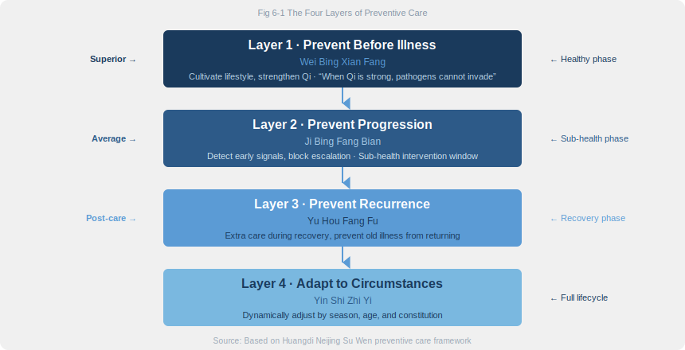

# Chapter 6 · The Art of Not Getting Sick

> 是故圣人不治已病治未病，不治已乱治未乱。夫病已成而后药之，乱已成而后治之，譬犹渴而穿井，斗而铸锥，不亦晚乎。
> *Shì gù shèng rén bù zhì yǐ bìng zhì wèi bìng, bù zhì yǐ luàn zhì wèi luàn. Fū bìng yǐ chéng ér hòu yào zhī, luàn yǐ chéng ér hòu zhì zhī, pì yóu kě ér chuān jǐng, dòu ér zhù zhuī, bù yì wǎn hū.*
>
> "Therefore the sage does not treat illness after it appears, but before. Does not treat disorder after it erupts, but before. To medicate after disease has formed, to intervene after chaos has erupted — this is like digging a well when you're already thirsty, forging weapons after the battle has begun. Is it not too late?"
>
> — *Su Wen*, Chapter 2 (四气调神大论)

## 6.1 The Physician Who Walked Away

The *Han Feizi*, a Legalist classic from the third century BC, preserves a parable that has echoed through Chinese culture for over two thousand years.

The renowned physician Bian Que visited the King of Cai. He stood in the great hall, observed the king for a moment, and spoke: "Your Majesty has an illness in the surface of the skin. If left untreated, it will go deeper." The king waved him off. "I am perfectly fine." After Bian Que left, the king told his attendants with a sneer: "Doctors love diagnosing illness in healthy people just to take credit for the cure."

Ten days later, Bian Que returned. "Your illness has entered the flesh. It will worsen without treatment." The king ignored him. Another ten days. "The illness is now in your stomach and intestines." The king sat in silence.

Ten more days passed. Bian Que saw the king from a distance, turned around, and walked away. The king sent a messenger to ask why. Bian Que's answer: "When illness is in the skin, hot compresses can reach it. In the flesh, acupuncture can reach it. In the organs, herbal decoctions can reach it. But now it has entered the bone marrow. This is the domain of fate itself. There is nothing I can do."

Five days later, the king collapsed in pain and died.

Han Feizi told this story to make a political point: deal with threats while they are still small. The *Su Wen* applied the same logic to medicine — **the sage does not treat illness after it appears, but before.** To medicate after disease has formed is like digging a well after you are already dying of thirst. Too late.

Twenty-five centuries later, the parable still cuts deep. A fasting blood sugar of 6.0 on a check-up report, filed away in a drawer. Three months of low back pain, masked with ibuprofen. Waking at 3 AM night after night, dismissed as "work stress." We are not lacking warnings. We have bloodwork, imaging, wearable data, doctor's notes. What we lack is what the king lacked: the willingness to face the problem.

---

## 6.2 Three Tiers of Doctors: Superior, Average, Inferior

The Neijing measures a physician's skill not by how severe a disease they can cure, but by how early they can intervene.

**上工 (shàng gōng) — The Superior Doctor** treats what is not yet sick. Before disease forms, this physician is already adjusting constitution, strengthening resilience, and eliminating risk. You may never realize how skilled they are, because under their care you simply do not fall ill.

**中工 (zhōng gōng) — The Average Doctor** treats emerging illness. When you start feeling that "something is off," this physician has already stepped in.

**下工 (xià gōng) — The Inferior Doctor** treats established disease. They fight symptoms, manage crises, and perform emergency rescues after the damage is done.

Why is this ranking counterintuitive? Because the superior doctor's work looks the least "medical." No life-or-death moments on the operating table. No dramatic comeback stories. Patients may feel the doctor did nothing at all. That is precisely the highest achievement: **the best medical intervention is the one that makes medical intervention unnecessary.**

Take the thought one step further. What does modern Western medicine celebrate most? Emergency rooms, surgical theaters, ICUs, oncology wards. In the Neijing's framework, all of these fall under 下工. Emergency medicine matters — it saves lives every day. But the structural problem is clear: healthcare systems pour the most resources, the most advanced technology, and the brightest minds into the downstream end of disease, while upstream prevention remains neglected.

The data backs this up. CDC statistics show that every $1 invested in prevention saves $5.60 in treatment costs. Chronic diseases account for 90% of U.S. healthcare spending, yet 80% of heart disease, stroke, and type 2 diabetes cases are preventable through lifestyle changes. Globally, healthcare systems are paying the bill for 下工 while the 上工 approach sits on the shelf.

The Lifestyle Medicine movement now emerging worldwide — exercise prescriptions, nutritional interventions, stress management, sleep optimization — is walking the same path 上工 walked. Twenty-five centuries later, modern medicine is finally learning to move upstream.

---

## 6.3 The Four Layers of Prevention

治未病 (zhì wèi bìng) does not simply mean "prevention." The Neijing's preventive philosophy is a four-tier progressive framework covering the full cycle from health through recovery.

**Layer 1 — Prevent Before Illness (未病先防).** You have no symptoms. You feel fine. But the superior doctor is already at work: aligning your circadian rhythm (Chapter 2), calibrating your diet (Chapter 3), regulating your emotions (Chapter 4), maintaining your movement practice (Chapter 5). Everything in the preceding chapters serves this layer. The key scripture: 「正气存内，邪不可干」(*Su Wen*, Ch. 72, 刺法论) — "When righteous Qi is strong within, pathogenic Qi cannot invade."

**Layer 2 — Prevent Progression (既病防变).** Disrupted sleep, fluctuating appetite, low mood, frequent colds. These are not "nothing." They are the illness moving from skin to flesh. The average doctor intervenes here — catching it now, before a small imbalance becomes a named disease. The lesson of Bian Que's parable lives in this layer: the problem was not that there was no cure, but that the window of opportunity was missed.

**Layer 3 — Prevent Recurrence (愈后防复).** You have recovered from an illness. But healed is not the same as strong. The post-recovery period is when the body is most vulnerable, righteous Qi not yet restored, old patterns ready to resurface. This layer demands extra care: lighter meals, emotional stability, adequate rest, a gradual return to activity.

**Layer 4 — Adapt to Circumstances (因时制宜).** Prevention is not a fixed protocol. Guard against wind in spring, heat in summer, dryness in autumn, cold in winter. What works for a twenty-year-old differs sharply from what a sixty-year-old needs. What suits a Qi-deficient constitution may actively harm a Damp-heat type. Prevention must be personalized and dynamic — which is the subject of the next section.

---

## 6.4 Constitutional Types: Know Your Body

The Neijing never believed in one-size-fits-all wellness. Its foundational insight is that every person has a distinct **体质 (tǐ zhì)** — a constitutional type shaped by genetics and accumulated life experience — and what heals one constitution may harm another.

Building on Neijing principles, modern TCM scholar Wang Qi systematized nine basic constitutional types:

| Constitution | Core Traits | Vulnerabilities | Strategy |
|-------------|------------|----------------|----------|
| 平和 Balanced | Energetic, rosy complexion, sleeps well | The goal state | Maintain equilibrium |
| 气虚 Qi-deficient | Fatigues easily, catches colds, speaks softly | Recurrent infections, poor digestion | Tonify Qi, strengthen Spleen |
| 阳虚 Yang-deficient | Always cold, cold extremities, sluggish | Joint pain, edema | Warm Yang, dispel cold |
| 阴虚 Yin-deficient | Dry mouth, hot palms, insomnia | Constipation, night sweats | Nourish Yin, moisten dryness |
| 痰湿 Phlegm-damp | Overweight, soft belly, drowsy | Metabolic syndrome, high lipids | Resolve phlegm, drain dampness |
| 湿热 Damp-heat | Oily face, bitter taste, acne-prone | UTIs, skin conditions | Clear heat, drain dampness |
| 血瘀 Blood-stasis | Dull complexion, dark lips, bruises easily | Cardiovascular disease | Activate blood, resolve stasis |
| 气郁 Qi-stagnant | Depressed mood, chest tightness, sighing | Depression, thyroid issues | Soothe Liver, move Qi |
| 特禀 Allergic | Allergy-prone, sneezing, sensitive skin | Asthma, hives | Boost Qi, stabilize the exterior |

This is **personalized medicine** — the Chinese prototype, twenty-five centuries before "precision health" became a buzzword. The Neijing was already saying that the same food, same exercise, and same climate will produce radically different effects in different bodies. A Yang-deficient person chugging mung bean soup to "clear heat" will only get weaker. A Damp-heat person loading up on warming ginger and dates will only get more inflamed.

Here is how this plays out in practice. Winter arrives, and wellness blogs declare it is time to nourish with warming foods — lamb stew, ginger tea, goji berries. For a Yang-deficient or Qi-deficient person, this advice is sound. But if you are a Damp-heat type, loading up on warming foods in winter does not boost your energy. It triggers mouth ulcers, acne flare-ups, and restless nights. The same bowl of lamb stew, two different bodies, two opposite outcomes.

Today's Precision Medicine Initiative, pharmacogenomics, and personalized nutrition are doing the same thing with gene sequencing and AI algorithms — finding the health strategy that fits *this person*, not *everyone*. Constitutional diagnosis is the Chinese original.

---

## 6.5 The Body's Early Warning System

The Neijing does not just preach prevention as a philosophy. It provides a concrete methodology for reading the body's early signals — before disease has a name.

**Face color.** The *Su Wen* contains a complete Five-Color Diagnosis (五色诊) system. A greenish hue signals Liver distress: pain and anger. Red signals Heart fire: heat and inflammation. Yellow signals Spleen deficiency: dampness and weakness. White signals Lung depletion: cold and Qi deficiency. Dark or blackish signals Kidney exhaustion: deep cold and blood stasis. A glance in the mirror each morning — not checking your looks, checking your color baseline. A single day's change means little. A persistent shift is a signal.

**Pulse quality.** This is the crown jewel of Neijing diagnostics. Precise pulse reading requires years of training, but you can track one simple indicator: place your fingers on your radial artery at rest. A steady, moderate pulse is normal. A thin, weak pulse suggests Qi deficiency. An irregular rhythm warrants a doctor's visit.

**Sleep patterns.** Difficulty falling asleep, frequent night waking, vivid dreams, early waking. Do not dismiss these with "I'm just stressed." In the Neijing framework, sleep disturbance is an early expression of Yin-Yang imbalance.

**Digestion.** Sudden appetite changes, bloating, altered stool patterns. The Neijing designates the Spleen-Stomach as the "root of post-natal life" — digestive anomalies are often the body's earliest systemic distress signal.

**Emotional shifts.** Unexplained irritability, persistent low mood, free-floating anxiety. Emotional changes are not merely psychological events. They are the outward projection of shifting organ Qi.

**Energy trajectory.** You used to power through to 3 PM with sharp focus; now you crash right after lunch. You used to have energy for weekend plans; now you just want to lie down. This gradual downward drift in your baseline means expenditure is outpacing replenishment — what the Neijing calls the precursor to Qi deficiency.

Modern wearable technology is doing the same thing. The Apple Watch's heart rate variability (HRV) monitoring, the Oura Ring's sleep scoring, continuous glucose monitors (CGM) tracking metabolic waves — all of these capture subtle physiological shifts before symptoms appear. The Neijing used a physician's senses and experience. Modern tools use sensors and algorithms. Different means, same goal: **detect the whisper before it becomes a scream.**

---

## 6.6 Where Modern Prevention Meets Ancient Wisdom

Line up the core strategies of modern preventive medicine and they map almost one-to-one onto the Neijing's 治未病 framework.

**Annual health check-ups** → 上工 thinking. A systematic scan of the body's state, catching abnormalities before symptoms emerge.

**Vaccination** → 未病先防. Building immune barriers before pathogens arrive — the technological expression of "when righteous Qi is strong, pathogenic Qi cannot invade."

**Cancer screening** → 既病防变. Early detection, early treatment — blocking the progression from "skin" to "bone marrow."

**Chronic disease management** → 愈后防复. Long-term management of diabetes and hypertension is sustained intervention to prevent spiraling deterioration.

**Lifestyle Medicine** (American College of Lifestyle Medicine) → the complete Neijing methodology. Its six pillars — nutrition, physical activity, sleep, stress management, social connection, and avoidance of risky substances — read like a modern translation of the Neijing's core chapters.

**Blue Zones research.** In *The Blue Zones*, Dan Buettner documented five communities where people live measurably longer — Okinawa, Sardinia, Loma Linda, Nicoya, Ikaria. Their shared habits align with the Neijing: plant-forward diets (Chapter 3), regular low-intensity movement (Chapter 5), deep community bonds (external support for emotional regulation), minimal or no alcohol, and a daily rhythm with purpose. No Blue Zone resident takes supplements, runs marathons, or holds a gym membership. They simply live the life the Neijing described.

**The gut microbiome revolution.** Over the past decade, microbiome research has revealed the gut's profound connections to immunity, mood, and metabolism. The Neijing designated the Spleen-Stomach as the "root of post-natal life" twenty-five centuries ago. Science took the long way around and arrived at the same starting point.

All these modern strategies answer the same question: how do you act before disease arrives? The Neijing answered it in three characters — 治未病. The difference is not in the concept; it is in the system. The Neijing wove scattered strategies into a unified preventive philosophy. Modern medicine is reassembling the pieces.

---

## 6.7 Daily Practice: Your Personal Prevention Protocol

治未病 is not a grand philosophical declaration. It is a set of daily, actionable behaviors.

**Weekly body scan.** Every Sunday evening, spend five minutes reviewing seven dimensions: energy level (1–10), sleep quality, digestive state, emotional baseline, pain or discomfort, skin condition, motivation to move. Precision is not the point — awareness is. If any dimension trends downward for two consecutive weeks, you have found your "skin-level signal." Record weekly scores in a phone note. After a month, trends tell you far more than any single number.

**Seasonal prevention adjustments.** Spring: prioritize Liver care — spend time outdoors, keep emotions flowing, eat lighter. Summer: protect the Heart — avoid extreme heat, take midday rest, include bitter foods. Autumn: nourish the Lung — moisturize, eat pears and lily bulb, guard against excessive grief. Winter: preserve the Kidney — sleep earlier, eat warming foods, reduce energy-draining activities. Pay special attention during seasonal transitions. These are the periods when the body is most vulnerable to imbalance and "skin-level signals" appear most frequently.

**The 70% Rule.** The Neijing's "leave room" philosophy permeates every domain: eat to 70% full, exercise to 70% capacity, work to 70% fatigue. Never push any resource to its limit. In Okinawa — one of the world's longest-lived communities — there is a phrase: *Hara Hachi Bu*, eat until 80% full and stop. The principle is identical.

**Build health reserves.** The Neijing conceptualizes life energy in three tiers: 精 (Jīng, essence), 气 (Qì, vitality), and 神 (Shén, spirit). The advanced prevention strategy is to actively deposit into these accounts during good times. Regular sleep accumulates Jīng, moderate exercise cultivates Qì, joyful engagement nourishes Shén. When challenge arrives, you have reserves to draw on instead of running on deficit.

Think of it as an emergency fund in personal finance: you do not wait until you have lost your job to start saving. The time when your body feels strongest is precisely when you should be banking health capital.

**When to self-adjust, when to see a doctor.** Mild sleep disruption, brief digestive discomfort, occasional mood swings — if these return to normal within a week or two through lifestyle adjustments, self-regulation is working. But if signals persist beyond two weeks, intensify, or present as symptoms you have never experienced, do not hesitate. See a physician. The wisdom of 上工 is not a replacement for professional care. It is a way to reduce the need for it.

---

## 6.8 Reflection Moment: Are You Preventing, or Waiting?

Ask yourself three questions.

**When was the last time you proactively paid attention to your health while feeling perfectly fine?** If the answer is "I can't remember," your current mode is 下工 — reactive, not preventive.

**Can you name your top three health risk factors right now?** Family history, sedentary habits, chronic sleep debt, emotional stress, dietary monotony. If you have no map of your own risk landscape, prevention has no coordinates. Risk awareness is where 上工 thinking begins.

**Do you have a sustainable health baseline?** Not a burst of gym enthusiasm that fades in two weeks, but a minimum viable health habit you could maintain for ten years. Walking 6,000 steps a day. Lights out by 11 PM. Vegetables at every meal.

The starting point of 治未病 is not knowledge, not technology, not supplements. It is **awareness**. Awareness of your body. Awareness of which direction risk is heading. Awareness of when the moment to change has arrived. Bian Que saw the illness in the king's skin. The king refused to see it in himself. That refusal was more fatal than the disease.

Try this right now. Close your eyes and scan your body from head to toe. Where is there tension? Where is there fatigue? Where is there a dull ache you have been ignoring? When was the last time you did this? If the answer is "never," that is your starting point.

---

### Today's Actions

- ⚡ Pull up your most recent health check-up. Find one metric at the "high-normal" or "borderline" range — that is your early warning signal.
- ⚡ Take 30 seconds for a full body scan: energy, sleep, digestion, mood, pain — rate each 1–5. Write it down.
- 🔄 Starting this week, do a "Five-Dimension Body Scan" every Sunday evening for 4 weeks to establish your baseline.

### 21-Day Micro-Experiment

**"The Early Warning Tracker"** — Pick one recurring body signal you have noticed recently (afternoon energy crash, post-meal bloating, morning bitter taste, trouble falling asleep). Track its intensity (0–5) every day for 21 days, alongside that day's key variables: sleep duration, meals, exercise, and mood. After 21 days, look for correlations — under what conditions does the signal intensify? Under what conditions does it fade?

### Evidence Strength Ratings

| Neijing Principle | Evidence Level | Notes |
|-------------------|---------------|-------|
| The superior doctor treats before illness (prevention is the highest medicine) | ✓ Confirmed | CDC data: every $1 in prevention saves $5.60 in treatment; lifestyle interventions can prevent 80% of cardiovascular disease |
| Nine constitutional types (personalized wellness) | ? Plausible hypothesis | Wang Qi's constitution theory is widely used in TCM, but lacks large-scale RCT validation within Western medical frameworks |
| "When righteous Qi is strong, pathogenic Qi cannot invade" | ? Plausible hypothesis | The principle that robust immune function reduces infection risk is sound, but the precise mapping of "righteous Qi" to immunological metrics remains under study |
| Facial color / pulse as early warning | ? Plausible hypothesis | Some facial diagnostic findings correlate with modern diagnoses (e.g., pallor and anemia), but systematic validation is incomplete |

---

## 6.9 Summary & Bridge to Chapter 7

Prevention is the supreme directive of the *Huangdi Neijing*. Everything in the preceding five chapters — circadian rhythm, dietary harmony, emotional cultivation, movement and stillness — converges on a single principle: **do not wait until you are sick to act.** It is not a technique. It is an attitude: attentive to the body, respectful of risk, committed to balance.

Look closely at all these principles and a deeper structure emerges. Rhythm follows the rhythm of Yin and Yang. Food carries thermal natures — cold, hot, warm, cool. Emotions rise and fall between organs in complementary pairs. Movement seeks balance between action and stillness. Every wellness principle in this book points to the same meta-principle — **Yin and Yang**.

The first five chapters showed you *how*. This chapter answered *why*. The next chapter reveals the underlying principle that governs it all.

In the next chapter, we enter the Neijing's ultimate philosophy: the Way of Yin and Yang. This is not mysticism. It is not abstract metaphysics. It is a startlingly practical thinking framework that explains why balance is never static, why health is a dynamic process, and how to apply this 2,500-year-old "unified field theory" to the texture of everyday life.

---

## References

1. **Anonymous.** *Huangdi Neijing Su Wen*, Chapters 2 (四气调神大论) and 72 (刺法论) — Core source texts for the 治未病 doctrine.
2. **Han Fei.** (c. 233 BC). *Han Feizi*, "Explaining Lao Tzu" (喻老篇): The Parable of Bian Que and King Huan of Cai — Classic fable illustrating the four-stage disease progression.
3. **Trust for America's Health.** (2024). "Prevention for a Healthier America." — CDC data on cost-effectiveness of prevention; every $1 in prevention saves $5.60.
4. **Buettner, D.** (2008). *The Blue Zones: Lessons for Living Longer from the People Who've Lived the Longest*. National Geographic. — Lifestyle research on the world's five longest-lived communities.
5. **Wang, Q.** (2005). "Classification and Diagnosis Basis of Nine Basic Constitutions in Chinese Medicine." *Journal of Beijing University of Traditional Chinese Medicine*, 28(4). — Foundational paper on the nine-constitution classification system.
6. **American College of Lifestyle Medicine.** (2024). "The Six Pillars of Lifestyle Medicine." ACLM Position Statement. — Official position on the six pillars of lifestyle medicine.
7. **Rippe, J.M.** (Ed.). (2019). *Lifestyle Medicine*. 3rd edition, CRC Press. — Comprehensive textbook on lifestyle medicine.
8. **Gilbert, J.A. et al.** (2018). "Current understanding of the human microbiome." *Nature Medicine*, 24(4), 392-400. DOI: 10.1038/nm.4517 — Review of gut microbiome and health relationships.
