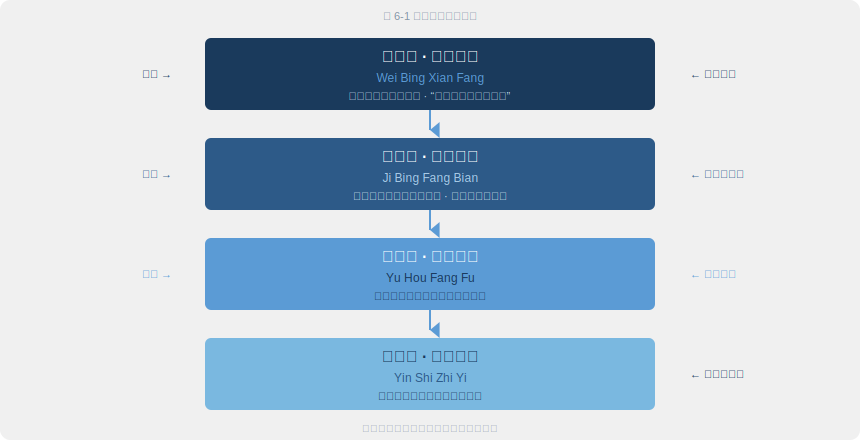

# 第六章 · 治未病

> 是故圣人不治已病治未病，不治已乱治未乱。夫病已成而后药之，乱已成而后治之，譬犹渴而穿井，斗而铸锥，不亦晚乎。
>
> — 《黄帝内经·素问·四气调神大论》

## 6.1 扁鹊见蔡桓公

《韩非子·喻老》记录了一段流传两千多年的对话。

名医扁鹊拜见蔡桓公，站在大殿上观察片刻，开口说："君有疾在腠理，不治将恐深。"桓公摆手："寡人无疾。"扁鹊退下后，桓公对左右冷笑："医生这种人，就喜欢把没病的说成有病来邀功。"

十天后，扁鹊再来。"君之病在肌肤，不治将益深。"桓公不理他。又过十天。"君之病在肠胃，不治将益深。"桓公沉默。

再过十天，扁鹊远远望见桓公，转身就走。桓公派人追问原因。扁鹊只回了几句话："病在腠理，汤熨之所及；在肌肤，针石之所及；在肠胃，火齐之所及。今在骨髓，司命之所属，无奈何也。"

五天后，桓公体痛而亡。

韩非子讲这个故事，不是为了夸扁鹊医术高明。他在说一个治国道理：祸患要在萌芽时解决。《素问·四气调神大论》把同样的逻辑用在了医学上——**圣人不治已病治未病，不治已乱治未乱。** 渴了才挖井，仗打起来才铸兵器，来得及吗？

两千五百年后，这段话仍然扎人。体检报告上空腹血糖 6.0，塞进抽屉。连续三个月腰痛，靠止痛药对付。凌晨三点反复醒来，归结为"最近压力大"。我们不缺警告。我们有体检、有数据、有医嘱。我们缺的是蔡桓公缺的东西：愿意面对问题的勇气。

---

## 6.2 三种医生：上工、中工、下工

内经衡量医术高低的标准，不是你能治多重的病，而是你能在多早的阶段介入。

**上工**（Superior Physician）治未病。疾病还没形成，他已经在调整体质、维护正气、消除风险。你可能永远意识不到他有多厉害，因为在他手上你根本不生病。

**中工**（Average Physician）治欲病。疾病刚冒头，你觉得"最近有点不对劲"，中工已经出手了。

**下工**（Inferior Physician）治已病。疾病完全显现，对抗症状、处理危机、抢救性命。

为什么说这个分级颠覆常识？上工的工作看起来最不像医生。没有手术台上的生死时刻，没有起死回生的戏剧性。他的病人甚至觉得他什么都没做。这恰恰是最高境界：**最好的医疗是让医疗不必发生。**

再想一步。现代西方医学最引以为傲的领域是什么？急诊、外科、ICU、肿瘤治疗。在内经的框架里，这些全部属于"下工"。急诊当然重要，每天都在救命。但问题出在结构上：我们的医疗体系把最多资源、最高技术、最优秀人才投入到了疾病的下游，而上游几乎无人问津。

数据佐证了这个判断。美国疾控中心（CDC）统计显示，预防领域每投入 1 美元，治疗端可以节省 5.60 美元。慢性病占美国医疗支出的 90%，其中 80% 的心脏病、中风和 2 型糖尿病可以通过生活方式干预预防。全球医疗系统都在为"下工"买单，"上工"的思路被搁置一旁。

今天兴起的生活方式医学（Lifestyle Medicine）运动，用运动处方、营养干预、压力管理、睡眠优化来对抗慢性病。这不就是在重走"上工"的路吗？两千五百年后，现代医学终于开始往上游走。

---

## 6.3 治未病的四个层次

"治未病"不等于"预防"二字。内经的预防哲学是一个四层递进框架，覆盖从健康到康复的完整周期。

**第一层：未病先防（Prevent Before Illness）。** 你没有任何症状，身体看起来健康。但上工已经在行动：调作息（第二章）、正饮食（第三章）、理情志（第四章）、勤运动（第五章）。前五章的全部内容服务于这一层。关键经文：「正气存内，邪不可干」（《素问·刺法论》第七十二篇）。正气充足，外邪无隙可乘。

**第二层：既病防变（Prevent Progression）。** 睡眠变差、食欲波动、情绪低落、容易感冒。这些不是"没什么大事"，而是疾病从腠理向肌肤推进的信号。中工在这里出手，及时干预，防止小毛病演变成大疾病。

现代医学有个概念叫"亚健康"（Sub-health）：体检指标正常，但人明显不舒服。内经两千五百年前就为这个灰色地带设计了干预策略。扁鹊的故事警告的就是这一点——不是无药可救，是错过了最佳窗口。

**第三层：愈后防复（Prevent Recurrence）。** 病好了不等于身体强了。大病初愈，正气尚未恢复，旧疾最容易趁虚复发。这一层要求康复期加倍谨慎：饮食清淡、情绪平稳、适度休息、循序恢复。"病来如山倒，病去如抽丝"，这句老话说的就是愈后防复的逻辑。

**第四层：因时制宜（Adapt to Circumstances）。** 预防策略不能一成不变。春天防风，夏天防暑，秋天防燥，冬天防寒。二十岁的预防重点是建设，六十岁的重点是保存。气虚体质和湿热体质的方案截然相反。预防必须个性化、动态化。下一节展开讨论。

---

## 6.4 体质辨识：没有万能养生方案

内经从不认为存在一种放之四海而皆准的养生方法。它反复强调的核心概念是**体质（Constitution）**：先天禀赋与后天积累共同塑造的身体倾向性。

基于内经理论，现代中医学家王琦教授系统总结了九种基本体质类型：

| 体质 | 核心特征 | 易感倾向 | 调养方向 |
|------|---------|---------|---------|
| 平和质 Balanced | 精力充沛、面色红润、睡眠良好 | 目标状态 | 维持平衡 |
| 气虚质 Qi-deficient | 容易疲劳、易感冒、说话声低 | 反复感冒、消化不良 | 补气健脾 |
| 阳虚质 Yang-deficient | 畏寒怕冷、手脚冰凉、精神不振 | 关节冷痛、水肿 | 温阳散寒 |
| 阴虚质 Yin-deficient | 口干咽燥、手足心热、失眠 | 便秘、盗汗 | 滋阴润燥 |
| 痰湿质 Phlegm-damp | 体型偏胖、腹部松软、容易困倦 | 代谢综合征、高血脂 | 化痰祛湿 |
| 湿热质 Damp-heat | 面部油腻、口苦、容易长痘 | 泌尿感染、皮肤病 | 清热利湿 |
| 血瘀质 Blood-stasis | 面色晦暗、嘴唇偏紫、易瘀青 | 心脑血管疾病 | 活血化瘀 |
| 气郁质 Qi-stagnant | 情绪低落、胸闷叹气、失眠多梦 | 抑郁、甲状腺疾病 | 疏肝理气 |
| 特禀质 Allergic | 容易过敏、打喷嚏、皮肤敏感 | 哮喘、荨麻疹 | 益气固表 |

这就是**个性化医学（Personalized Medicine）**的中国原型。同样的食物、运动和气候，在不同体质的人身上效果截然不同。阳虚的人拼命喝绿豆汤清热，只会越喝越虚。湿热的人天天吃桂圆红枣补气，只会越补越上火。

冬天到了，养生公众号说"该进补了"，全办公室一起喝羊肉汤、泡枸杞。在九种体质的框架下，这个建议只对阳虚质和气虚质成立。湿热质的人冬天大量进补温热食物，等来的不是精力充沛，而是口腔溃疡、痤疮爆发、夜不安眠。同一碗羊肉汤，不同的身体，不同的结局。

如今的精准医学（Precision Medicine）、药物基因组学（Pharmacogenomics）和个性化营养（Personalized Nutrition）用基因测序和 AI 算法做同样的事：找到适合"这个人"而非"所有人"的方案。体质辨识，是精准健康的中国原型。

---

## 6.5 未病的信号：身体在低声说话

内经教的不只是"预防"的理念，更是一套识别早期预警信号的具体方法。

**面色。** 《素问·脉要精微论》记载了完整的"五色诊"（Five-Color Diagnosis）系统。青色主肝，对应疼痛和愤怒。赤色主心，对应热证。黄色主脾，对应虚弱和湿气。白色主肺，对应寒证和气虚。黑色主肾，对应寒极和血瘀。清晨洗脸时看一眼镜子，不是看美丑，是看颜色基调有没有变化。偶尔一天的波动不算数，持续性的偏移才是信号。

**脉象。** 这是内经诊断体系的核心。精准把脉需要专业训练，但你可以关注一个简单指标：安静时手指放在手腕桡动脉处，感受脉搏力度和节律。平稳有力是正常，细弱无力提示气虚，节律紊乱应该就医。

**睡眠。** 入睡困难、夜间频繁醒来、多梦、早醒。不要用"压力大"三个字打发这些信号。在内经看来，睡眠障碍是阴阳失调（Yin-Yang Imbalance）的早期表达。

**消化。** 食欲突然变化、腹胀、大便性状改变。内经以脾胃为后天之本，消化系统异常往往是全身失衡的最早信号。

**情绪。** 无缘由的烦躁、持续的低落、莫名的焦虑。情绪变化不仅是心理事件，更是脏腑气机变化的外在投射。

**精力波动。** 你以前下午三点还能集中注意力，现在午饭后就犯困到无法思考。以前周末有精力社交，现在只想躺着。这种基线的下移，说明消耗正在超过补给。内经称之为"气虚"（Qi Deficiency）的前兆。

现代可穿戴设备在做同一件事。Apple Watch 的心率变异性（HRV）监测、Oura Ring 的睡眠评分、连续血糖监测仪（CGM）的波动曲线，都在捕捉症状出现之前的微妙生理变化。内经用医者的感官和经验，现代用传感器和算法。手段不同，目标相同：**在低语变成尖叫之前，听到身体的声音。**

---

## 6.6 古今交汇：现代预防医学与治未病

把现代预防医学的核心策略逐一展开，它们几乎可以一一映射到内经的治未病体系。

**年度体检** → 上工思维。每年系统审视身体状态，在症状出现之前发现异常。

**疫苗接种** → 未病先防。疾病到来之前建立免疫屏障。"正气存内，邪不可干"的现代科技版本。

**癌症筛查** → 既病防变。早发现、早治疗，阻断从"腠理"到"骨髓"的进程。

**慢病管理** → 愈后防复。糖尿病、高血压的长期管理，就是防止反复恶化的持续干预。

**生活方式医学**（American College of Lifestyle Medicine）→ 完整的内经方法论。它的六大支柱是饮食、运动、睡眠、压力管理、社交连接、减少有害物质。翻译成内经的语言，就是前五章的内容。

**蓝区研究（Blue Zones）。** Dan Buettner 在《蓝区》中记录了全球五个最长寿的社区：冲绳、撒丁岛、洛马琳达、尼科亚、伊卡里亚。他们的共同点与内经高度一致：植物为主的饮食（第三章）、规律的体力活动（第五章）、紧密的社区关系（情志调节的外部支撑）、适度或不饮酒、生活有节奏有目标。没有一个蓝区居民在吃补剂、跑马拉松或买健身房年卡。他们只是在过内经描述的那种生活。

**肠道微生物组革命（Gut Microbiome Revolution）。** 近十年的微生物组研究揭示了肠道菌群与免疫、情绪、代谢之间的深层联系。内经两千五百年前就把脾胃定义为"后天之本"。科学绕了一大圈，回到了同一个起点。

这些现代策略最终都在回答同一个问题：如何在疾病发生之前采取行动？内经用四个字回答——治未病。区别不在理念，在系统性。内经把散落的策略编织成统一的预防哲学，现代医学正在把它们重新拼凑起来。

---

## 6.7 日常实践：你的个人预防方案

治未病不是宏大的哲学宣言，而是可以落地的日常行为。

**每周身体扫描。** 每周日晚上花五分钟，回顾七个维度：精力水平（1-10 分）、睡眠质量、消化状态、情绪基调、疼痛或不适、皮肤状态、运动意愿。不需要精确打分，觉察本身就是治未病的第一步。连续两周某个维度持续走低？这就是你的"腠理信号"。用手机备忘录记录每周评分，一个月后回看趋势，比单次数字更有价值。

**季节性预防调整。** 春季疏肝：多户外、情绪舒展、饮食清淡。夏季养心：避暑、午休、适量苦味食物。秋季润肺：保湿、多梨百合、节制悲伤。冬季藏肾：早睡晚起、温补饮食、减少消耗性活动。换季期间格外留心，季节转换是身体最容易失衡的窗口，也是"腠理信号"出现最频繁的时候。

**七分饱原则。** 内经的"留有余地"哲学渗透在所有维度：吃到七分饱，练到七分力，工作到七分累。永远不要把任何资源耗到极限。日本冲绳有个词叫"腹八分"（Hara Hachi Bu），吃到八分饱就停。冲绳是世界上最长寿的地区之一，这个理念与内经完全相通。

**建立健康储备。** 内经将生命能量概括为精、气、神三个层次。治未病的高级策略是在身体状态好的时候主动储蓄：规律睡眠积蓄精，适度运动培育气，精神愉悦涵养神。当挑战来临时，你有储备可消耗，而不是在赤字状态下硬撑。

这和财务管理中的应急基金是同一个逻辑：你不会等失业了才开始存钱。在身体状态最好的时候，正是最该"存健康"的时候。

**何时自调，何时就医。** 轻微的睡眠波动、短暂的消化不适、偶尔的情绪起伏，如果一两周内通过生活方式调整恢复正常，这是自调的范畴。但信号持续超过两周、强度加重、或出现从未有过的新症状，不要犹豫，去看医生。上工的智慧不是替代就医，是减少不必要的就医。

---

## 6.8 反思时刻：你在预防，还是在等待？

问自己三个问题。

**你最近一次在没有任何症状时主动关注健康，是什么时候？** 答案是"想不起来"的话，你目前的模式是下工式的——等问题出现才反应。

**你能说出自己当前最大的三个健康风险因素吗？** 家族病史、久坐、长期缺觉、慢性情绪压力、饮食单一。如果你对自己的风险地图一无所知，预防无从谈起。风险意识是上工思维的起点。

**你有一个可持续的健康基线吗？** 不是某次心血来潮的健身打卡，而是一个你能坚持十年的最低限度健康习惯。每天走 6,000 步。每晚 11 点前入睡。每顿饭有蔬菜。

治未病的起点不是知识，不是技术，不是补剂。是**觉察**。觉察身体的状态，觉察风险的方向，觉察改变的时机。扁鹊看到了蔡桓公腠理之疾，桓公却拒绝觉察自己的身体。拒绝觉察，比疾病本身更致命。

试一下。现在闭上眼睛，从头顶到脚底扫描一遍你的身体。哪里紧张？哪里疲惫？哪里有隐隐的不适？你上次这样做是什么时候？如果答案是"从来没有"，这就是你的起点。

---

### 今日行动

- ⚡ 打开最近一次体检报告，找出一项处于"正常偏高"或"临界"的指标。这就是你的预警信号。
- ⚡ 用 30 秒做一次全身扫描：精力、睡眠、消化、情绪、疼痛，每项 1-5 分，记下来。
- 🔄 从本周起，每周日晚上做一次"五维身体扫描"，连续做 4 周，建立基线。

### 21 天微实验

**"预警信号追踪"**——选择身体最近最常出现的一个小信号（午后犯困、饭后胀气、晨起口苦、入睡困难），连续 21 天每天记录强度（0-5 分）和当天的生活变量（睡眠时间、进食、运动、情绪）。21 天后寻找关联：什么条件下信号变强？什么条件下减弱？

### 证据强度标注

| 内经原则 | 证据等级 | 说明 |
|---------|---------|------|
| 上工治未病（最高医术是预防）| ✓ 已证实 | CDC 数据：预防每投入 $1 节省 $5.60；生活方式干预可预防 80% 的心血管病 |
| 九种体质（个性化养生）| ? 合理假说 | 王琦体质学说在中医界广泛应用，但缺乏大规模 RCT 验证 |
| 正气存内邪不可干 | ? 合理假说 | 免疫功能强则不易感染的原则正确，但"正气"与免疫力的精确映射仍在研究中 |
| 面色/脉象早期预警 | ? 合理假说 | 部分面诊发现与现代诊断有相关性（如面色苍白与贫血），系统性验证不足 |

---

## 6.9 总结与过渡

治未病是整部《黄帝内经》的最高纲领。前五章讲的一切——时间节律、饮食调和、情志养护、运动导引——最终汇聚到一个核心：**不要等到病了才行动。** 它不是一项技术，而是一种态度：对身体保持觉察，对风险保持敬畏，对平衡保持追求。

仔细回看这些原则，你会发现它们共享一个更深的结构。节律是阴阳的节律。食物有寒热温凉之分。情绪在脏腑间此消彼长。运动在动与静之间寻找平衡。每一条养生法则，最终都指向同一个元原理——**阴阳**。

前五章告诉你怎么做。这一章回答了为什么要做。下一章揭示的是这一切背后的原理。

下一章进入内经的终极哲学：阴阳之道。这不是玄学，不是神秘主义，而是一个惊人实用的思维框架。它解释了为什么平衡不是静止，为什么健康是一个动态过程，以及如何在日常生活中运用这个两千五百年前的"统一场论"。

---

## 参考文献

1. **佚名。** 《黄帝内经·素问》第 2 篇（四气调神大论）、第 33 篇（评热病论）— 治未病核心经文出处。
2. **韩非。** (约前 233). 《韩非子·喻老篇》：扁鹊见蔡桓公 — 疾病四阶段递进的经典寓言。
3. **Trust for America's Health.** (2024). "Prevention for a Healthier America." — CDC 预防投入成本效益数据，预防每投 $1 节省 $5.60。
4. **Buettner, D.** (2008). *The Blue Zones: Lessons for Living Longer from the People Who've Lived the Longest*. National Geographic. — 全球五大长寿社区的生活方式研究。
5. **Wang, Q.** (2005). "Classification and Diagnosis Basis of Nine Basic Constitutions in Chinese Medicine." *Journal of Beijing University of Traditional Chinese Medicine*, 28(4). — 九种体质分类系统的奠基论文。
6. **American College of Lifestyle Medicine.** (2024). "The Six Pillars of Lifestyle Medicine." ACLM Position Statement. — 生活方式医学六大支柱的官方立场声明。
7. **Rippe, J.M.** (Ed.). (2019). *Lifestyle Medicine*. 3rd edition, CRC Press. — 生活方式医学综合教材。
8. **Gilbert, J.A. et al.** (2018). "Current understanding of the human microbiome." *Nature Medicine*, 24(4), 392-400. DOI: 10.1038/nm.4517 — 肠道微生物组与健康关系的综述。
