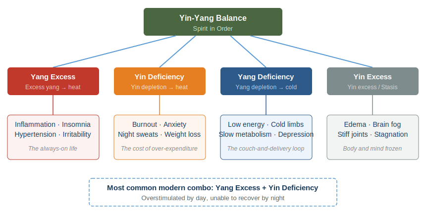

# Chapter 7 · Balance, Not Perfection

> 阴平阳秘，精神乃治；阴阳离决，精气乃绝。
> *Yīn píng yáng mì, jīng shén nǎi zhì; yīn yáng lí jué, jīng qì nǎi jué.*
>
> "When Yin is calm and Yang is secure, the spirit is in order. When Yin and Yang separate, the vital essence is exhausted."
>
> — *Su Wen*, Chapter 3 (生气通天论)

## 7.1 When Wellness Becomes Illness

In 1997, American physician Steven Bratman published a short article in *Yoga Journal*. He described a pattern he had observed in himself and his patients: some people's fixation on "healthy eating" had grown severe enough to damage their physical and mental health. He coined a term for it — orthorexia nervosa.

Bratman was not writing as a detached observer. In the late 1970s, he worked as a cook on an organic farm in upstate New York. He ate only vegetables pulled straight from the soil, refused all processed food, and policed every ingredient with religious intensity. His diet grew ever "purer." His social circle shrank. His anxiety deepened. Then one day it hit him: the pursuit of dietary purity had itself become a mental cage. His "healthy lifestyle" was making him sick.

Two decades later, the pattern had spread. In 2016, Bratman and psychologist Thomas Dunn published a comprehensive literature review examining all existing research on orthorexia. They found that prevalence rates ran significantly higher among groups that prized health — fitness trainers, nutrition students, yoga practitioners — than in the general population. The Quantified Self movement had spawned its own recognized side effect: data anxiety, where any metric drifting from its "optimal" value triggers panic.

How does pursuing health end up damaging it?

The *Huangdi Neijing* hinted at the answer twenty-five centuries ago. Its core prescription is not "find the optimal parameters and lock them in." It is six characters: **阴平阳秘，精神乃治.** Yin "calm" — settled, not maximized. Yang "secure" — contained, not pushed to peak intensity. The keyword is not "optimal." It is "harmony."

Health is not a number you can pin down. It is a living path that adjusts constantly between two poles.

---

## 7.2 Yin-Yang Demystified

For many people, the words "Yin and Yang" conjure images of Taiji symbols, feng shui compasses, or martial arts mysticism. That layer of esoteric associations buries what is, in fact, an extremely practical thinking tool.

The essence of Yin-Yang is simple. Four observations about how nature works. Nothing more.

**Everything has complementary opposites.** There is day and there is night, inhale and exhale, work and rest. Not philosophical speculation — a description of observable reality.

**The opposites are interdependent.** Without the contrast of night, the concept of "day" would not exist. Without rest as a baseline, activity loses its meaning. Yin cannot exist without Yang. Yang cannot exist without Yin.

**The opposites transform into each other.** Summer pushed to its extreme becomes autumn and winter. Activity pushed to its extreme demands stillness. Reversal at the extreme is not moral advice — it is natural law.

**The opposites exist in dynamic balance.** This balance does not mean a perfectly level scale. It means a seesaw in constant, rhythmic motion — tilting one way, then the other, never still.

| Yin (阴) | Yang (阳) |
|----------|----------|
| Rest | Activity |
| Night | Day |
| Cool | Warm |
| Receiving | Giving |
| Conserving | Expending |
| Nourishing | Transforming |
| Winter | Summer |
| Solitude | Social |

*Su Wen*, Chapter 5 declares: 「阴阳者，天地之道也，万物之纲纪，变化之父母，生杀之本始。」— "Yin and Yang are the Way of heaven and earth, the guiding principles of all things, the parents of all change, the root and beginning of life and death."

This is not a claim about supernatural forces. It is the assertion that dynamic interplay between complementary opposites is the operating logic behind all natural processes.

The Neijing uses Yin-Yang for clinical diagnosis. When a person falls ill, the first question is not "What disease is this?" but "Where has the Yin-Yang balance shifted?" By 500 BCE, that kind of systems thinking was already well developed.

---

## 7.3 The Four Imbalances

When Yin-Yang drifts out of equilibrium, it takes one of four patterns. Understanding them gives you a diagnostic framework for reading your own state.

**Yang Excess (阳亢, yáng kàng)** Yang energy running too hot — an engine red-lining. Inflammation, insomnia, high blood pressure, irritability, flushed face and red eyes. In today's world, this is the "always on" person: packed schedules, constant stimulation, adrenaline powering everything. The system is overheating.

**Yin Deficiency (阴虚, yīn xū)** The reserves that nourish and repair have been depleted. This often appears alongside Yang Excess — burn too hot and the fuel runs out. Bodily dryness, anxiety, night sweats, weight loss, palpitations. The body's overdraft alarm going off after months of 3 AM finishes and caffeine-fueled mornings.

**Yang Deficiency (阳虚, yáng xū)** Vital energy insufficient, like a flame barely flickering. Cold extremities, low spirits, sluggish metabolism, depressive tendencies. The opposite extreme: the inertial loop of couch, delivery food, and phone scrolling. The body has lost its capacity to ignite.

**Yin Excess / Cold Stagnation (阴亢/寒凝, yīn kàng / hán níng)** Cold and stagnation have congealed the system. Edema, weight gain, mental fog, stiff joints. The body becomes standing water, having lost its will to flow.

Here is the paradox of modern life: most people suffer from **two imbalances simultaneously** — Yang Excess plus Yin Deficiency. Daytime means overstimulation: information bombardment, back-to-back meetings, caffeine. Nighttime brings no real recovery: blue light, shallow sleep, anxious rumination. The accelerator is floored while the fuel tank hits empty. This is the Yin-Yang reading of the contemporary burnout epidemic.

---

## 7.4 Homeostasis, Allostasis, and the Neijing

Think Yin-Yang is merely an ancient metaphor? Modern biology may change your mind.

In 1932, American physiologist Walter Cannon introduced the concept of **homeostasis** in his book *The Wisdom of the Body*. The body maintains stable internal conditions through feedback mechanisms: temperature, blood sugar, pH, blood pressure — all locked within narrow ranges. This is virtually the same idea as "Yin calm, Yang secure," rendered in a different language.

Homeostasis has a blind spot, though. It implies that balance is static, like a thermostat locked at 22°C. In 1988, neuroscientist Peter Sterling and physiologist Joseph Eyer proposed **allostasis**: the body does not maintain fixed set points but continuously adjusts its targets in response to the environment. Heart rate rises and cortisol spikes under stress — that is not "imbalance" but active adaptation. Balance itself is dynamic.

This is the core insight of Yin-Yang theory: balance is not stillness. It is rhythmic oscillation.

Sterling also introduced **allostatic load**. When the body is forced into prolonged adaptive adjustment, the cumulative cost of that adjustment becomes damage — chronic inflammation, immune suppression, accelerated organ aging. The Neijing's warning maps directly: 「阴阳离决，精气乃绝」— when the dynamic regulatory system of Yin and Yang itself breaks down, vital energy is exhausted.

One more concept resonates powerfully: **hormesis**. Small doses of stress strengthen the system. Cold water immersion, intermittent fasting, high-intensity exercise — all mild disruptions that activate the body's repair capacity. In Yin-Yang language: moderate Yang (challenge) stimulates Yin (repair), making the whole system more resilient.

The Neijing did not use modern terminology. But it grasped the same truth: balance is not rigid maintenance. It is elastic responsiveness.

---

## 7.5 Yin-Yang in Your Daily Life

Yin-Yang is not just theory. You can apply it to everyday decisions starting today.

**Work and rest.** Focused work is Yang — expending energy, producing output. Rest is Yin — restoring energy, absorbing and integrating. A critical distinction: scrolling social media, organizing to-do lists, listening to business podcasts — these are still Yang. Staring out a window, walking with no destination, sitting quietly with your phone off — that is Yin. Real Yin-phase rest means letting the mind go fully offline.

**Social and solitude.** Social activity is Yang — projecting energy outward. Solitude is Yin — drawing attention inward. Even the most extroverted person needs solitude to digest experience. Even the most introverted person needs social connection to activate vitality. Which side carries the bigger deficit for you?

**Exercise and recovery.** Training is Yang — it tears muscle fibers. Recovery is Yin — it repairs and rebuilds them stronger. Training without recovery is not discipline; it is self-harm. Overtraining syndrome is the athletic version of 阴阳离决.

**Stimulation and stillness.** Information intake is Yang: news, social media, podcasts, video. Reflection is Yin: letting information settle, integrate, and form your own thoughts. We consume hundreds of times more information daily than we did twenty years ago. How much time do we allocate for digestion? Close to zero.

**Eating.** Warm, nourishing food is Yang — replenishing energy, warming the body. Light, simple food is Yin — cleansing the system, reducing burden. You do not need to eat "perfectly" all the time. Respond to what your body asks for in the moment.

**Seasons.** Expand outward in spring and summer (Yang) — more outdoor activity, socializing, earlier rising. Contract inward in autumn and winter (Yin) — more indoor quiet, solitude, earlier sleep. The seasonal wellness practices from Chapter 2 are, at their core, following the natural Yin-Yang rhythm of the year.

One pattern worth facing: **modern life carries a massive Yin deficit.** Our culture worships Yang — productivity, hustle, stimulation, growth, "always be shipping." Rest is called laziness. Solitude is called antisocial. Doing nothing is called wasting your life. Yin-Yang theory replies bluntly: without Yin to sustain it, Yang becomes a rootless fire. The brighter it burns, the faster it dies.

---

## 7.6 Harmony, Not Perfection

What happened to Bratman? He became a family physician and spent two decades helping patients caught in the same trap he had escaped. His core lesson: the problem was never the pursuit of health. The problem was when that pursuit became another compulsion. The tool had turned on its user.

*Su Wen*, Chapter 1 prescribed the antidote long ago:

> 法于阴阳，和于术数，食饮有节，起居有常，不妄作劳，故能形与神俱，而尽终其天年，度百岁乃去。
> *Fǎ yú yīn yáng, hé yú shù shù, shí yǐn yǒu jié, qǐ jū yǒu cháng, bù wàng zuò láo, gù néng xíng yǔ shén jù, ér jìn zhōng qí tiān nián, dù bǎi suì nǎi qù.*
>
> "Model on Yin and Yang, harmonize with the arts of calculation, moderate food and drink, regularize daily life, and do not overexert recklessly — and so body and spirit remain whole, living out the natural span, departing at a hundred years."

Look at the word choices. 法于阴阳 — *model on* Yin-Yang's patterns, not *control* them. 和于术数 — *harmonize* with methods, not be *enslaved* by them. 有节 — with moderation, not calculated to decimal points. 有常 — with regularity, not timed to the minute. 不妄作劳 — don't *recklessly* exhaust yourself, but it doesn't say "never exert."

The keyword of this entire passage is **和** (hé) — harmony. Not **完** (wán) — perfection.

Modern society has coined clinical names for the pathology of over-optimization. Orthorexia — an obsessive fixation on "clean eating." Exercise addiction — turning fitness into self-punishment. Sleep anxiety — when monitoring sleep quality is precisely what causes insomnia. The dark side of the Quantified Self — data tracking that becomes data dread.

Yin-Yang thinking offers a simple remedy: **being roughly right is healthier than being precisely right.** Allow fluctuation. Allow drift. An occasional dinner that is not nutritionally ideal will not break anything, as long as the overall rhythm holds. The seesaw tilts — that is fine. It comes back.

---

## 7.7 Daily Practice: The Yin-Yang Audit

Spend five minutes each week on a Yin-Yang audit. No app required, no data needed — just honest self-awareness.

**Step 1: Overall sense.** Was this week more Yang (doing a lot, high expenditure, heavy stimulation) or more Yin (doing less, low drive, feeling stagnant)?

**Step 2: Six-domain scan.**

| Domain | Yang-leaning signals | Yin-leaning signals |
|--------|---------------------|---------------------|
| Work | Overtime, packed tasks, breathlessness | Procrastination, no motivation, emptiness |
| Exercise | Too many intense sessions, body aching | Didn't move all week, body stiff |
| Social | Too many obligations, social fatigue | No meaningful connection all week |
| Food | Greasy/spicy, overeating | No appetite, monotonous diet |
| Sleep | Trouble falling asleep, vivid dreams, early waking | Oversleeping, can't get up, more tired after rest |
| Screens | Dry eyes, scattered attention | Boredom, hollowness |

**Step 3: Write the prescription.**

Yang-heavy week (over-expenditure)? Write a "Yin prescription": go to bed an hour earlier, cancel one unnecessary social event, walk instead of run, eat a simple light meal, sit for ten minutes with your phone off.

Yin-heavy week (stagnation)? Write a "Yang prescription": go outside and get sunlight, call a friend, do one workout that makes you sweat, eat a warm hearty meal, tackle one task you have been putting off.

This is not precision medicine. It is the simplest form of self-awareness — sensing the tilt and gently correcting. The art of the seesaw.

---

## 7.8 Reflection Moment

Close the book. Close your eyes. Ask yourself: **Right now, where does my Yin-Yang lean?**

Yang Excess — system overheating, unable to stop? Yin Deficiency — reserves depleted, running on willpower alone? Yang Deficiency — flame barely flickering, unable to summon the energy to start? Or perhaps two at once — burning too hard by day, unable to recover by night?

No rush for an answer. Asking the question is itself the beginning of balance. Because awareness is Yin.

---

### Today's Actions

- ⚡ Review the past week: was your life more Yang (busy, stimulated, social, output-heavy) or more Yin (quiet, restful, solitary, input-heavy)? Recognizing the imbalance is the first step toward correcting it.
- ⚡ If the answer is "too Yang" (true for most modern people), schedule 30 minutes of pure "Yin time" tonight — no screens, no socializing, no learning. Just sitting quietly or walking with no destination.
- 🔄 This week, try "Yin-Yang Work Cycles": after every 90 minutes of focused work (Yang), take 15 minutes of genuine rest (Yin) — not phone scrolling, but eyes closed, stretching, or staring out the window.

### 21-Day Micro-Experiment

**"The Yin-Yang Diary"** Each evening, summarize your day's balance in one word: "too Yang," "too Yin," or "balanced." Record this for 21 consecutive days. If a day was too Yang, intentionally add a Yin activity the next day — a slow walk, a bath, ten minutes of silence. If too Yin, add a Yang activity — a workout, a phone call with a friend, tackling a task you have been avoiding. After 21 days, observe how your overall energy and mood have shifted.

### Evidence Strength Ratings

| Neijing Principle | Evidence Level | Notes |
|-------------------|---------------|-------|
| Yin calm, Yang secure (dynamic balance sustains health) | ✓ Confirmed | The ancient formulation of homeostasis / allostasis, a cornerstone of modern physiology |
| Yin deficiency = over-expenditure / burnout | ✓ Confirmed | The core mechanism of burnout syndrome: chronic over-activation → insufficient recovery |
| Yin and Yang are mutually rooted and mutually transforming | ✓ Confirmed | Sympathetic / parasympathetic antagonistic cooperation; hormesis (moderate stress strengthens the system) |
| Yang excess = hyperactivation / inflammation | ✓ Confirmed | Chronic sympathetic overdrive → inflammation → metabolic disruption, supported by extensive epidemiological evidence |
| Seasonal Yin-Yang cycles precisely map to the human body | ? Plausible hypothesis | Seasonal effects on physiology are confirmed, but the Neijing's precise season–organ–emotion mapping lacks complete validation |

---

## 7.9 Summary & Bridge to Chapter 8

The first six chapters addressed specific dimensions of wellness: seasonal rhythm, the way of food, emotional regulation, movement, and the art of prevention. Yin-Yang is the operating system running beneath all of them.

Seasonal wellness is, at its core, following the annual Yin-Yang macro-rhythm. Dietary moderation is balancing Yin and Yang in food. Emotional regulation is the Yin-Yang flow of emotional energy. Movement practice is alternating between motion (Yang) and stillness (Yin). Prevention is maintaining Yin-Yang equilibrium before it breaks.

The Neijing calls Yin-Yang "the Way of heaven and earth, the guiding principles of all things." It truly is the meta-principle governing everything else.

Among all the means of restoring Yin-Yang balance, one stands as the most powerful, the most fundamental, and the most neglected by modern people — **sleep**. Consciousness steps aside, the body takes over, repairing every expenditure of the day. The Neijing regarded sleep as the microcosm of heaven and earth's Yin-Yang alternation, enacted within the human body every single night.

In Chapter 8, we enter the world of sleep.

---

## References

**Bratman, S. & Knight, D.** (2000). *Health Food Junkies: Orthorexia Nervosa — Overcoming the Obsession with Healthful Eating*. Broadway Books. — Systematic account of orthorexia, based on Bratman's own experience and clinical observations.

**Dunn, T.M. & Bratman, S.** (2016). "On orthorexia nervosa: A review of the literature and proposed diagnostic criteria." *Eating Behaviors*, 21, 11–17. DOI: 10.1016/j.eatbeh.2015.12.006 — Literature review and proposed diagnostic criteria for orthorexia, including prevalence data.

**Cannon, W.B.** (1932). *The Wisdom of the Body*. W.W. Norton. — Foundational text introducing the concept of homeostasis.

**Sterling, P. & Eyer, J.** (1988). "Allostasis: A New Paradigm to Explain Arousal Pathology." In *Handbook of Life Stress, Cognition and Health*, pp. 629–649. — Allostasis theory: the body maintains balance through dynamic adjustment, not fixed set points.

**Calabrese, E.J. & Baldwin, L.A.** (2002). "Defining Hormesis." *Human & Experimental Toxicology*, 21(2), 91–97. DOI: 10.1191/0960327102ht217oa — Systematic review of hormesis, explaining how small doses of stress can strengthen biological systems.

**Maslach, C. & Leiter, M.P.** (2016). "Burnout." In *Stress: Concepts, Cognition, Emotion, and Behavior*. Academic Press, pp. 351–357. — Classic framework defining burnout across three dimensions: emotional exhaustion, depersonalization, and reduced efficacy.

***Huangdi Neijing Su Wen***, Chapters 1 (上古天真论), 3 (生气通天论), and 5 (阴阳应象大论). — Core classical source for this chapter.

**Laozi.** *Dao De Jing*, Chapter 42. — "All things carry Yin and embrace Yang; through the blending of Qi they achieve harmony" — the classic philosophical statement of Yin-Yang harmony.
