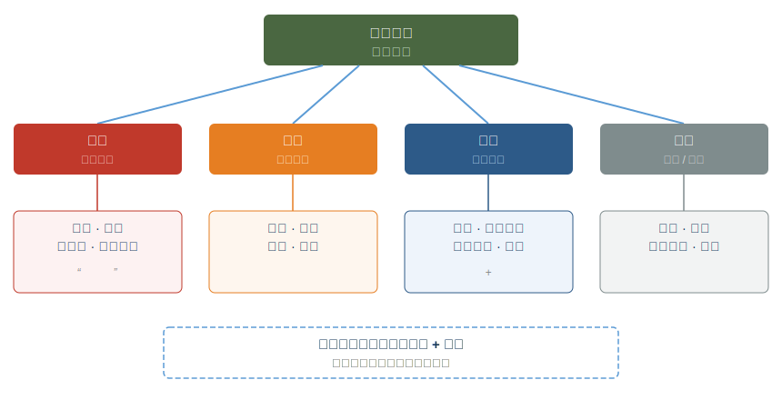

# 第七章 · 阴阳之道

> 阴平阳秘，精神乃治；阴阳离决，精气乃绝。
>
> — 《黄帝内经·素问·生气通天论》

## 7.1 当养生变成病

1997 年，美国医生斯蒂芬·布拉特曼（Steven Bratman）在《瑜伽杂志》上发了一篇短文。他描述了一种他在自己和患者身上反复观察到的怪现象：有些人对"健康饮食"的执念已经严重损害了身心。他给这种状态起了个名字——正食症（orthorexia nervosa）。

布拉特曼不是旁观者。1970 年代末，他在纽约一家有机农场做厨师，每天只吃刚从地里拔出来的菜，拒绝一切加工食品。饮食越来越"纯净"，社交圈越来越窄，焦虑越来越重。直到某天他猛然意识到：对纯净度的追求本身已经变成精神枷锁。他的"健康生活方式"正在让他生病。

二十年后，这种现象更加普遍。2016 年，布拉特曼与心理学家邓恩（Thomas Dunn）合作发表综述，回顾了当时所有关于正食症的研究。他们发现，在健身教练、营养学专业学生和瑜伽练习者等"注重健康"的群体中，正食症倾向的比例显著高于普通人群。量化自我运动（Quantified Self）的参与者中也出了一个公认的副作用：数据焦虑。某项指标一偏离"最优值"，恐慌就跟上来了。

追求健康，怎么反过来损害健康？

《黄帝内经》两千五百年前就暗示了答案。内经的核心处方不是"找到最优参数并锁定"，而是六个字：**阴平阳秘，精神乃治。** 阴"平"——安定，不是最大化。阳"秘"——固守，不是最强化。关键字不是"最优"，是"和"。

健康不是一个可以锁死的数值。它是一条在两极之间持续微调的活路。

---

## 7.2 阴阳不神秘

一听到"阴阳"，很多人立刻想到八卦图、风水罗盘或武侠片里的运功口诀。这层神秘色彩遮住了一个极其实用的思维工具。

阴阳的本质很朴素。四条从自然界观察中归纳出的规律，如此而已。

**万物皆有互补的两面。** 有白天就有黑夜，有呼就有吸，有工作就有休息。不是玄想，是如实描述。

**两面相互依存。** 没有黑夜做对比，"白天"这个概念根本不成立。没有休息做底色，活动失去意义。阴不能独存，阳亦然。

**两面相互转化。** 夏天走到极致转入秋冬，活动到极致身体强制要求静止。物极必反不是道德训诫，是自然规律。

**两面处于动态平衡。** 这种平衡不是天平两端一样重，而是跷跷板的往复——偏过去，再回来，永不静止。

| 阴 | 阳 |
|---|---|
| 休息 | 活动 |
| 黑夜 | 白天 |
| 凉爽 | 温热 |
| 接受 | 给予 |
| 储藏 | 消耗 |
| 滋养 | 转化 |
| 冬季 | 夏季 |
| 独处 | 社交 |

《素问·阴阳应象大论》说：「阴阳者，天地之道也，万物之纲纪，变化之父母，生杀之本始。」它不是在宣称阴阳是超自然力量。它在说：互补对立的动态平衡，就是自然界一切变化的底层逻辑。

内经用阴阳做什么？做临床诊断。一个人生病了，不先问"得了什么病"，先问"阴阳偏在哪里"。两千五百年前，这种系统思维已经相当成熟。

---

## 7.3 四种失衡

阴阳偏离平衡有四种基本模式。搞清楚它们，你就拥有了一套解读自身状态的框架。

**阳亢（Yang Excess）** 阳气过旺，引擎长期超转。炎症、失眠、高血压、容易发怒、面红目赤。放到当下，这就是"永远在线"的人：日程排满，刺激不断，肾上腺素驱动一切。系统过热。

**阴虚（Yin Deficiency）** 滋养和修复的资源被耗尽，常与阳亢同时出现：燃烧太猛，储备枯竭。身体干燥、焦虑不安、夜间盗汗、消瘦、心悸。这是加班到凌晨三点、靠咖啡续命的身体发出的透支警报。

**阳虚（Yang Deficiency）** 活力不足，火焰微弱。四肢冰冷、精神萎靡、代谢迟缓、抑郁倾向。另一种极端：沙发-外卖-刷手机的惯性循环，身体失去了点火的能力。

**阴亢 / 寒凝（Yin Excess / Cold Stagnation）** 阴寒凝滞，系统停摆。水肿、体重增加、思维迟钝、关节僵硬。身体变成一潭死水，失去了流动的意愿。

现代生活有一个吊诡之处：大多数人同时处于两种失衡——**阳亢加阴虚**。白天过度刺激：信息轰炸、背靠背会议、咖啡因。晚上无法真正恢复：屏幕蓝光、浅睡眠、焦虑反刍。油门踩到底，油箱同时见底。这就是当代倦怠流行病（burnout epidemic）的阴阳解读。

---

## 7.4 稳态、适应性平衡与内经

觉得阴阳只是古老比喻？现代生物学可能会改变这个判断。

1932 年，美国生理学家沃尔特·坎农（Walter Cannon）在《身体的智慧》一书中提出"稳态"（homeostasis）概念。身体通过反馈机制维持内环境稳定：体温、血糖、pH、血压，全部被锁定在狭窄范围内。这和"阴平阳秘"几乎是同一句话的不同语言版本。

但稳态有一个盲点：它暗示平衡是静态的，像恒温器锁定 22°C。1988 年，神经科学家彼得·斯特林（Peter Sterling）和约瑟夫·艾尔（Joseph Eyer）提出"适应性稳态"（allostasis）。身体不是维持固定参数，而是根据环境不断调整目标值。面对压力时心率升高、皮质醇上升——不是"失衡"，而是主动适应。平衡本身就是动态的。

阴阳理论的精髓恰好在这里：平衡不是静止，是有节奏的往复。

斯特林还引入了"适应性负荷"（allostatic load）。长期被迫做适应性调整，调整本身的代价会累积成损伤：慢性炎症、免疫下降、器官加速老化。内经怎么说的？"阴阳离决，精气乃绝。"动态调节系统一旦被击穿，生命力枯竭。

还有一个概念值得注意：**毒物兴奋效应**（hormesis）。小剂量压力反而增强系统。冷水浸泡、间歇性断食、高强度运动，都是轻微的"破坏"，激发身体的修复能力。用阴阳的语言说：适度的阳（挑战）激发阴（修复），整个系统变得更强韧。

内经没用现代术语，但它抓住的真相一样：平衡不是僵硬的维护，是有弹性的应变。

---

## 7.5 日常中的阴阳

阴阳不只是理论。它可以立刻用于每日决策。

**工作与休息。** 专注工作是阳——消耗精力，输出成果。休息是阴——恢复精力，吸收沉淀。注意一个关键区别：刷短视频、整理待办清单、听商业播客，这些仍然是阳。发呆、散步、无目的地坐在窗边——这才是阴。真正的阴性休息意味着让大脑彻底离线。

**社交与独处。** 社交是阳，向外输出能量。独处是阴，向内收回注意力。最外向的人也需要独处来消化体验，最内向的人也需要社交来激活生命力。你属于哪一端的赤字更大？

**运动与恢复。** 训练是阳，撕裂肌纤维。恢复是阴，修复并使其更强。没有恢复的训练不是勤奋，是自我伤害。过度训练综合征（overtraining syndrome）就是运动领域的"阴阳离决"。

**刺激与静默。** 信息摄入是阳：新闻、社交媒体、播客、视频。反思是阴：让信息沉淀、整合、形成自己的想法。我们每天摄入的信息量是二十年前的数百倍，留给消化的时间呢？接近于零。

**饮食。** 温热丰盛是阳，补充能量、温暖身体。清淡简素是阴，清理肠胃、减轻负担。不需要永远吃得"完美"，根据身体当下的状态做出回应就好。

**四季。** 春夏向外扩展（阳）——多户外、多社交、早起。秋冬向内收敛（阴）——多静养、多独处、早睡。第二章谈过的四季养生，底层逻辑就是顺应阴阳的年度节律。

有一个规律值得正视：**现代生活存在巨大的阴性赤字。** 我们的文化崇拜阳——生产力、拼搏、刺激、增长、"永远在路上"。休息被视为懒惰，独处被视为孤僻，无所事事被视为浪费生命。阴阳理论的回答很直接：没有阴的支撑，阳就是无根之火。烧得越旺，熄灭越快。

---

## 7.6 和谐，不是完美

布拉特曼后来怎么了？他成为一名家庭医生，花了二十年帮助有同样困扰的患者。他总结出一个核心教训：问题不在于追求健康，而在于追求健康的方式变成了另一种强迫。工具反噬了使用工具的人。

《素问·上古天真论》早就给出了处方：

> 法于阴阳，和于术数，食饮有节，起居有常，不妄作劳，故能形与神俱，而尽终其天年，度百岁乃去。

逐字看用词。"法于阴阳"——效法阴阳的规律，不是控制阴阳。"和于术数"——与方法和谐相处，不是被方法奴役。"有节"——有节制，不是计算到小数点。"有常"——有规律，不是精确到分钟。"不妄作劳"——不胡乱消耗，但也没说"不作劳"。

整段话的核心字是**和**——和谐。不是**完**——完美。

现代社会已经为过度优化起了一系列病名。正食症（orthorexia）：对"健康饮食"的病态执念。运动成瘾：把健身变成自我惩罚。睡眠焦虑：对睡眠质量的监控反而制造失眠。量化自我运动的阴暗面：数据追踪变成数据恐惧。

阴阳思维给出的解法很简单：**追求"大致对"比追求"精确对"更健康。** 允许波动，允许偏离。偶尔吃一顿不那么健康的晚饭，只要整体节奏是对的。跷跷板偏一偏没关系，它会回来。

---

## 7.7 日常实践：阴阳审计

每周花五分钟做一次阴阳审计。不需要 App，不需要数据，只需要对自己诚实。

**第一步：整体感觉。** 这周总体偏阳（做得多、消耗大、刺激多）还是偏阴（做得少、动力低、停滞感）？

**第二步：六个维度扫描。**

| 维度 | 偏阳信号 | 偏阴信号 |
|------|---------|---------|
| 工作 | 加班多、任务密集、喘不过气 | 拖延、无动力、空虚感 |
| 运动 | 高强度训练过多、身体酸痛 | 整周没动、身体僵硬 |
| 社交 | 应酬过多、社交疲劳 | 整周没与人深度交流 |
| 饮食 | 辛辣油腻、暴饮暴食 | 没食欲、饮食单调 |
| 睡眠 | 入睡困难、多梦、早醒 | 嗜睡、起不来、越睡越累 |
| 屏幕 | 眼睛干涩、注意力涣散 | 无聊感、空虚感 |

**第三步：开处方。**

偏阳（过度消耗）？开一张"阴方"：早睡一小时、取消一个不必要的社交、散步代替跑步、吃一顿清淡的饭、关掉手机坐十分钟。

偏阴（停滞低迷）？开一张"阳方"：出门晒太阳、约一个朋友聊天、做一次让身体出汗的运动、吃一顿热乎丰盛的饭、着手做一件拖了很久的事。

这不是精密医学干预。这是最朴素的自我觉察：感知偏差，轻轻纠回。跷跷板的艺术。

---

## 7.8 反思时刻

合上书，闭上眼，问自己：**此刻，我的阴阳偏在哪里？**

是阳亢——系统过热，停不下来？阴虚——储备耗尽，靠意志力硬撑？阳虚——火焰微弱，提不起精神？还是两种同时——白天过度燃烧，夜晚无法修复？

不急着找答案。问这个问题本身就是阴阳平衡的起点。因为觉察，是阴。

---

### 今日行动

- ⚡ 回顾过去一周：你的生活更偏阳（忙碌、刺激、社交、输出）还是更偏阴（安静、恢复、独处、输入）？意识到失衡就是调整的第一步。
- ⚡ 如果答案是"偏阳"（多数现代人如此），今晚给自己安排 30 分钟纯粹的"阴性时间"——不看屏幕、不社交、不学习，只是静坐或散步。
- 🔄 本周尝试"阴阳交替工作法"：每 90 分钟高强度工作（阳）后，安排 15 分钟真正的休息（阴）——不是刷手机，而是闭眼、伸展或发呆。

### 21 天微实验

**"阴阳日记"** 每晚用一个词概括今天的阴阳状态："太阳"、"太阴"或"平衡"。连续记录 21 天。"太阳"的第二天有意加入一项阴性活动；"太阴"的第二天有意加入一项阳性活动。21 天后观察整体能量变化。

### 证据强度标注

| 内经原则 | 证据等级 | 说明 |
|---------|---------|------|
| 阴平阳秘（动态平衡维持健康）| ✓ 已证实 | 即 homeostasis / allostasis 的古代表述，现代生理学核心概念 |
| 阴虚 = 过度消耗 / 倦怠 | ✓ 已证实 | 倦怠综合征（burnout）的核心机制：长期过度激活 → 恢复不足 |
| 阴阳互根互转 | ✓ 已证实 | 交感 / 副交感神经系统的拮抗协作；hormesis（适度压力增强系统） |
| 阳亢 = 过度兴奋 / 炎症 | ✓ 已证实 | 慢性交感神经亢奋 → 炎症 → 代谢紊乱，大量流行病学证据 |
| 四季阴阳消长精确对应人体 | ? 合理假说 | 季节影响生理已证实，但内经的精确四季-脏腑-情志映射缺乏完整验证 |

---

## 7.9 总结与过渡

前六章谈了具体的养生维度：四季节律、饮食之道、情志调摄、运动养生、治未病思维。阴阳是贯穿所有维度的底层操作系统。

四季养生的本质是顺应阴阳的年度大节奏。饮食有节的本质是食物中阴阳的平衡。情志调摄的本质是情绪能量的阴阳流动。运动养生的本质是动（阳）与静（阴）的交替。治未病的本质是在阴阳尚未失调时维持平衡。

内经把阴阳称为"天地之道，万物之纲纪"。它确实是统摄一切的元原则。

在所有恢复阴阳平衡的手段中，有一种最强大、最基本，却最被现代人忽视——**睡眠**。意识退场，身体接管，修复昼间所有损耗。内经将睡眠视为天地阴阳交替在人体中的缩影。

第八章，我们进入睡眠的世界。

---

## 参考文献

**Bratman, S. & Knight, D.** (2000). *Health Food Junkies: Orthorexia Nervosa — Overcoming the Obsession with Healthful Eating*. Broadway Books. — 正食症（orthorexia）概念的系统阐述，布拉特曼基于自身经历和临床观察提出该诊断。

**Dunn, T.M. & Bratman, S.** (2016). "On orthorexia nervosa: A review of the literature and proposed diagnostic criteria." *Eating Behaviors*, 21, 11–17. DOI: 10.1016/j.eatbeh.2015.12.006 — 正食症文献综述及诊断标准建议，涵盖流行率数据。

**Cannon, W.B.** (1932). *The Wisdom of the Body*. W.W. Norton. — 稳态（homeostasis）概念的开创性著作，阐述身体通过反馈机制维持内环境稳定。

**Sterling, P. & Eyer, J.** (1988). "Allostasis: A New Paradigm to Explain Arousal Pathology." In *Handbook of Life Stress, Cognition and Health*, pp. 629–649. — 适应性稳态理论，提出身体通过动态调整（而非固定设定值）维持平衡。

**Calabrese, E.J. & Baldwin, L.A.** (2002). "Defining Hormesis." *Human & Experimental Toxicology*, 21(2), 91–97. DOI: 10.1191/0960327102ht217oa — 毒物兴奋效应的系统综述，阐述小剂量压力如何增强生物系统。

**Maslach, C. & Leiter, M.P.** (2016). "Burnout." In *Stress: Concepts, Cognition, Emotion, and Behavior*. Academic Press, pp. 351–357. — 现代倦怠研究的经典框架，定义情绪耗竭、去人格化和效能感降低三个维度。

**《黄帝内经·素问》**，第一篇《上古天真论》、第三篇《生气通天论》、第五篇《阴阳应象大论》。— 本章引用的核心原典。

**老子.** 《道德经》第四十二章。— "万物负阴而抱阳，冲气以为和"，阴阳和谐的经典哲学表述。
