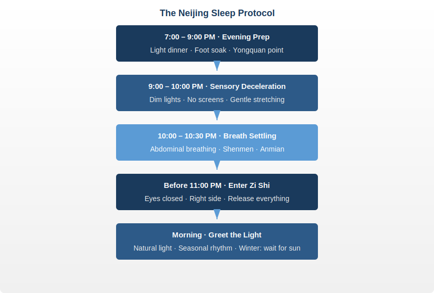

# Chapter 8 · Sleep: The Great Healer

> 卫气昼日行于阳，夜行于阴……阳气尽则卧，阴气尽则寤。
> *Wèi qì zhòu rì xíng yú yáng, yè xíng yú yīn... yáng qì jìn zé wò, yīn qì jìn zé wù.*
>
> "Defensive Qi travels through Yang channels during the day and through Yin channels at night... When Yang Qi is exhausted, one sleeps. When Yin Qi is exhausted, one wakes."
>
> — *Ling Shu*, Chapter 28 (口问篇); cf. Chapter 18 (营卫生会篇)

## 8.1 A Discovery in a Late-Night Lab

In the fall of 2013, at the University of Rochester Medical Center, Danish-born neuroscientist Maiken Nedergaard and her team ran an experiment whose results no one had predicted.

They injected fluorescent tracers into the cerebrospinal fluid of living mice, then watched through a two-photon microscope in real time. While the mice were awake, the tracer barely moved. Then the mice fell asleep. On the screen, fluorescence suddenly surged. Brain cells shrank by roughly 60%, the gaps between them widened, and cerebrospinal fluid rushed through these channels like water through opened floodgates, carrying away the metabolic waste that had accumulated during waking hours.

Among the waste being flushed out was a molecule called beta-amyloid protein. Its abnormal accumulation is the hallmark pathology of Alzheimer's disease.

Nedergaard named this cleaning system the "glymphatic system." The paper appeared in the October 2013 issue of *Science* under a single-sentence title: *Sleep Drives Metabolite Clearance from the Adult Brain*. Sleep powers the brain's waste removal. And this system's efficiency drops by roughly 90% during wakefulness. The brain only cleans itself properly while you sleep.

This answered a question that had puzzled scientists for decades: why must we sleep at all? The answer goes beyond "rest." Sleep is the brain's garbage collection window. Skip it, and the waste piles up. Let it pile up long enough, and disease follows.

Chinese physicians twenty-five centuries ago had no microscopes, no fluorescent tracers. But *Ling Shu* Chapter 18 recorded this: 「卫气昼日行于阳，夜行于阴……阳气尽则卧，阴气尽则寤」(wèi qì zhòu rì xíng yú yáng, yè xíng yú yīn... yáng qì jìn zé wò, yīn qì jìn zé wù). Defensive Qi (卫气, wèi qì) patrols the body's surface by day, guarding the exterior; at night it retreats into the organs, repairing the interior. When Yang Qi is spent, sleep follows.

External patrol ends, internal cleaning begins. What Nedergaard verified with molecular biology is the same pattern described twenty-five centuries ago. Different language, same conclusion: sleep is not optional downtime. It is the body's command to switch into repair mode.

---

## 8.2 Wei Qi and Sleep: The Neijing's Sleep Model

The Neijing's explanation of sleep is precise and systematic. The central concept is **Wei Qi** (卫气), the body's defensive energy.

During the day (the Yang phase), Wei Qi circulates on the body's surface. It performs three functions: maintaining alertness, regulating body temperature, and defending against pathogenic invasion. Your daytime energy, sharp reflexes, and warm skin are all signs of Wei Qi at work on the exterior.

At night (the Yin phase), Wei Qi withdraws from the surface and descends into the five Zang organs. It shifts from guarding the perimeter to repairing the interior: restoring damaged organ tissue, rebuilding immune reserves, clearing metabolic waste.

The Neijing records that Wei Qi completes fifty circuits every twenty-four hours. Twenty-five during the day (Yang circuits), twenty-five at night (Yin circuits). When the daytime circuits finish and Yang Qi is spent, drowsiness arises. When the nighttime circuits complete and the Yin phase ends, waking follows naturally.

Map this model onto modern physiology:

- **Daytime**: sympathetic nervous system dominance, cortisol sustaining alertness, immune surveillance in "patrol mode"
- **Nighttime**: parasympathetic dominance, melatonin inducing sleep, growth hormone surging, immune system entering "deep repair mode"
- **Sleep cycles**: modern sleep science identifies roughly five 90-minute cycles per night, totaling approximately 7.5 hours, closely matching the Neijing's twenty-five Yin circuits

Wei Qi traveling through Yang by day and Yin by night is not mysticism. It is a high-level abstraction of the human circadian rhythm.

---

## 8.3 Sleep Debt: The Irreversible Cost

Nedergaard's discovery revealed sleep's cleaning function. The next question: what happens when you chronically deny the brain this cleaning cycle?

In 2018, Ehsan Shokri-Kojori's team at the National Institutes of Health answered with PET scans. They had twenty healthy volunteers experience both a normal night of sleep and a full night of deprivation, then scanned their brains. Just one sleepless night produced a measurable rise in beta-amyloid levels in the hippocampus and thalamus.

One night. Not months. Not years. One night.

Matthew Walker laid out the logic in *Why We Sleep* (2017): the brain generates metabolic waste every day, and sleep handles the removal. Miss one night, waste accumulates a little more. Day after day, beta-amyloid builds up like silt on a riverbed. Walker's line: "the shorter your sleep, the shorter your life span." Not rhetoric. Statistics.

The harsher truth: sleep debt cannot be fully repaid. A 2016 study in *Scientific Reports* showed that weekend recovery sleep after five days of restriction temporarily reduced subjective drowsiness but did not restore cognitive performance. The brain remembers every skipped cleaning cycle.

Return to the Neijing's language: Wei Qi runs twenty-five circuits through the organs each night, completing repair and cleaning. Every circuit you cut short steals from the body's repair budget. No visible consequences in the short term? That only means the invoice has not arrived yet.

---

## 8.4 Seasonal Sleep: Sleeping With the Seasons

The Neijing does not prescribe the same sleep schedule year-round. *Su Wen* Chapter 2 (四气调神大论) assigns a different sleep prescription to each season:

| Season | Neijing Instruction | Approx. Hours | Modern Rationale |
|--------|-------------------|---------------|-----------------|
| 春 Spring | 夜卧早起 (Sleep late, rise early) | ~7h | Lengthening daylight, rising Yang |
| 夏 Summer | 夜卧早起 (Sleep late, rise early) | ~6.5–7h | Peak Yang, maximum daylight |
| 秋 Autumn | 早卧早起 (Sleep early, rise early) | ~7.5–8h | Yang declining, begin conserving |
| 冬 Winter | 早卧晚起，必待日光 (Sleep early, rise late — wait for sunlight) | ~8–9h | Minimum daylight, deep Yin, maximum conservation |

「早卧晚起，必待日光」(zǎo wò wǎn qǐ, bì dài rì guāng). In winter, go to bed early, rise late, and wait until the sun appears before getting up. Written twenty-five centuries ago, this sentence describes the core findings of modern chronobiology with precision:

- Melatonin secretion duration varies seasonally, lasting longer in winter
- Light exposure is the master clock calibration signal for the circadian rhythm
- Mammals universally show an instinct to sleep longer during winter months
- Reduced winter daylight at high latitudes directly correlates with Seasonal Affective Disorder (SAD)

Modern society uses artificial light and alarm clocks to erase this natural variation. We force ourselves to wake at the same time year-round, dragging ourselves out of bed in winter darkness. The Neijing would call this fighting the Dao.

---

## 8.5 The Zi Shi Rule: Why 11 PM Matters

In the Neijing's twelve-period daily cycle, **Zi Shi** (子时, 11 PM – 1 AM) corresponds to the Gallbladder meridian. This is the pivot of the entire day: the moment Yin reaches its zenith and nascent Yang begins to stir. The Neijing teaches that being in deep sleep during this window is essential for the Yin-Yang handoff to proceed smoothly.

Missing the Zi Shi sleep window is like missing the optimal transfer at a train junction. Everything downstream gets delayed.

Modern sleep research validates this:

- **Growth hormone secretion** peaks during the first deep-sleep cycle after falling asleep, typically between 11 PM and 1 AM. Fall asleep at 2 AM instead, and even eight hours of sleep yields substantially less growth hormone.
- **Melatonin concentration** peaks around midnight. Delayed sleep onset compresses the proportion of deep slow-wave sleep.
- **The "second wind" phenomenon**: feel sleepy before 11 PM but push through? The body releases a micro-surge of cortisol to maintain wakefulness. That is why staying up past 1 AM can make you feel "not tired anymore." This is not recovery. It is a stress response. You tricked your own body.

Sleeping before Zi Shi is not superstition. It is a physiological principle validated by twenty-five centuries of clinical observation and modern endocrinology alike.

---

## 8.6 Modern Sleep Science: The Warnings

In 2017, Matthew Walker published *Why We Sleep*, sounding an alarm across the globe: sleep deprivation is one of the greatest public health crises of modern civilization.

Walker's findings, and those of the global sleep research community, validate the Neijing's intuitions point by point:

**Immunity**: A single night of partial sleep deprivation (sleeping only from 10 PM to 3 AM) reduces natural killer (NK) cell activity by approximately 28%, according to Irwin et al. (1994). NK cells are the body's frontline cancer defense. Wei Qi travels through Yin at night to rebuild this defense line. Rob the body of its nocturnal repair, and the immune system deteriorates measurably within a single night.

**Metabolism**: Several consecutive days of short sleep (under six hours) increase ghrelin (hunger hormone) and decrease leptin (satiety hormone). You eat more and stop less. Many people blame their appetite when the real culprit is insufficient sleep. Prather's 2015 study put it more directly: sleeping under six hours per night raises the risk of catching a cold by 4.2 times.

**Memory and cognition**: Memory consolidation occurs during sleep, especially during REM phases. Sleep loss directly impairs working memory, creativity, and decision-making.

**Emotional regulation**: One night of poor sleep increases amygdala reactivity by approximately 60%. You are not "short-tempered by nature." You are sleep-deprived.

**Cancer risk**: The World Health Organization classifies night shift work as a Group 2A probable carcinogen. Chronic circadian disruption significantly elevates breast and prostate cancer risk.

The Neijing had no concept of "carcinogen." But it repeatedly warned: to violate the day-night rhythm is to violate the Dao, and the consequence is that "a hundred diseases arise."

---

## 8.7 Insomnia: The Neijing's Differential Framework

The Neijing does not treat insomnia as a single disorder. It identifies multiple patterns of 不寐 (bù mèi, "sleeplessness"), each with distinct causes and solutions:

**Heart-Kidney Disharmony** (心肾不交, xīn shèn bù jiāo): Heart belongs to Fire, Kidney to Water. Normally, Heart Fire descends to warm the Kidneys while Kidney Water ascends to cool the Heart, completing a water-fire circuit. When the circuit breaks? A racing mind trapped in an exhausted body. This is the most common insomnia pattern of the modern workplace: lying in bed, physically drained, but thoughts running like an uncontrolled search engine indexing tomorrow's to-do list. *Remedy*: Pre-sleep foot soak to draw Fire downward; massage Yongquan point (涌泉, sole of the foot).

**Liver Qi Stagnation Generating Fire** (肝郁化火, gān yù huà huǒ): Chronic stress and suppressed anger cause Liver Qi to stagnate, eventually transforming into Fire. Difficulty falling asleep, excessive dreaming, waking irritable. The modern equivalent: chronic stress leading to cortisol rhythm disruption and sustained sympathetic overdrive. *Remedy*: Evening walks to release Liver Qi; avoid confrontational content before bed.

**Spleen-Stomach Disharmony** (脾胃不和, pí wèi bù hé): 「胃不和则卧不安」 — "When the stomach is disturbed, sleep is restless." Modern research confirms: eating high-fat foods within two hours of sleep significantly increases gastroesophageal reflux and fragments sleep architecture. *Remedy*: Light dinners; no food within three hours of sleep.

**Heart Blood Deficiency** (心血虚, xīn xuè xū): Insufficient Heart Blood fails to anchor the spirit, producing light sleep, vivid dreams, easy startling, and anxious palpitations. Common in people who overwork mentally while eating irregularly. Modern correlate: low iron stores and anemia are strongly associated with poor sleep quality. *Remedy*: Iron-rich and B-vitamin foods; regular meal timing.

Four patterns of insomnia. Four distinct causes. Four targeted protocols. Not one-size-fits-all, but differential treatment based on pattern recognition.

---

## 8.8 Daily Practice: The Neijing Sleep Protocol

Translating the Neijing's sleep wisdom into a nightly executable routine:

**7:00–9:00 PM · Evening Preparation**
- Dinner to 70% fullness; avoid spicy and greasy foods
- Hot foot soak for 15–20 minutes (water at 40–42°C / 104–108°F), optionally with ginger slices or mugwort
- Massage Yongquan point (涌泉, in the depression at the front third of the sole), 2–3 minutes per foot

**9:00–10:00 PM · Sensory Deceleration**
- Dim indoor lighting; eliminate or filter blue-light screens
- Light stretching or standing meditation (站桩, zhàn zhuāng), 5–10 minutes
- No intense discussions, provocative news, or work emails

**10:00–10:30 PM · Breath and Spirit Settling**
- Abdominal breathing: inhale 4 seconds (through nose), hold 7 seconds, exhale 8 seconds (through mouth)
- Or Neijing-style breath regulation: focus awareness on the lower Dantian (丹田), breathe naturally, silently say "release" (松, sōng) with each exhale
- Massage Shenmen point (神门, ulnar depression of the wrist crease) and Anmian point (安眠, depression below the mastoid process behind the ear)

**Before 11:00 PM · Enter Zi Shi**
- Lie flat with eyes closed; side-lying also good (the Neijing recommends right side)
- Release everything. Tomorrow's tasks belong to tomorrow's Yang Qi

**Morning · Greet the Light**
- Seek natural light as soon as possible after waking (even on overcast days)
- In winter, honor the 必待日光 principle — do not force yourself up before dawn

---

## 8.9 Reflection Moment

Give yourself a sleep audit. Answer these five questions honestly (score each 1–5; 1 = not at all true, 5 = completely true):

1. I regularly get into bed after 11:00 PM. ___
2. My sleep schedule is identical in winter and summer. ___
3. I am still on my phone or doing work within an hour of bedtime. ___
4. I need an alarm to wake up (waking naturally almost never happens). ___
5. I frequently experience daytime drowsiness or brain fog. ___

**20–25**: Your sleep is seriously overdrawing your body. Return to Section 8.8. Start tonight.

**13–19**: Room for improvement. Focus on the Zi Shi rule and a pre-sleep ritual.

**5–12**: Your sleep rhythm is approaching the Neijing ideal. Maintain seasonal adjustments.

Sleep is not wasted time. It is the most powerful prescription your body writes for itself every single day.

---

### Today's Actions

- ⚡ Check your bedroom: are there any standby lights from electronic devices? Cover them or move them out. Darkness is melatonin's best friend.
- ⚡ Try a "digital curfew" tonight: place your phone outside the bedroom to charge before 11 PM. Even one night counts.
- 🔄 Starting tonight, establish a fixed 15-minute pre-sleep ritual (foot soak, stretching, breathing exercises, or reading a paper book — pick one) and maintain it for 14 consecutive nights.

### 21-Day Micro-Experiment

**"The 11 PM Experiment"**: For 21 consecutive nights, be in bed with lights off and phone put away by 11 PM. Each morning upon waking, record two numbers: self-rated sleep quality (1–5) and wake-up energy level (1–5). At the end of week 3, calculate your averages and compare them against your week 1 scores.

### Evidence Strength Ratings

| Neijing Principle | Evidence Level | Notes |
|-------------------|---------------|-------|
| Wei Qi patrols Yang by day, Yin by night | ✓ Confirmed | Sympathetic (day) / parasympathetic (night) switching + immune cell circadian rhythms are well documented |
| Organs repair during sleep | ✓ Confirmed | The glymphatic system (discovered 2013): the brain clears metabolic waste during sleep |
| Adjust sleep duration by season | ✓ Confirmed | Seasonal melatonin secretion variation + photoperiod effects on sleep need, supported by epidemiological data |
| Zi Shi (11 PM – 1 AM) is the most critical sleep window | ? Plausible hypothesis | Growth hormone peaking during early deep sleep is established, but optimal sleep onset varies by individual chronotype |
| Heart-Kidney disharmony causes insomnia | ? Plausible hypothesis | The "racing mind + exhausted body" pattern is common among insomnia patients, but the TCM organ-attribution model lacks precise validation |

---

## 8.10 Summary & Bridge to Chapter 9

In the preceding chapters, you recalibrated your circadian rhythm (Chapter 2), restructured your diet (Chapter 3), learned to navigate emotions (Chapter 4), found the balance of movement (Chapter 5), and understood the deep logic of Yin-Yang equilibrium (Chapter 7). Now you see where they all converge: **sleep**.

Sleep is the junction where every wellness pillar meets. Disrupted rhythm means you cannot fall asleep at Zi Shi. A heavy dinner means Spleen-Stomach disharmony keeps you tossing. Suppressed emotions mean Liver Fire ignites the night. Too little or too much exercise means Qi and Blood cannot transition smoothly from Yang to Yin. Every pillar that falters ultimately reveals itself in broken sleep.

The converse is equally true: if your sleep is good, deep, complete, seasonally attuned, then your rhythm, diet, emotions, and movement are very likely functioning well. Sleep is the body's ultimate health indicator.

Nedergaard's glymphatic system tells us the brain washes itself every night. Walker's epidemiological data tells us the consequences of denying that wash span immunity, metabolism, cognition, emotion, and cancer risk. The Neijing captured the same truth in six characters twenty-five centuries ago: 卫气夜行于阴.

Do not steal its working hours.

In the next chapter, we assemble all the pieces. **Chapter 9 delivers your complete 90-day wellness reset plan**, from Week 1 micro-adjustments to Week 12 deep integration, transforming twenty-five centuries of wisdom into action you can begin tomorrow.

---

## References

**Xie, L., Kang, H., Xu, Q. et al.** (2013). "Sleep drives metabolite clearance from the adult brain." *Science*, 342(6156), 373–377. DOI: 10.1126/science.1241224 — First discovery of the glymphatic system: the brain clears beta-amyloid and other metabolic waste during sleep.

**Shokri-Kojori, E., Wang, G.-J., Wiers, C.E. et al.** (2018). "β-Amyloid accumulation in the human brain after one night of sleep deprivation." *PNAS*, 115(17), 4483–4488. DOI: 10.1073/pnas.1721694115 — A single sleepless night causes measurable beta-amyloid accumulation in the hippocampus.

**Walker, M.** (2017). *Why We Sleep: Unlocking the Power of Sleep and Dreams*. Scribner. — Comprehensive sleep science review covering the impact of sleep loss on immunity, metabolism, cognition, and cancer risk.

**Prather, A.A., Janicki-Deverts, D., Hall, M.H. & Cohen, S.** (2015). "Behaviorally assessed sleep and susceptibility to the common cold." *Sleep*, 38(9), 1353–1359. DOI: 10.5665/sleep.4968 — Sleeping under six hours per night increases cold infection risk by 4.2 times.

**Irwin, M., Mascovich, A., Gillin, J.C. et al.** (1994). "Partial sleep deprivation reduces natural killer cell activity in humans." *Psychosomatic Medicine*, 56(6), 493–498. DOI: 10.1097/00006842-199411000-00004 — A single night of partial sleep deprivation (10 PM–3 AM only) reduces NK cell activity by approximately 28%.

**Van Cauter, E. & Plat, L.** (1996). "Physiology of growth hormone secretion during sleep." *Journal of Pediatrics*, 128(5), S32–S37. — Growth hormone peaks during the first deep-sleep cycle after sleep onset.

**IARC Monographs Vol. 124.** (2019). "Night shift work." WHO/International Agency for Research on Cancer. — WHO classifies night shift work as Group 2A probable carcinogen.

**Wehr, T.A.** (2001). "Photoperiodism in humans and other primates: Evidence and implications." *Journal of Biological Rhythms*, 16(4), 348–364. — Human melatonin secretion is photoperiod-dependent, with longer duration in winter.

***Huangdi Neijing Ling Shu***, Chapter 28 (口问篇) and Chapter 18 (营卫生会篇); ***Huangdi Neijing Su Wen***, Chapter 2 (四气调神大论). — Wei Qi circadian circulation theory and seasonal sleep regulation.
