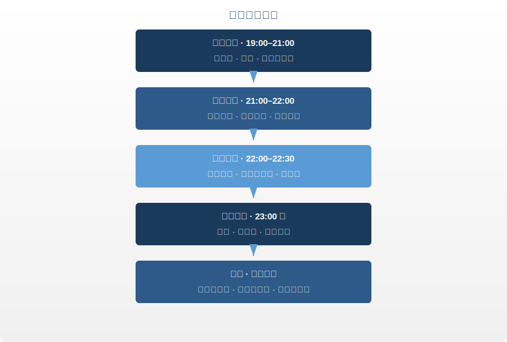

# 第八章 · 睡眠大药

> 卫气昼日行于阳，夜行于阴……阳气尽则卧，阴气尽则寤。
>
> — 《黄帝内经·灵枢·口问》（第二十八篇）；参见《营卫生会》（第十八篇）

## 8.1 深夜实验室里的发现

2013年秋天，美国罗切斯特大学医学中心的一间实验室里，丹麦裔神经科学家 Maiken Nedergaard 和她的团队完成了一项将改写教科书的实验。

他们把荧光示踪剂注入活体小鼠的脑脊液，用双光子显微镜实时观察。小鼠清醒时，荧光液几乎纹丝不动。然后小鼠睡着了。屏幕上，荧光突然涌动起来。脑细胞收缩了约60%，细胞间的缝隙骤然打开，脑脊液像打开闸门的高压水流灌入这些通道，把白天堆积的代谢废物逐一冲走。

被冲走的废物中，有一种叫 β-淀粉样蛋白的分子。它的异常堆积，正是阿尔茨海默病的核心病理标志。

Nedergaard 把这套清洗系统命名为"胶质淋巴系统"（glymphatic system）。论文发表在当年十月的 *Science* 杂志上，标题只有一句话：*Sleep Drives Metabolite Clearance from the Adult Brain*。翻译过来：睡眠驱动大脑清除废物。而这套系统在清醒状态下效率骤降约90%。大脑只在你睡着的时候才洗得干净。

这回答了一个困扰科学界几十年的问题：我们为什么非睡不可？不是"休息"那么简单。睡眠是大脑的垃圾清运时段。不睡，垃圾就堆着。堆久了，就病了。

两千五百年前的中国医学家没有显微镜，没有荧光示踪剂。但《黄帝内经·灵枢》第二十八篇《口问》写下了这段话：「卫气昼日行于阳，夜行于阴……阳气尽则卧，阴气尽则寤」（wèi qì zhòu rì xíng yú yáng, yè xíng yú yīn... yáng qì jìn zé wò, yīn qì jìn zé wù）。卫气白天运行于体表，守卫外部；夜晚潜入五脏六腑，修复内部。阳气耗尽，人就该入睡。

外部巡逻收工，内部清洁启动。Nedergaard 用分子生物学验证的，正是这条两千五百年前就被准确描述的规律。语言不同，结论相同：睡眠不是可选的休息，是身体切换到修复模式的生理指令。

---

## 8.2 卫气与睡眠：内经的睡眠模型

内经对睡眠的解释精巧而系统。核心概念是**卫气**（wèi qì），身体的防御能量。

白天（阳相），卫气运行于体表，负责三件事：维持警觉、调节体温、抵御外邪（病原体）。你白天精力充沛、反应敏锐、体表温暖，这些都是卫气在外运行的表现。

夜晚（阴相），卫气从体表撤回，潜入五脏六腑。不再守卫外部，转向内部修复：修补受损的脏腑组织，重建免疫储备，清理白天积累的代谢废物。

内经记载，卫气每昼夜运行五十个循环。白天二十五个（阳循环），夜晚二十五个（阴循环）。阳循环走完，人产生困意；阴循环结束，人自然苏醒。

这个模型映射到现代生理学：

- **白天**：交感神经主导，皮质醇（cortisol）维持警觉，免疫监控处于"巡逻模式"
- **夜晚**：副交感神经主导，褪黑素（melatonin）诱导睡眠，生长激素（GH）大量分泌，免疫系统进入"深度修复模式"
- **睡眠周期**：现代睡眠科学发现人每晚经历约五个90分钟的睡眠周期，合计约7.5小时，与内经"夜间二十五个阴循环"的描述高度吻合

卫气日行于阳、夜行于阴，不是玄学。这是对人体昼夜节律的高度抽象。

---

## 8.3 睡眠负债：不可逆的代价

Nedergaard 的发现揭示了睡眠的清洁功能。接下来的问题是：如果连续剥夺这个清洁过程，会怎样？

2018年，美国国家卫生研究院（NIH）的 Ehsan Shokri-Kojori 团队用 PET 扫描回答了这个问题。他们让20名健康志愿者分别经历正常睡眠和一整夜不睡，然后扫描大脑。仅仅一晚不睡，海马体和丘脑中的 β-淀粉样蛋白水平就出现了可测量的上升。

一晚。不是几个月，不是几年。一晚。

加州大学伯克利分校的 Matthew Walker 在 *Why We Sleep*（2017）中把逻辑链条讲得更直白：大脑每天产生代谢废物，睡眠负责清除。少睡一夜，废物多积一分。日复一日，β-淀粉样蛋白像河床上的淤泥越堆越厚。Walker 的原话："the shorter your sleep, the shorter your life span"（睡得越少，命越短）。这不是修辞，是统计学结论。

更残酷的事实是：睡眠负债无法完全偿还。2016年 *Scientific Reports* 的一项研究表明，连续五天睡眠不足后的周末补觉，虽然暂时缓解了困倦感，认知功能并未完全恢复。大脑记住了每一次被跳过的清洁周期。

回到内经的语言：卫气夜间在脏腑中运行二十五个循环，完成修复与清理。你每削减一个循环，就是从身体的修复预算中挪用。短期看不到后果？那只是因为账单还没寄到。

---

## 8.4 四时睡眠：跟着季节睡觉

内经不认为一年四季都该睡同样的时间。《素问·四气调神大论》（第二篇）为每个季节开出了不同的睡眠处方：

| 季节 | 内经指令 | 建议时长 | 现代解释 |
|------|---------|---------|---------|
| 春 | 夜卧早起 | ~7 小时 | 日照渐长，阳气上升，身体活跃度增加 |
| 夏 | 夜卧早起 | ~6.5–7 小时 | 阳气鼎盛，日照最长，能量外放 |
| 秋 | 早卧早起 | ~7.5–8 小时 | 阳气收敛，开始蓄积，身体需要更多恢复 |
| 冬 | 早卧晚起，必待日光 | ~8–9 小时 | 阴气最盛，日照最短，深度收藏 |

「早卧晚起，必待日光」（zǎo wò wǎn qǐ, bì dài rì guāng）。冬天要早睡晚起，一定等到太阳出来再起身。这句话写于两千五百年前，却精确描述了现代时间生物学的核心发现：

- 褪黑素的分泌量随季节变化，冬季分泌持续时间更长
- 光照是昼夜节律（circadian rhythm）的主时钟校准信号
- 哺乳动物普遍存在冬季增加睡眠时长的本能
- 高纬度地区冬季日照减少与季节性情绪障碍（SAD）直接相关

现代社会用人造光和闹钟抹杀了四季的睡眠差异。全年同一时间起床，冬天天还黑就被闹钟拽醒。内经会说，这是在对抗天道。

---

## 8.5 子时入睡法则：为什么23点很重要

在内经的十二时辰体系中，**子时**（23:00–01:00）对应足少阳胆经。这是一天之中阴气达到极盛、阳气开始萌生的转折点。内经认为，在这个时段进入深度睡眠，是让阴阳顺利交接的关键。

错过子时入睡，就像错过了列车的最佳换乘窗口。后面的一切都会延误。

现代睡眠研究对此的验证：

- **生长激素分泌高峰**出现在入睡后的第一个深度睡眠周期，通常在23:00–01:00之间。凌晨两点才入睡，即使睡足八小时，生长激素的分泌量也会大幅减少。
- **褪黑素浓度**在午夜前后达到峰值。延迟入睡会压缩深睡期占比。
- **"第二次清醒"现象**：晚上十一点前觉得困，硬撑过去，身体会释放一次小剂量的皮质醇来维持清醒。所以熬夜到凌晨一点反而觉得"不困了"。但这不是精力恢复，而是应激反应。你骗了自己的身体。

子时入睡不是迷信。它是经过两千五百年临床观察和现代内分泌学双重验证的生理规律。

---

## 8.6 现代睡眠科学的警告

2017年，Matthew Walker 在 *Why We Sleep* 中以近乎警报的口吻向全世界宣告：睡眠不足是现代社会最大的公共健康危机之一。

Walker 和全球睡眠研究者的发现，逐条印证了内经的直觉：

**免疫力**：仅一晚部分睡眠剥夺（只睡晚10点至凌晨3点），自然杀伤细胞（NK cell）活性就下降约28%（Irwin et al., 1994）。NK细胞是人体抗癌的第一道防线。卫气夜行于阴，目的就是重建这道防线。剥夺夜间修复，免疫防御在一夜之间即可出现可测量的退化。

**代谢**：连续数天睡眠不足（少于六小时），饥饿素（ghrelin）上升，瘦素（leptin）下降。你会更饿，更难停下嘴。很多人以为自己管不住嘴，真正的问题是睡不够觉。Prather 团队2015年的研究更直接：每晚睡不到六小时的人，感冒风险是充足睡眠者的4.2倍。

**记忆与认知**：记忆巩固发生在睡眠期间，尤其是快速眼动睡眠（REM）阶段。睡眠不足直接损害工作记忆、创造力和决策能力。

**情绪**：一晚睡眠不足，杏仁核（情绪中枢）的反应性增加约60%。你不是"脾气不好"，你是睡眠不足。

**癌症风险**：世界卫生组织（WHO）已将夜班工作列为2A类致癌物（probable carcinogen）。长期昼夜颠倒，乳腺癌和前列腺癌风险显著上升。

内经没有"致癌物"的概念，但它反复强调：违背昼夜节律就是违背天道，后果是"百病由生"。

---

## 8.7 不寐：内经的失眠分型

内经不把失眠当作单一疾病。它识别了多种"不寐"模式，每种有不同的病因和对策：

**心肾不交**（xīn shèn bù jiāo）：心属火，肾属水。正常时心火下降温肾，肾水上升济心，水火既济。循环断裂的表现？脑子停不下来，身体却精疲力竭。这是现代职场最常见的失眠模式：躺在床上，身体很累，思维却像一台失控的搜索引擎，不断翻检明天的待办事项。对策：睡前泡脚引火下行，按揉涌泉穴。

**肝郁化火**（gān yù huà huǒ）：长期压力和压抑的愤怒让肝气郁结，郁久化火。入睡困难、多梦易醒、醒后烦躁。现代等价物：慢性压力导致皮质醇节律紊乱，交感神经持续亢奋。对策：睡前散步释放肝气，避免睡前处理冲突性信息。

**脾胃不和**（pí wèi bù hé）：「胃不和则卧不安」。胃里不舒服，就睡不踏实。现代研究证实：睡前两小时内进食高脂肪食物显著增加胃食管反流概率，破坏睡眠结构。对策：晚餐不过饱，睡前三小时不进食。

**心血虚**（xīn xuè xū）：心血不足，无法养神，导致浅睡、多梦、容易惊醒，伴随焦虑心悸。常见于长期用脑过度、饮食不规律的人群。现代对照：铁储备不足和贫血与睡眠质量下降高度相关。对策：补充含铁和B族维生素的食物，规律饮食。

四种失眠，四种原因，四套方案。不是一刀切，而是辨证施治。

---

## 8.8 日常实践：内经安眠方案

将内经的睡眠智慧转化为每日可执行的流程：

**19:00–21:00 · 晚间准备**
- 晚餐七分饱，避免辛辣油腻
- 热水泡脚15–20分钟（水温40–42°C），加入少量生姜或艾叶
- 按揉涌泉穴（足底前三分之一凹陷处），每侧2–3分钟

**21:00–22:00 · 感官减速**
- 调暗室内灯光，关闭或屏蔽蓝光屏幕
- 轻度拉伸或站桩5–10分钟
- 避免激烈讨论、刺激性新闻、工作邮件

**22:00–22:30 · 呼吸安神**
- 腹式呼吸：吸气四秒（鼻吸），屏气七秒，呼气八秒（口呼）
- 或采用内经调息法：意守丹田，自然呼吸，每次呼气时默念"松"
- 按揉神门穴（手腕横纹尺侧凹陷处）和安眠穴（耳后乳突下方凹陷处）

**23:00 前 · 进入子时**
- 闭目平躺，侧卧亦佳（内经倡导右侧卧）
- 放下一切。明天的事，留给明天的阳气

**晨起 · 迎接阳光**
- 起床后尽快接触自然光（即使是阴天）
- 冬季遵循"必待日光"原则，不强迫自己天黑起床

---

## 8.9 反思时刻

给自己做一个睡眠审计。诚实回答以下五个问题（每题1–5分，1=完全不符，5=完全符合）：

1. 我经常在23:00之后才上床。 ___
2. 我的睡眠时间在冬天和夏天完全一样。 ___
3. 我睡前一小时还在看手机或处理工作。 ___
4. 我需要闹钟才能起床（自然醒几乎不存在）。 ___
5. 我白天经常感到困倦或脑雾。 ___

**20–25分**：你的睡眠正在严重透支身体。回到8.8节，今晚就开始调整。

**13–19分**：有改善空间。重点关注子时入睡和睡前仪式。

**5–12分**：你的睡眠节律接近内经的理想状态。注意保持季节性调整。

睡眠不是浪费时间。它是身体每天为你开出的最强处方。

---

### 今日行动

- ⚡ 检查你的卧室：有没有待机的电子设备发出光源？把它们遮住或移出卧室。黑暗是褪黑素的朋友。
- ⚡ 今晚试一次"数字宵禁"：23:00前把手机放到卧室外面充电，哪怕只做一晚。
- 🔄 从今晚开始，建立一个15分钟的固定睡前仪式（泡脚/拉伸/呼吸/阅读纸质书，选任意一种），连续14天不中断。

### 21天微实验

**"子时入睡实验"**：连续21天在23:00前上床，关灯，放下手机。每天早晨醒来时记录两个数字：自评睡眠质量（1-5分）和醒来时的精力评分（1-5分）。第三周结束时，计算平均分并与第一周对比。

### 证据强度标注

| 内经原则 | 证据等级 | 说明 |
|---------|---------|------|
| 卫气昼行于阳、夜行于阴 | ✓ 已证实 | 交感（日）/副交感（夜）神经系统切换 + 免疫细胞的昼夜节律已被充分记录 |
| 睡眠时内脏修复 | ✓ 已证实 | 胶质淋巴系统（glymphatic system）2013年发现：睡眠时大脑清除代谢废物 |
| 四时调整睡眠时长 | ✓ 已证实 | 季节性褪黑素分泌变化 + 光周期影响睡眠需求，有流行病学数据支持 |
| 子时（23:00-1:00）入睡最关键 | ? 合理假说 | 生长激素在前半夜深睡期峰值分泌属实，但最佳入睡时间因个体 chronotype 而异 |
| 心肾不交导致失眠 | ? 合理假说 | "racing mind + exhausted body"模式在失眠患者中极常见，但中医脏腑归因缺乏精确验证 |

---

## 8.10 总结与过渡

在前面的章节中，你校准了昼夜节律（第二章），调整了饮食结构（第三章），学会了疏导情绪（第四章），找到了运动的平衡（第五章），理解了阴阳平衡的深层逻辑（第七章）。现在你看到了它们的汇合点：**睡眠**。

睡眠是所有养生支柱的交汇处。节律紊乱，你无法在子时入睡。饮食过重，脾胃不和让你辗转难眠。情绪积压，肝郁化火点燃夜晚。运动不足或过度，气血不能顺利从阳转阴。每一根支柱的失守，最终都在睡眠中暴露。

反过来说，如果你的睡眠是好的，深沉、完整、顺应季节，那说明你的节律、饮食、情志、运动大概率都在正常运转。睡眠是身体健康的终极指示器。

Nedergaard 的胶质淋巴系统告诉我们：大脑每天晚上都在自我清洗。Walker 的流行病学数据告诉我们：剥夺这个清洗过程的后果覆盖免疫、代谢、认知、情绪和癌症风险。两千五百年前的内经用六个字概括了同一件事：卫气夜行于阴。

不要剥夺它工作的时间。

下一章，我们把所有拼图组装起来。**第九章将提供一套完整的九十天养生重启方案**，从第一周的微调到第十二周的深度整合，把两千五百年前的智慧变成你明天就能开始的行动。

---

## 参考文献

**Xie, L., Kang, H., Xu, Q. et al.** (2013). "Sleep drives metabolite clearance from the adult brain." *Science*, 342(6156), 373–377. DOI: 10.1126/science.1241224 — 首次发现胶质淋巴系统：大脑在睡眠中清除β-淀粉样蛋白等代谢废物。

**Shokri-Kojori, E., Wang, G.-J., Wiers, C.E. et al.** (2018). "β-Amyloid accumulation in the human brain after one night of sleep deprivation." *PNAS*, 115(17), 4483–4488. DOI: 10.1073/pnas.1721694115 — 仅一晚不睡即可导致海马体β-淀粉样蛋白水平上升。

**Walker, M.** (2017). *Why We Sleep: Unlocking the Power of Sleep and Dreams*. Scribner. — 综合睡眠科学研究，阐述睡眠不足对免疫、代谢、认知和癌症风险的全面影响。

**Prather, A.A., Janicki-Deverts, D., Hall, M.H. & Cohen, S.** (2015). "Behaviorally assessed sleep and susceptibility to the common cold." *Sleep*, 38(9), 1353–1359. DOI: 10.5665/sleep.4968 — 每晚睡不到六小时，感冒感染风险增加4.2倍。

**Irwin, M., Mascovich, A., Gillin, J.C. et al.** (1994). "Partial sleep deprivation reduces natural killer cell activity in humans." *Psychosomatic Medicine*, 56(6), 493–498. DOI: 10.1097/00006842-199411000-00004 — 一晚部分睡眠剥夺（仅睡10PM–3AM）使NK细胞活性下降约28%。

**Van Cauter, E. & Plat, L.** (1996). "Physiology of growth hormone secretion during sleep." *Journal of Pediatrics*, 128(5), S32–S37. — 生长激素在入睡后第一个深睡期达到分泌峰值。

**IARC Monographs Vol. 124.** (2019). "Night shift work." WHO/International Agency for Research on Cancer. — 世界卫生组织将夜班工作列为2A类致癌物。

**Wehr, T.A.** (2001). "Photoperiodism in humans and other primates: Evidence and implications." *Journal of Biological Rhythms*, 16(4), 348–364. — 人类褪黑素分泌具有光周期依赖性，冬季分泌时间更长。

**《黄帝内经·灵枢》** 第18篇（营卫生会篇），**《黄帝内经·素问》** 第2篇（四气调神大论）。 — 卫气昼夜循环理论与四时睡眠调节。
