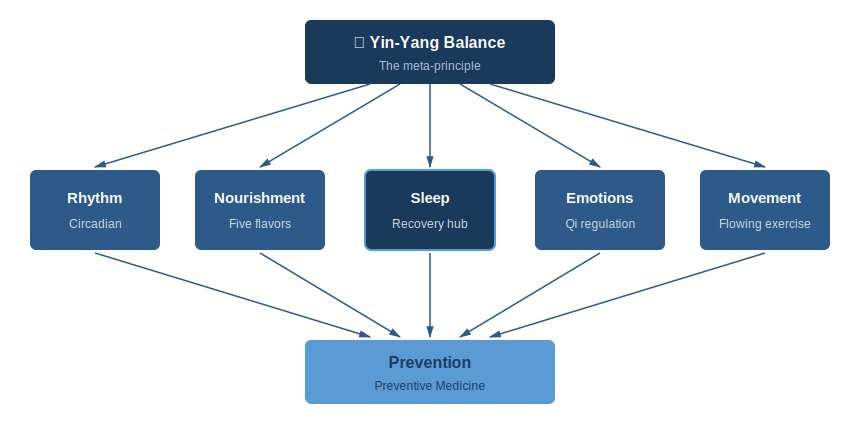

# Chapter 9 · Your 90-Day Wellness Reset

> 知其要者，一言而终；不知其要者，流散无穷。
> *Zhī qí yào zhě, yī yán ér zhōng; bù zhī qí yào zhě, liú sàn wú qióng.*
>
> "Those who grasp the essential can say it in one word. Those who don't will wander endlessly."
>
> — *Su Wen*, Chapter 74 (至真要大论)

## 9.1 The Emperor's Final Question

The Yellow Emperor asked Qi Bo: the ancients lived to a hundred with vitality intact. People today decline at fifty. Has the world changed, or have we lost the Way?

Plain enough. And after eight chapters, the pieces of Qi Bo's answer are on the table. Rhythm. Nourishment. Emotions. Movement. Prevention. Yin-Yang. Sleep. Seven dimensions, seven puzzle pieces. But pieces sitting on a table don't help anyone. They need assembling.

That's what this chapter does: compress every principle into a ninety-day action plan you can start tomorrow.

*Su Wen* Chapter 25 puts it bluntly: "Those who grasp the essential can say it in one word. Those who don't will wander endlessly." After 2,500 years of commentary, the essential word is: **和 (hé)** — harmony. Harmony with Yin and Yang. With the seasons. Among five flavors, seven emotions, movement and stillness, waking and sleeping.

Why ninety days? Two reasons.

First, ninety days spans one season. The Neijing treats the four seasons as the fundamental unit of biological rhythm. Spring generates, summer grows, autumn harvests, winter stores. Each season is a complete cycle.

Second, modern behavioral science lands on a similar number. Phillippa Lally and colleagues at University College London tracked 96 participants and found that new habits take an average of 66 days to become automatic, with complex behaviors requiring longer. Ninety days provides a safety margin. It's where ancient wisdom and modern research converge.

---

## 9.2 The Five Pillars — A Recap

The big picture first.

| Pillar | Chapter | Key Principle | One Sentence |
|--------|---------|---------------|-------------|
| Rhythm | Ch 2 | 子午流注 Body Clock | Live in sync with your biological timetable |
| Nourishment | Ch 3 | 五味平衡 Five Flavors | Balance five flavors, eat with the seasons |
| Emotions | Ch 4 | 七情调和 Seven Emotions | Emotions are Qi — regulate, don't suppress |
| Movement | Ch 5 | 形劳不倦 Effortless Effort | Move like water — flowing, not forcing |
| Prevention | Ch 6 | 治未病 Treat Before Illness | Prevent rather than treat |

Yin-Yang balance (Chapter 7) runs through everything as the meta-principle. Sleep (Chapter 8) is the master recovery mechanism. The pillars are the foundation, Yin-Yang the roof, sleep the central column.

---

## 9.3 Phase 1: Foundation (Days 1–30)

Theme: calibrate the clock. Don't overhaul your life overnight. Build the rhythm first.

### Weeks 1–2: Sleep Reset

Every change starts with sleep. Why? Because nothing else works well when sleep is broken.

Chapter 8's core argument: the 子时 (zǐ shí) window — 11 PM to 1 AM — is when Yin energy peaks and the body enters its deepest repair cycle. Missing this window means missing the body's prime recovery phase.

Four actions:
- Be in bed before 11 PM. Treat it as a non-negotiable appointment.
- No screens for one hour before bed.
- Get natural sunlight within 30 minutes of waking.
- A 15-minute warm foot soak before sleep. Simple. Remarkably effective.

These four moves may sound ordinary. Andrew Huberman's neuroscience research at Stanford has repeatedly confirmed that morning light exposure and consistent sleep timing are the two most powerful circadian levers. The Neijing's call to "model on Yin and Yang, harmonize with the arts of calculation" points at the same mechanism, stated twenty-five centuries earlier.

### Weeks 3–4: Rhythm Alignment

Once sleep stabilizes, calibrate the daytime rhythm.

- Eat breakfast between 7–9 AM (辰时, chén shí, when the Stomach meridian peaks). Make it the biggest meal of the day.
- Finish dinner before 7 PM. Keep it light.
- One 15-minute walk per day. Mornings preferred.
- A 2-minute morning breathing practice. Diaphragmatic. Calm the mind before the day starts.

**Phase 1 success criteria:**
- Asleep before 11 PM ≥ 5 nights per week
- Eating breakfast ≥ 5 days per week
- Daily walk ≥ 5 days per week

Perfection is not the standard. Consistent execution at 70% beats an ambitious plan that collapses at 100%.

---

## 9.4 Phase 2: Expansion (Days 31–60)

Theme: layer food wisdom and emotional awareness onto the rhythmic foundation.

### Weeks 5–6: The Five-Flavor Diet

Start with a self-audit. Which flavors dominate your current diet? For most modern eaters the answer is sweet and salty. What about the other three?

- Add one "missing flavor" per week. Bitter (green tea, dark leafy greens). Sour (fermented foods, vinegar). Pungent (ginger, garlic, fresh herbs).
- At least one warm breakfast daily. Congee, oatmeal, soup — not iced coffee and cold cereal.
- Practice 七分饱 (qī fēn bǎo): stop eating when you're 70% full, when you could eat a few more bites but choose not to.

Five-flavor balance is addition, not restriction. Chapter 3's core insight: the question is never "what must I give up?" but "what's missing?" When your taste map expands from two colors to five, eating becomes richer, not more austere.

### Weeks 7–8: Emotional Hygiene

- A 3-minute morning emotional check-in. Journal or mental scan: what is my emotional weather right now?
- Identify your dominant emotional pattern. Anger? Overthinking? Anxiety?
- Practice 以情胜情 (counter-emotion therapy) once per week. 怒则走: when angry, take a walk. 忧则歌: when melancholy, listen to music or sing. 恐则思: when fearful, engage rational analysis.
- Replace one daily doomscrolling session with a 10-minute walk.

Remember Chapter 4's core principle: emotions are not the enemy. They are Qi in motion. The goal isn't elimination but flow. Ever notice how your chest feels tight when you swallow anger, but clear after a good cry? That's Qi moving.

**Phase 2 success criteria:**
- Conscious five-flavor practice in ≥ 3 meals per week
- Morning emotional check-in ≥ 4 days per week
- Can name your dominant emotional pattern

---

## 9.5 Phase 3: Integration (Days 61–90)

Theme: from deliberate practice to second nature. The principles dissolve into the fabric of daily life.

### Weeks 9–10: Movement Evolution

- Upgrade the daily walk to 30 minutes.
- Add one Tai Chi, Qigong, or stretching session per week. A YouTube tutorial is a perfectly fine starting point.
- Follow the Neijing movement schedule: morning stretching, peak exercise at 3–5 PM (Bladder meridian active, physical performance at its highest), gentle evening wind-down.
- Practice "Five Exhaustions" awareness: change posture every 50 minutes. Prolonged looking harms Blood. Prolonged sitting harms Flesh. Prolonged standing harms Bone. Prolonged walking harms Sinews. Prolonged lying harms Qi.

### Weeks 11–12: Seasonal Attunement and Prevention

- Adjust sleep timing and food to the current season (revisit the seasonal guides in Chapters 2 and 3).
- Weekly body scan: rate energy, sleep, digestion, mood, and pain on a 1–5 scale. Five questions, five minutes.
- Build your personal constitution profile (revisit the nine types in Chapter 6).
- Start planning your next ninety days. This is a way of living, not a program with an expiry date.

**Phase 3 success criteria:**
- Exercise ≥ 4 days per week, varied and moderate
- Seasonal awareness reflected in daily choices
- Weekly self-monitoring established as habit

---

## 9.6 The Weekly Rhythm Template

All elements woven into one executable weekly plan.

| Time | Monday–Friday | Saturday | Sunday |
|------|-------------|----------|--------|
| 6:00–7:00 | Wake, sunlight, breathing | Sleep in | Sleep in |
| 7:00–9:00 | Warm breakfast (biggest meal) | Market visit, seasonal cooking | Relaxed brunch |
| 9:00–12:00 | Work (50-min focus + movement snacks) | Outdoor exercise or Tai Chi | Rest, read, reflect |
| 12:00–13:00 | Moderate lunch, brief rest | Light lunch | Light lunch |
| 15:00–17:00 | Exercise window (walk or workout) | Social time, leisure | Time in nature |
| 18:00–19:00 | Light dinner | Light dinner | Meal prep for the week |
| 21:00–22:00 | Wind down, foot soak, no screens | Same | Weekly body scan |
| Before 23:00 | Sleep | Sleep | Sleep |

Not a military schedule. Rhythmic scaffolding. Once the scaffold becomes habit, you won't notice it anymore. Like riding a bike: you obsess over balance at first, then one day you stop thinking about it entirely.

---

## 9.7 Common Obstacles and Neijing Solutions

| Obstacle | Neijing Perspective | Practical Solution |
|----------|-------------------|-------------------|
| "I'm too busy" | 过劳伤气: overwork depletes Qi. Being busy is the reason to practice, not the excuse to skip. | Start with ONE change: fix your sleep time. Ten minutes a day is enough to begin. |
| "I travel constantly" | 因时制宜: adapt to context, anchor the essentials. | Keep the 11 PM sleep rule regardless of time zone. |
| "I hate morning exercise" | 因人制宜: adapt to the person. | Good news: the Neijing's peak exercise window is 3–5 PM, not dawn. |
| "Healthy food is boring" | 五味平衡: balance, not restriction. | Add flavors, don't subtract them. Ginger, garlic, fermented foods, herbs are allies. |
| "I can't control my emotions" | 情志有法: awareness first. | Don't control. Name the emotion. Locate it in your body. That alone shifts the dynamic. |
| "This is too much at once" | 和 (harmony), not 完 (perfection). | The 70% rule: consistency at 70% beats perfection that crumbles. |

---

## 9.8 Your Wellness Dashboard

Once a month, take five minutes for a self-assessment. Pen and paper. No apps.

**Five-Pillar Score (rate each 1–5):**

1. **Sleep** — Falling asleep easily? Waking refreshed?
2. **Nourishment** — Eating breakfast? Stopping at 70% full? Five flavors expanding?
3. **Emotions** — Do you know your emotional state? Are you tending it?
4. **Movement** — Moving regularly? In more than one way?
5. **Vitality** — Overall 精气神 (Jīng-Qì-Shén). Compared to last month, trending up or down?

Record monthly. Don't chase numbers. Chase direction. After three months, the trend tells a clearer story than any single score.

---

### Evidence Check

| Principle | Evidence Level | Notes |
|-----------|---------------|-------|
| 90 days is sufficient to change habits | ✓ Confirmed | Lally 2010: average 66 days to habit automaticity; 90 days provides a safe margin |
| Gradual change outperforms radical overhaul | ✓ Confirmed | Behavioral science consensus: tiny-habit strategies succeed at far higher rates than total-reform approaches |
| The 70% rule (70% consistency > 100% perfection) | ? Plausible hypothesis | Intuitively sound and consistent with "perfect is the enemy of good," but lacks direct quantitative comparison |
| Social support enhances health behavior | ✓ Confirmed | Blue Zones research + multiple RCTs confirm peer support significantly improves adherence |
| The season as the fundamental unit of wellness | ? Plausible hypothesis | The Neijing's four-season framework has philosophical grounding, but the "exactly 90 days" mapping is approximate |

---

## 9.9 The Emperor's Answer

Back to the question on page one.

The Yellow Emperor asked: people today decline at fifty, while the ancients lived to a hundred. Has the world changed, or have we lost the Way?

Qi Bo's answer sits in the opening passage of *Su Wen*, Chapter 1:

「上古之人，其知道者，法于阴阳，和于术数，食饮有节，起居有常，不妄作劳，故能形与神俱，而尽终其天年，度百岁乃去。」

*Shàng gǔ zhī rén, qí zhī dào zhě, fǎ yú yīn yáng, hé yú shù shù, shí yǐn yǒu jié, qǐ jū yǒu cháng, bù wàng zuò láo, gù néng xíng yǔ shén jù, ér jìn zhōng qí tiān nián, dù bǎi suì nǎi qù.*

"The ancients who understood the Way modeled on Yin and Yang, harmonized with the arts of calculation, ate and drank with moderation, lived with regularity, and did not overexert recklessly. Thus their form and spirit were complete, and they lived out their natural span of years, departing only after a hundred."

Twenty-five centuries later, this remains the finest wellness prescription ever written. 法于阴阳: follow nature's laws. 和于术数: master balance. 食饮有节: eat with measure. 起居有常: live with rhythm. 不妄作劳: don't spend what you can't replenish.

The Way was never lost. It was buried under blue-light screens at midnight, delivery meals at 11 PM, work sprints that burn through weekends, emotions swallowed instead of tended. But it's still there. In the rhythm of sunrise and sunset. In the richness of five flavors on a simple plate. In the calm after a deep breath. In the clarity that greets you after genuine rest.

Your body already knew all of this.

The final question is not Qi Bo's. It's yours: starting tomorrow, what will you choose to do differently?

---

## 9.10 Reflection Moment

**Which single Neijing principle resonated most deeply with you?** The circadian wisdom of 子午流注? The dietary philosophy of five-flavor balance? The emotional method of 以情胜情? The preventive art of 治未病? Write it down. Put it where you'll see it every day.

**What is the first change you will make tomorrow?** Not three. Not five. One. Being in bed by 11 tonight. Eating a warm breakfast tomorrow morning. Stepping outside for ten minutes the next time anger rises. The smallest change, consistently executed, is a hundred times more powerful than a perfect plan left on a shelf.

**Who will you walk these ninety days with?** Dan Buettner's Blue Zones research reveals the same pattern in every long-lived community on Earth: the defining feature isn't genetics, diet, or climate. It's connection. Find a partner, a friend, a family member. Share the journey.

「知其要者，一言而终。」

The word is **和** — harmony.

And the action starts tomorrow.

---

## Advanced Modules: After the 90 Days

Once you complete the 90-day plan, you'll have a solid wellness foundation. The next three chapters help you go deeper:

- **Ch 10 · Meridians & Fascia**: Upgrade the movement practices from Chapter 5 — add meridian stretching, foam rolling, and self-acupressure to move from the muscular level to the fascial level.
- **Ch 11 · Breath & Posture**: Systematize the diaphragmatic breathing that runs through your entire 90-day practice — add the Six Healing Sounds, standing meditation, and walking meditation to make breath regulation your daily operating system.
- **Ch 12 · AI & TCM**: Use AI tools to run a constitutional self-assessment and generate a personalized wellness protocol. Report your weekly health data to AI, turning your 90-day plan into a continuously optimizing lifelong system.

---

## References

1. **Anonymous.** *Huangdi Neijing Su Wen*, Chapters 1 (上古天真论), 2 (四气调神大论), and 74 (至真要大论) — Core classical text for the book.

2. **Lally, P., van Jaarsveld, C.H.M., Potts, H.W.W., & Wardle, J.** (2010). "How are habits formed: Modelling habit formation in the real world." *European Journal of Social Psychology*, 40(6), 998–1009. DOI: 10.1002/ejsp.674 — Average 66 days to habit automaticity.

3. **Huberman, A.** (2021). "Using Light for Health." *Huberman Lab Podcast*, Stanford University. — Morning light exposure and circadian regulation.

4. **Buettner, D.** (2008). *The Blue Zones: Lessons for Living Longer from the People Who've Lived the Longest*. National Geographic. — Shared traits of the world's longest-lived communities.

5. **Clear, J.** (2018). *Atomic Habits: An Easy & Proven Way to Build Good Habits & Break Bad Ones*. Avery. — Tiny-habit strategies and behavioral change.

6. **American College of Lifestyle Medicine.** (2024). "The Six Pillars of Lifestyle Medicine." ACLM Position Statement. — The six pillars of lifestyle medicine.

7. **Walker, M.** (2017). *Why We Sleep: Unlocking the Power of Sleep and Dreams*. Scribner. — Sleep science and health recovery.
