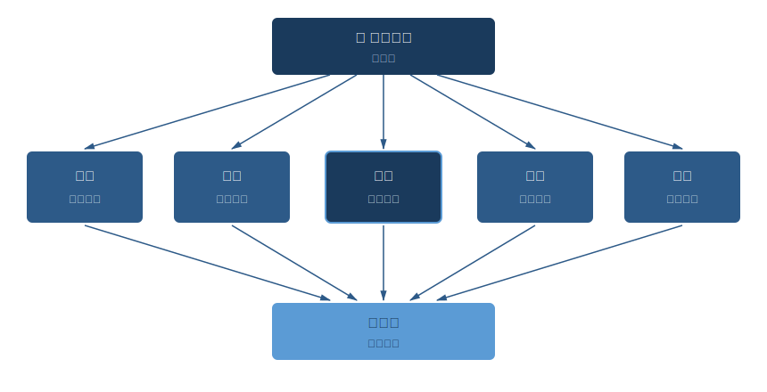

# 第九章 · 九十天养生计划

> 知其要者，一言而终；不知其要者，流散无穷。
>
> — 《黄帝内经·素问·至真要大论》（第七十四篇）

## 9.1 黄帝的最后一问

黄帝问岐伯：上古之人，春秋皆度百岁而动作不衰；今时之人，年半百而动作皆衰。时世异耶？人将失之耶？

翻成大白话：是时代变了，还是人把道弄丢了？

前八章分别拆解了这个问题。节律、饮食、情志、运动、预防、阴阳、睡眠，七块拼图。但拼图散在桌上没用，得拼到一起，变成你能照着走的路。

《素问·至真要大论》有一句话可以为整部内经做注脚：「知其要者，一言而终；不知其要者，流散无穷。」抓住核心，一个字就能说完。抓不住？会在细节里迷失一辈子。

那个字是什么？**和**。和于阴阳，和于四时，和于五味，和于情志，和于动静，和于睡醒。这一章的任务：把"和"压缩成一张九十天的行动路线图。

为什么是九十天？两个理由。

第一，九十天约等于一个季节。内经以四季为生命节律的基本单位。春生、夏长、秋收、冬藏，每个季节就是一次完整的循环。

第二，现代行为科学给出了相近的数字。Phillippa Lally 等人 2010 年在《欧洲社会心理学杂志》上发表的研究追踪了 96 名受试者，发现一个新习惯从刻意执行到自动化平均需要 66 天，复杂行为需要更久。九十天是安全余量，也是传统与科学的交汇点。

---

## 9.2 五柱总览

先看全局。

| 支柱 | 章节 | 核心原则 | 一句话 |
|------|------|---------|--------|
| 顺时 | 第二章 | 子午流注 | 活在身体的时间表里 |
| 食养 | 第三章 | 五味平衡 | 平衡五味，顺时而食 |
| 调情志 | 第四章 | 七情调和 | 情绪是气，调节而非压抑 |
| 动形 | 第五章 | 形劳不倦 | 如水流动，不对抗，不过度 |
| 治未病 | 第六章 | 上工治未病 | 预防先于治疗 |

阴阳（第七章）贯穿一切，是元原理。睡眠（第八章）是核心恢复机制。五柱是地基，阴阳是屋顶，睡眠是中央支柱。

---

## 9.3 第一阶段：筑基（第 1-30 天）

主题：校准生活的钟。不要同时改变一切，先把节律建起来。

### 第 1-2 周：睡眠重置

所有改变从睡眠开始。为什么？因为睡不好，其他什么都做不好。

第八章的核心论点：子时（23:00-01:00）是阴气最盛的窗口，身体在这个时段进入最深层的修复。错过子时再补觉，效果打折。

四个行动：
- 23:00 前上床，把这件事当成不可迟到的约定
- 睡前 1 小时停掉所有屏幕
- 起床后 30 分钟内晒太阳
- 睡前热水泡脚 15 分钟

这四件事看起来普通？Andrew Huberman 在斯坦福的神经科学研究反复证实：晨光暴露和稳定的就寝时间是调节昼夜节律最有效的两个手段。内经说"法于阴阳，和于术数"，和现代睡眠科学说的是同一件事。

### 第 3-4 周：节律校准

睡眠稳定之后，开始调白天的节奏。

- 7:00-9:00 吃早餐（辰时，胃经当令），让早餐成为一天中最丰盛的一餐
- 晚餐在 19:00 前完成，份量轻简
- 每天 15 分钟步行，早晨优先
- 每天早晨做 2 分钟腹式呼吸

**第一阶段达标线：**
- 23:00 前入睡 ≥ 每周 5 晚
- 吃早餐 ≥ 每周 5 天
- 每日步行 ≥ 每周 5 天

不追求完美。70% 的持续执行远胜 100% 的宏大计划。

---

## 9.4 第二阶段：拓展（第 31-60 天）

主题：在节律基础上叠加饮食调整和情绪觉察。

### 第 5-6 周：五味饮食

先做一个自检：你平时的饮食里，哪些味道占主导？多数人的答案是甜和咸。其他三味呢？

- 每周增加一种"缺席的味道"。苦（绿茶、苦瓜）、酸（发酵食品、醋）、辛（姜、蒜、香料）
- 每天至少一顿温热早餐。粥、汤、燕麦，不是冰咖啡加冷沙拉
- 践行七分饱。吃到"还能再来几口"的时候，放下筷子

五味平衡是加法，不是减法。第三章的核心洞见：问题不是"不能吃什么"，而是"还缺什么"。味觉的版图从两种颜色扩展到五种，饮食反而变得更丰富。

### 第 7-8 周：情志卫生

- 每天早晨 3 分钟情绪签到。日记或者默想都行：此刻的情绪底色是什么？
- 识别你的主导情绪模式。容易怒？容易忧思？容易焦虑？
- 每周实践一次"以情胜情"。怒则走（愤怒时去散步），忧则歌（忧郁时听音乐或唱歌），恐则思（恐惧时用理性分析）
- 把每天的一次刷手机时间替换为 10 分钟散步

记住第四章的核心法则：情绪不是敌人，是气的表达。目标不是消灭情绪，而是让气流动起来。你有没有注意过，生闷气时胸口是堵的，痛哭一场之后反而通畅了？那就是气在流动。

**第二阶段达标线：**
- 每周 ≥ 3 餐有意识地实践五味平衡
- 晨间情绪签到 ≥ 每周 4 天
- 能说出自己的主导情绪模式

---

## 9.5 第三阶段：融合（第 61-90 天）

主题：从刻意练习到不假思索。内经的智慧融进日常的肌理，不再需要提醒自己。

### 第 9-10 周：运动进阶

- 每日步行升级为 30 分钟
- 每周加一次太极、八段锦或拉伸（YouTube 教程就够了）
- 遵循内经的运动时间表：晨起拉伸，午后 15:00-17:00 做强度较高的锻炼（膀胱经当令，体能高峰），傍晚柔缓收尾
- 实践"五劳"觉察：每 50 分钟变换姿势。久视伤血、久坐伤肉、久立伤骨、久行伤筋、久卧伤气

### 第 11-12 周：四时调摄与治未病

- 根据当前季节调整睡眠和饮食（回顾第二、三章的季节指导）
- 每周做一次身体扫描：精力、睡眠、消化、情绪、疼痛，五个维度各打 1-5 分
- 构建个人体质档案（回顾第六章的九种体质）
- 开始规划下一个九十天。这不是一个有截止日期的项目，是一种活法

**第三阶段达标线：**
- 每周运动 ≥ 4 天，方式多样
- 日常选择中体现季节意识
- 每周自我监测已成习惯

---

## 9.6 每周节律模板

所有要素合并成一张可执行的周计划。

| 时间 | 周一至周五 | 周六 | 周日 |
|------|-----------|------|------|
| 6:00-7:00 | 起床、晨光、呼吸练习 | 适当晚起 | 适当晚起 |
| 7:00-9:00 | 温热早餐（一天最丰盛） | 逛市场、烹饪时令食材 | 轻松早午餐 |
| 9:00-12:00 | 工作（50 分钟专注 + 运动间隙） | 户外运动或太极 | 休息、阅读、反思 |
| 12:00-13:00 | 适量午餐，短暂休息 | 轻简午餐 | 轻简午餐 |
| 15:00-17:00 | 运动窗口（散步或锻炼） | 社交休闲 | 亲近自然 |
| 18:00-19:00 | 清淡晚餐 | 清淡晚餐 | 备餐（为下周准备） |
| 21:00-22:00 | 放松、泡脚、远离屏幕 | 同左 | 每周身体扫描 |
| 23:00 前 | 入睡 | 入睡 | 入睡 |

这不是军事化时间表，是节律的脚手架。等脚手架成为习惯，你不会再注意到它。就像骑自行车，刚学的时候满脑子在想怎么保持平衡，骑熟了根本不用想。

---

## 9.7 常见障碍与内经解法

| 障碍 | 内经视角 | 实用解法 |
|------|---------|---------|
| "我太忙了" | 过劳伤气。忙不是理由，是最该养生的原因 | 从一件事开始：固定睡觉时间。每天 10 分钟就能启动改变 |
| "我经常出差" | 因时制宜。环境在变，原则不变 | 守住锚点：不论哪个时区，23:00 规则不动摇 |
| "我讨厌早起运动" | 因人制宜，不必强迫 | 下午 15:00-17:00 才是内经推荐的运动高峰 |
| "健康饮食太无聊" | 五味平衡是加法，不是减法 | 加味道，别减味道。姜、蒜、香料、发酵食品都是盟友 |
| "我控制不了情绪" | 情志有法，先觉察再调节 | 别想着控制，先命名。说出那个情绪的名字，找到它在身体里的位置 |
| "这些加起来太多了" | 和，不是完 | 七分法则：70% 的持续性胜过 100% 的完美主义 |

---

## 9.8 你的健康仪表盘

每月花五分钟做一次自评。纸笔就够了，不需要 App。

**五柱评分（每项 1-5 分）：**

1. **睡眠**：入睡顺畅？醒来精神？
2. **饮食**：早餐有吃？七分饱做到了？五味有扩展？
3. **情志**：知道自己的情绪状态？有在调节？
4. **运动**：每周有在动？不只一种方式？
5. **整体活力**：和上个月比，方向是上升还是下降？

每月记录一次。不追求分数，追求趋势。连续三个月看下来，方向比数字重要得多。

---

### 证据强度标注

| 原则 | 证据等级 | 说明 |
|------|---------|------|
| 90 天足以改变习惯 | ✓ 已证实 | Lally 2010 研究：平均 66 天形成习惯，90 天提供安全余量 |
| 渐进式改变优于激进式 | ✓ 已证实 | 行为科学共识：微习惯策略的成功率远超全面改革 |
| 七分法则（70% 持续性 > 100% 完美）| ? 合理假说 | 与"完美是好的敌人"一致，但缺乏直接对比的量化研究 |
| 社交支持增强健康行为 | ✓ 已证实 | 蓝区研究 + 多项行为干预 RCT 证实同伴支持显著提高依从性 |
| 季节为养生基本单位 | ? 合理假说 | 内经以四季为框架有哲学基础，"恰好 90 天"是近似而非精确 |

---

## 9.9 黄帝的答案

回到第一页的那个问题。

黄帝问：今时之人，年半百而动作皆衰，时世异耶？人将失之耶？

岐伯的回答，出现在《素问》第一篇的开头：

「上古之人，其知道者，法于阴阳，和于术数，食饮有节，起居有常，不妄作劳，故能形与神俱，而尽终其天年，度百岁乃去。」

*Shàng gǔ zhī rén, qí zhī dào zhě, fǎ yú yīn yáng, hé yú shù shù, shí yǐn yǒu jié, qǐ jū yǒu cháng, bù wàng zuò láo, gù néng xíng yǔ shén jù, ér jìn zhōng qí tiān nián, dù bǎi suì nǎi qù.*

上古那些懂得养生之道的人，以阴阳为法则，以术数为调和，饮食有节制，起居有规律，不过度劳作。形体与精神合一，得以尽享天年，活过百岁才离去。

两千五百年后，这段话仍然是最好的养生处方。法于阴阳，遵循自然规律。和于术数，掌握平衡的方法。食饮有节，饮食有度。起居有常，生活有律。不妄作劳，不过度消耗。

道没有丢。它被手机屏幕的蓝光、深夜的外卖、无尽的加班、被压抑的情绪遮住了。但道一直在那里。在日升月落的节律里，在五谷五味的丰饶里，在深呼吸后的平静里，在一夜好眠后的清明里。

你的身体本来就知道这些。

最后的问题不是岐伯的，是你的：明天，你打算做出什么不同？

---

## 9.10 反思时刻

**最打动你的是哪一条原则？** 子午流注的时间智慧？五味平衡的饮食哲学？以情胜情的调节之法？治未病的预防思维？把它写下来，贴在每天能看到的地方。

**明天要做的第一个改变是什么？** 不要三个，不要五个。一个就够。今晚 23:00 前上床，明早吃一顿热乎的早餐，下次愤怒涌起时出去走十分钟。最小的改变持续执行，比最完美的计划搁在那里强一百倍。

**你会拉谁一起走这九十天？** Dan Buettner 的蓝区研究反复印证同一个结论：全球最长寿社区的共同特征不是基因、不是饮食、不是气候，是人与人之间的连接。找一个伙伴、一个朋友、一个家人，一起上路。

「知其要者，一言而终。」

那个字是**和**。

行动，从明天开始。

---

## 进阶模块：90 天之后

完成 90 天计划后，你已经建立了一个稳固的养生基础。接下来三章可以帮你进一步深化：

- **Ch 10 · 经络与筋膜**：把第五章的运动练习升级——加入经络拉伸、泡沫轴滚动和穴位自我按压，让运动从"肌肉层面"深入到"筋膜层面"。
- **Ch 11 · 呼吸与姿态**：把贯穿整个 90 天的腹式呼吸练习系统化——加入六字诀、站桩、步行冥想，让"调息"成为你的日常操作系统。
- **Ch 12 · AI 与中医**：用 AI 工具做一次体质自测，生成属于你个人的养生方案。每周向 AI 汇报健康数据，让你的 90 天计划进化为一个持续优化的终身系统。

---

## 参考文献

1. **佚名.** 《黄帝内经·素问》第 1 篇（上古天真论）、第 2 篇（四气调神大论）、第 74 篇（至真要大论） — 本书核心经典文本。

2. **Lally, P., van Jaarsveld, C.H.M., Potts, H.W.W., & Wardle, J.** (2010). "How are habits formed: Modelling habit formation in the real world." *European Journal of Social Psychology*, 40(6), 998–1009. DOI: 10.1002/ejsp.674 — 习惯养成平均需要 66 天的经典研究。

3. **Huberman, A.** (2021). "Using Light for Health." *Huberman Lab Podcast*, Stanford University. — 晨光暴露与昼夜节律调节的神经科学依据。

4. **Buettner, D.** (2008). *The Blue Zones: Lessons for Living Longer from the People Who've Lived the Longest*. National Geographic. — 全球长寿社区的共同特征研究。

5. **Clear, J.** (2018). *Atomic Habits: An Easy & Proven Way to Build Good Habits & Break Bad Ones*. Avery. — 微习惯策略与行为变化机制。

6. **American College of Lifestyle Medicine.** (2024). "The Six Pillars of Lifestyle Medicine." ACLM Position Statement. — 生活方式医学六大支柱的循证框架。

7. **Walker, M.** (2017). *Why We Sleep: Unlocking the Power of Sleep and Dreams*. Scribner. — 睡眠科学与健康修复机制的系统论述。
