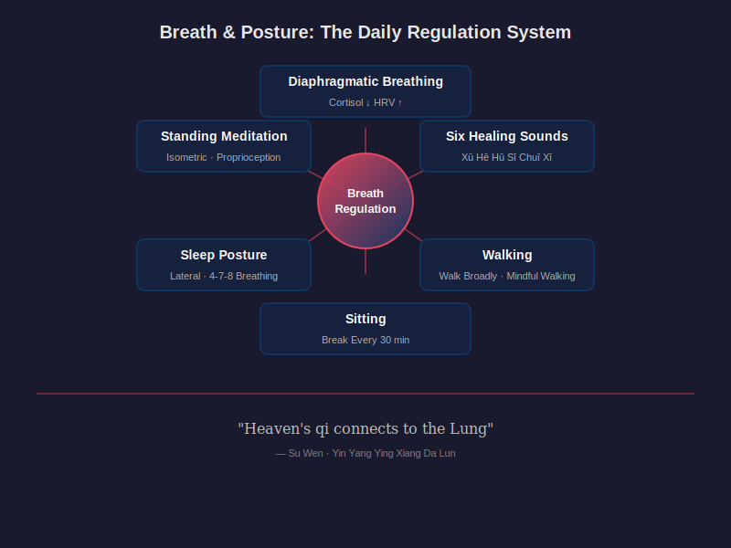

# Chapter 11 · Breath and Posture — The Art of Walking, Sitting, Lying, and Standing

> 恬淡虚无，真气从之，精神内守，病安从来。
> *Tián dàn xū wú, zhēn qì cóng zhī, jīng shén nèi shǒu, bìng ān cóng lái.*
>
> "When the mind is tranquil and empty, true qi follows. When the spirit is guarded within, how can illness arise?"
>
> — *Su Wen*, Chapter 1 (上古天真论)
>
> 天气通于肺。
> *Tiān qì tōng yú fèi.*
>
> "Heaven's qi connects to the Lung."
>
> — *Su Wen*, Chapter 9 (六节藏象论)

## 11.1 You Breathe 20,000 Times a Day and Never Notice

Place one hand on your chest and the other on your belly. Take a normal breath — don't change anything, just notice. Which hand moved?

If the chest hand rose and the belly hand stayed still, you breathe the way most modern adults breathe: shallowly, quickly, using the intercostal muscles and accessory neck muscles instead of the diaphragm. You are running your respiratory system on its backup generator.

The average adult takes between 17,000 and 23,000 breaths per day. At that volume, even a small inefficiency compounds. Chest breathing uses roughly twice the muscular effort of diaphragmatic breathing to move the same volume of air. It preferentially activates the sympathetic nervous system — the fight-or-flight branch — keeping cortisol slightly elevated, heart rate slightly faster, and muscle tension slightly higher than necessary. Over hours, days, and years, "slightly" adds up. Chronic shallow breathing is not a disease. It is a postural habit that tilts the body's entire autonomic baseline toward stress.

The Neijing understood breath as something more fundamental than gas exchange. In the classical framework, breath is the most direct channel through which a human being can regulate qi. *Su Wen* Chapter 9 states it plainly: 「天气通于肺」— heaven's qi connects to the Lung. The Lung in classical Chinese medicine is not just the anatomical organ. It is the body's interface with the atmosphere, the gateway through which external qi enters and internal qi is regulated. Breathing is where the outside world and the inner body meet.

*Su Wen* Chapter 3 (生气通天论) adds: 「气者，生之本也」(qì zhě, shēng zhī běn yě) — "Qi is the root of life." If qi is the root, breath is the tap root. Every other form of qi regulation — food, sleep, movement, emotion — operates indirectly. Breath operates directly. You cannot consciously accelerate your digestion or slow your liver metabolism. You can, in the space of a single exhale, shift your autonomic nervous system from sympathetic dominance to parasympathetic engagement.

That shift is not metaphorical. It is measurable, reproducible, and backed by three decades of cardiopulmonary research. The Neijing did not have the vocabulary of autonomic neuroscience. But it identified the phenomenon with precision: control the breath, and you control the qi; control the qi, and you control the body.

---

## 11.2 Diaphragmatic Breathing: The Science Behind Ancient Breathwork

The diaphragm is a dome-shaped muscle that separates the thoracic cavity from the abdominal cavity. When it contracts, it flattens downward, expanding the lungs from below and drawing air in. When it relaxes, it domes upward, compressing the lungs and pushing air out. This is the body's primary breathing mechanism — the one infants use instinctively and most adults have abandoned.

Watch a sleeping baby breathe. The belly rises and falls like a slow tide. The chest barely moves. No effort, no tension, no noise. That is diaphragmatic breathing — the factory default setting that modern life has overwritten.

**Why do adults lose it?** Three forces conspire. First, chronic stress: the fight-or-flight response shifts breathing upward into the chest, where the accessory muscles (scalenes, sternocleidomastoid, upper trapezius) can generate rapid, shallow breaths suited to sprinting from a predator. Second, postural collapse: hours of sitting with a flexed thoracic spine compress the abdominal cavity and restrict diaphragm excursion. Third, cultural aesthetics: "suck in your gut" cues people to brace the abdominals chronically, physically blocking the diaphragm from descending.

The result is a population of chest breathers running a stress-adapted breathing pattern twenty-four hours a day, regardless of whether any actual threat exists.

**What happens when you restore diaphragmatic breathing?**

In 2017, Xiao Ma and colleagues at Beijing Normal University published a randomized controlled trial in *Frontiers in Psychology*. Forty participants were assigned to either a diaphragmatic breathing training group (20 sessions over 8 weeks) or a control group. The breathing group showed significantly reduced cortisol levels, increased sustained attention, and reduced negative affect compared to controls. The cortisol reduction was not subtle — it was large enough to suggest a genuine shift in HPA axis activity, not just momentary relaxation.

The mechanism runs through the vagus nerve. The diaphragm is innervated by the phrenic nerve (C3–C5), but its rhythmic movement also mechanically stimulates the vagus nerve, which passes through the diaphragmatic hiatus alongside the esophagus. Slow, deep diaphragmatic breathing — particularly with an extended exhale — increases vagal tone. Higher vagal tone means stronger parasympathetic ("rest and digest") activation: lower heart rate, lower blood pressure, improved heart rate variability (HRV), enhanced digestive motility, and reduced inflammatory markers.

HRV — the variation in time intervals between consecutive heartbeats — has emerged as one of the most reliable biomarkers of autonomic health. Higher HRV correlates with better cardiovascular fitness, lower anxiety, greater emotional regulation capacity, and reduced all-cause mortality. A 2018 systematic review by Zaccaro and colleagues in *Frontiers in Human Neuroscience* analyzed 15 studies on slow breathing techniques (typically 6 breaths per minute) and found consistent improvements in HRV, with accompanying reductions in anxiety and increases in positive affect.

The Neijing's concept of 息 (xī, breath) maps onto this physiology with surprising precision. Classical texts describe ideal breathing as 深 (shēn, deep), 长 (cháng, long), 细 (xì, fine), and 匀 (yún, even). Deep: diaphragmatic, not chest-bound. Long: slow respiratory rate. Fine: low volume per breath, not gasping. Even: consistent rhythm without irregularity. These four qualities — deep, long, fine, even — are exactly the parameters that modern respiratory physiology identifies as optimal for vagal stimulation and autonomic balance.

**A basic diaphragmatic breathing exercise:**

1. Sit or lie down comfortably. Place one hand on your chest, the other on your belly.
2. Inhale through the nose for 4 counts. Direct the breath downward — the belly hand should rise, the chest hand should barely move.
3. Exhale through the nose or mouth for 6 counts. The belly hand falls as the diaphragm relaxes upward.
4. Repeat for 10 cycles (approximately 3 minutes).

The 4-count inhale and 6-count exhale create a roughly 6-breaths-per-minute rhythm — the frequency that multiple studies have identified as the "resonance frequency" for maximizing HRV amplitude. You don't need an app or a biofeedback device. You need a clock and a hand on your belly.

**Evidence tag: ✓ Confirmed.** Diaphragmatic breathing reduces cortisol, improves HRV, and activates the parasympathetic nervous system. Multiple RCTs and systematic reviews support these effects.

---

## 11.3 The Six Healing Sounds: One Sound, One Organ

The Six Healing Sounds (六字诀, liù zì jué) is one of China's oldest documented breathwork practices, codified during the Southern and Northern Dynasties (420–589 CE) by the physician Tao Hongjing. Each of the six sounds is performed on a slow exhale, paired with a specific mouth shape and body movement:

| Sound | Pinyin | Target Organ | Mouth Shape |
|-------|--------|-------------|-------------|
| 嘘 | xū | Liver | lips slightly parted, air flows through tight gap |
| 呵 | hē | Heart | mouth open wide, breath from deep throat |
| 呼 | hū | Spleen | lips rounded into an "O" |
| 呬 | sī | Lung | teeth lightly closed, air hisses through |
| 吹 | chuī | Kidney | lips pursed as if blowing out a candle |
| 嘻 | xī | San Jiao (Triple Burner) | mouth in a wide smile shape |

The classical claim is that each sound's specific vibration resonates with and "cleanses" its corresponding organ. Taken literally, this is hard to defend — vocal sounds do not selectively vibrate individual organs. But taken functionally, the practice does several things that modern science can explain.

**Extended exhale, every time.** Each healing sound is performed on a prolonged, controlled exhale. Six sounds × 6 repetitions each = 36 extended exhales in a single session. This alone produces significant parasympathetic activation through the vagal mechanism described in Section 11.2.

**Vocalization and vagus nerve stimulation.** Producing vocal sounds activates the laryngeal muscles, which are innervated by the recurrent laryngeal branch of the vagus nerve. Humming, chanting, and sustained vocalization have been shown to increase vagal tone. A 2013 study by Vickhoff and colleagues demonstrated that group singing synchronizes heart rate rhythms among participants, likely through shared respiratory patterns and vagal activation. The Six Healing Sounds function as a structured vocalization practice — a form of self-administered vagal stimulation.

**Breath shaping and airway resistance.** The different mouth shapes create different levels of airway resistance during exhalation. Pursed-lip breathing (the "chuī" sound) is a recognized respiratory therapy technique that increases expiratory airway pressure, prevents small airway collapse, and improves gas exchange in patients with COPD. The "sī" sound (teeth-closed hissing) creates similar back-pressure. Each mouth shape is, in effect, a different resistance setting on the exhale valve.

**Body awareness and interoception.** Practitioners are instructed to visualize the target organ while producing each sound. Whether or not the sound directly affects the organ, the practice trains interoceptive awareness — the ability to sense internal body states. Interoceptive accuracy has been linked to better emotional regulation and lower anxiety in multiple studies.

The Six Healing Sounds will not cure liver disease or repair a failing kidney. But as a structured breathwork protocol that combines extended exhales, vocalization-driven vagal stimulation, variable airway resistance, and body-focused attention, it checks every box that modern respiratory physiology considers beneficial.

**Evidence tag: ? Plausible hypothesis** (for organ-specific effects of individual sounds). **✓ Confirmed** (for the general benefits of extended exhale vocalization and pursed-lip breathing techniques).

---

## 11.4 Walking: The Best Exercise Is the Simplest

*Su Wen* Chapter 2 (四气调神大论) describes the ideal spring lifestyle: 「广步于庭」(guǎng bù yú tíng) — "walk broadly in the courtyard." The instruction appears in a passage about seasonal living. In spring, when nature stirs, the appropriate human response is to rise early and walk — not run, not sprint, not train — walk. Broadly. Without urgency.

This is not a throwaway line. Walking occupies a unique position in human physiology. Bipedal locomotion is the movement pattern that shaped the human skeleton, circulatory system, and brain over two million years of evolution. Running came later, for hunting. Lifting came later, for construction. Walking is the original human movement — the one every system in the body was optimized for.

**The cardiovascular case.** A 2023 meta-analysis by Banach and colleagues in the *European Journal of Preventive Cardiology* pooled data from 226,889 participants across 17 studies. The finding: all-cause mortality risk decreased with every additional 1,000 steps per day, starting as low as 3,967 steps. There was no lower threshold below which walking had no benefit. The dose-response curve flattened above approximately 10,000 steps, but the steepest mortality reduction occurred between 0 and 5,000 steps. For sedentary individuals, a single daily 30-minute walk represents the highest-leverage health intervention available.

**The cognitive case.** In 2011, Kirk Erickson and colleagues at the University of Pittsburgh published a landmark RCT in *Proceedings of the National Academy of Sciences*. One hundred and twenty older adults were randomized to either a walking program (40 minutes, three times per week) or a stretching-only control. After one year, the walking group showed a 2% increase in hippocampal volume — reversing the 1–2% annual shrinkage typical of aging. The stretching group showed the expected decline. Walking didn't just slow brain aging. It reversed it.

**The mood case.** A 2018 meta-analysis by Schuch and colleagues in *JAMA Psychiatry* found that physical activity — with walking as the most commonly studied form — significantly reduced the risk of developing depression across all age groups. The effect was dose-dependent but present even at low activity levels.

**Correct walking mechanics:**

Most people walk on autopilot. The mechanics matter more than you think.

- **Heel strike first, then roll through the midfoot to the toes.** The heel-to-toe roll engages the plantar fascia and the entire Superficial Back Line (see Chapter 10). Flat-footed slapping absorbs shock poorly and under-stimulates the foot's sensory network.
- **Slight knee bend at contact.** A fully extended knee at heel strike sends impact forces straight into the joint. A slight bend (5–10°) allows the quadriceps and hamstrings to act as shock absorbers.
- **Neutral pelvis.** Neither tucked under (posterior tilt, which flattens the lumbar curve) nor exaggerated (anterior tilt, which creates excessive lordosis). The pelvis should sit level, like a bowl of water you don't want to spill.
- **Gaze forward, not down.** Looking at your phone while walking shifts the head forward by 2–4 inches. The head weighs 10–12 pounds. At a 45° forward tilt, the effective load on the cervical spine reaches 50 pounds — the weight of a seven-year-old sitting on your neck.

**Walking meditation.** The Neijing's 「广步于庭」is not a prescription for step-counting. It is a prescription for presence. Walking meditation — practiced in both Buddhist and Daoist traditions — means walking slowly, feeling each phase of the gait cycle (lift, move, place), and treating each step as a deliberate act rather than a means of transport. Research on mindful walking shows additional benefits beyond standard walking: greater reductions in rumination, improved attentional control, and enhanced feelings of connection to the environment (Teut et al., 2013).

The simplest wellness intervention in this book: walk for 20 minutes every day. Not on a treadmill. Outside. Without earbuds. Feel the ground.

**Evidence tag: ✓ Confirmed.** Walking reduces all-cause mortality, improves cardiovascular health, increases hippocampal volume, reduces depression risk, and is supported by dozens of large-scale meta-analyses and RCTs.

---

## 11.5 Sitting: Modern Life's Greatest Postural Crisis

*Su Wen* Chapter 23 (宣明五气篇) delivers its verdict in four characters: 「久坐伤肉」(jiǔ zuò shāng ròu) — "prolonged sitting injures the flesh." We covered this in Chapter 5's discussion of the Five Exhaustions. Now let's go deeper — not into why sitting is harmful, but into how to sit when sitting is unavoidable.

The average office worker sits 9.3 hours per day (Clemes et al., 2014). Telling this person to "stop sitting" is like telling a fish to stop swimming. The realistic question is not *whether* to sit but *how*.

**The anatomy of a bad sit.** Most people sit on their sacrum, not their ischial tuberosities. The ischial tuberosities — the "sit bones" — are the two bony prominences at the bottom of the pelvis designed to bear seated weight. When you slump backward, your weight rolls off the sit bones and onto the sacrum and coccyx. This posteriorly tilts the pelvis, flattens the lumbar lordosis, rounds the thoracic spine, and pushes the head forward. The entire spinal column loses its natural S-curve and collapses into a C-shape. Over hours, the posterior ligaments of the lumbar spine stretch, the anterior disc spaces compress asymmetrically, the hip flexors shorten, and the deep stabilizer muscles (multifidus, transversus abdominis) disengage.

This is not a posture lecture. This is a description of the mechanical pathway from "sitting at a desk" to "low back pain" — a condition that affects 80% of adults at some point in their lives and costs global economies over $100 billion annually.

**Correct sitting principles:**

1. **Sit on your sit bones.** Rock your pelvis forward and back a few times to find the ischial tuberosities. When you feel two hard bumps pressing into the seat, stop. That is your base of support. The pelvis should be in a neutral position — neither tucked under nor exaggerated forward.

2. **Preserve the three spinal curves.** The lumbar spine should have a gentle inward curve (lordosis). The thoracic spine should have a gentle outward curve (kyphosis). The cervical spine should have a gentle inward curve. These three curves distribute compressive load across the entire spine. Lose any one of them and load concentrates at the transition zones (L4–L5, T12–L1, C5–C6) — precisely the most common sites of disc herniation.

3. **Feet flat on the floor, knees at 90°.** If your chair is too high, your feet dangle and the front edge of the seat compresses the back of your thighs, restricting venous return. If too low, your hip angle closes below 90°, increasing lumbar flexion load.

4. **Shoulders relaxed, not braced.** "Sit up straight" is the wrong cue. It makes people brace their shoulders back and up, which activates the upper trapezius and creates a rigid, tiring posture. The right cue: "let your shoulders melt downward." Gravity does the work.

5. **Screen at eye level.** The top of the monitor should be at or slightly below eye height. This keeps the cervical spine neutral. A screen 6 inches too low forces 20° of neck flexion — enough to increase cervical disc pressure by 60%.

**"The best posture is the next posture."** This phrase, attributed to various ergonomics researchers, captures the Neijing's Five Exhaustions principle in seven words. No static posture, no matter how "correct," is sustainable for hours. The intervertebral discs have no direct blood supply — they receive nutrients through a pumping mechanism driven by alternating compression and decompression. Sitting still starves the discs.

In 2016, a study published in the *Annals of Internal Medicine* (Diaz et al.) analyzed data from 7,985 adults wearing accelerometers. They found that both total sedentary time and uninterrupted sedentary bout duration predicted all-cause mortality. Breaking up sitting every 30 minutes with 5 minutes of light activity (standing, walking, stretching) reduced mortality risk independent of total sitting time. The biology is clear: it's not just how long you sit. It's how long you sit *without interruption*.

The practical rule: every 50 minutes, stand up, walk for 2 minutes, and perform one postural reset (shoulder circles, spinal twist, or a standing forward fold). Set a timer. Your discs, your hip flexors, and your cardiovascular system will thank you.

**Evidence tag: ✓ Confirmed.** Prolonged uninterrupted sitting increases all-cause mortality. Breaking up sedentary bouts reduces risk. Proper seated alignment reduces spinal load. Multiple epidemiological studies and biomechanical analyses support these conclusions.

---

## 11.6 Lying: Sleep Posture and Breathing Quality

The Neijing does not discuss sleep posture in exhaustive detail, but classical Chinese medical texts that built on the Neijing tradition — particularly Sun Simiao's *Qianjin Yaofang* (千金要方, 7th century CE) — recommend the right lateral recumbent position for sleep: lying on the right side, legs slightly bent, right hand under the cheek or pillow, left hand resting on the left hip.

The reasoning in classical texts is that this position keeps the heart (situated slightly left of midline) elevated rather than compressed, allows the stomach and intestines to rest in their natural position, and promotes smooth qi circulation during sleep. Sun Simiao called it the "lion's pose" (狮子卧), after the resting posture of the Buddha.

Modern sleep science partially validates this preference.

**Side sleeping vs. supine vs. prone:**

- **Side sleeping** (lateral) keeps the airway open by allowing the tongue and soft palate to fall laterally rather than posteriorly. For people with obstructive sleep apnea (OSA) or heavy snoring, side sleeping reduces apnea-hypopnea index (AHI) scores by 50% or more compared to supine sleeping (Ravesloot et al., 2013). Side sleeping also facilitates the glymphatic system — the brain's waste-clearance mechanism. A 2015 study by Lee and colleagues using dynamic contrast MRI in rodents found that lateral sleeping position was most efficient for glymphatic transport, suggesting that side sleeping may optimize brain waste clearance during sleep.

- **Supine sleeping** (on the back) distributes weight evenly across the spine and is generally recommended for spinal health — but it is the worst position for snoring and sleep apnea. Gravity pulls the tongue and soft palate backward, narrowing the airway. For people without airway issues, supine is fine. For the estimated 936 million adults worldwide with mild-to-severe OSA (Benjafield et al., 2019), it can be actively harmful.

- **Prone sleeping** (on the stomach) forces the neck into full rotation to breathe — 70–90° of cervical rotation maintained for hours. This compresses the vertebral arteries, stretches the contralateral cervical ligaments, and almost universally causes morning neck pain and stiffness. Sleep medicine specialists consistently recommend against prone sleeping.

The right-side-specific recommendation in classical texts has an additional anatomical rationale: the gastroesophageal junction enters the stomach from the right side. Left lateral sleeping positions the junction above the stomach, reducing gastric reflux. This makes left-side sleeping preferable for people with GERD. The classical preference for right-side may have been influenced by philosophical or Buddhist convention rather than purely anatomical reasoning. The honest recommendation: side sleeping is better than supine for most people; which side depends on whether airway or reflux is your bigger concern.

**Pre-sleep breathing: the 4-7-8 technique.**

Andrew Weil popularized the 4-7-8 technique, which draws on pranayama traditions:

1. Inhale through the nose for 4 counts.
2. Hold the breath for 7 counts.
3. Exhale through the mouth for 8 counts.
4. Repeat for 4 cycles.

The prolonged breath-hold increases CO₂ tolerance and the extended exhale drives strong parasympathetic activation. A 2022 study (Vierra et al., *Physiological Reports*) found that 4-7-8 breathing significantly reduced heart rate and systolic blood pressure within 4 minutes of practice. The technique works as a transition ritual — a physiological signal to the body that the waking state is ending and the sleep state should begin.

Combine sleep posture and pre-sleep breathing into a single habit: lie on your side, close your eyes, and perform four rounds of 4-7-8 breathing. Total time: approximately 2 minutes. This is the lowest-effort, highest-return sleep-onset intervention in the literature.

**Evidence tag: ✓ Confirmed** (for side sleeping benefits in sleep apnea and airway patency). **? Plausible hypothesis** (for right-side-specific superiority as a general recommendation; left side is better for GERD). **✓ Confirmed** (for slow breathing techniques reducing heart rate and promoting sleep onset).

---

## 11.7 Standing: Zhan Zhuang — Stillness as Exercise

The Neijing's movement philosophy includes a paradox: sometimes the most powerful exercise is not moving at all.

Zhan Zhuang (站桩, zhàn zhuāng, "standing like a post") is a standing meditation practice rooted in Daoyin tradition. The practitioner assumes a specific standing posture and holds it — typically for 5 to 40 minutes — without moving. To an observer, nothing is happening. Inside the body, everything is happening.

**The basic stance:**

1. Feet parallel, shoulder-width apart.
2. Knees slightly bent (10–15°) — not locked, not in a deep squat.
3. Pelvis neutral, tailbone pointing slightly downward.
4. Spine elongated, as if a thread pulls the crown of the head toward the ceiling.
5. Shoulders relaxed and slightly rounded forward.
6. Arms raised to chest height, elbows bent, palms facing the chest — as if embracing a large tree trunk. This is the classic "Embracing the Tree" (抱球桩) position.
7. Eyes soft, gaze slightly downward. Jaw relaxed. Tongue resting lightly on the upper palate.
8. Breathe naturally through the nose. Do not force a pattern.

It looks easy. Try it for two minutes. Your thighs will burn. Your shoulders will ache. Your mind will scream for you to move. That is the practice.

**What Zhan Zhuang trains:**

**Proprioception.** Standing still on slightly bent legs demands continuous micro-adjustments from the body's proprioceptive system — the network of sensors in muscles, tendons, and joints that monitors position and balance. A 2014 study by Tsang and colleagues found that Tai Chi practitioners (who typically train Zhan Zhuang as a foundation) showed significantly superior proprioceptive acuity in the knee and ankle compared to age-matched controls. Proprioceptive decline is a primary driver of falls in older adults. Training it is not optional — it is survival infrastructure.

**Isometric lower-limb strength.** The slightly bent knee position generates sustained isometric load on the quadriceps, hamstrings, and gluteal muscles. Unlike dynamic exercises, isometric holds maintain constant muscle tension without joint movement, reducing shear forces on the knee. A 2019 meta-analysis by Oranchuk and colleagues in *Sports Medicine* found that isometric training significantly improves maximal strength, tendon stiffness, and joint stability — benefits particularly relevant for people with knee osteoarthritis or those recovering from lower-limb injury.

**Fascial tension balance.** The Zhan Zhuang posture places the body in a state of "tensegrity" — a term from structural engineering describing structures that maintain their shape through a balance of continuous tension and isolated compression. The arms embrace, the knees bend, the spine elongates, the shoulders drop. Every major fascial chain is under mild, balanced tension. This differs fundamentally from the asymmetric, collapsed fascial loading of sitting at a desk or the repetitive unidirectional loading of running.

**Autonomic regulation.** Standing still forces mental stillness. The practice is often described as "meditation while standing." A 2016 pilot study on standing meditation by Fong and Ng (published in *Evidence-Based Complementary and Alternative Medicine*) found that 8 weeks of Zhan Zhuang practice significantly improved HRV indices and reduced perceived stress in healthy adults.

**A 5-minute daily standing meditation starter guide:**

- **Week 1:** Stand in the basic stance (without raising the arms) for 2 minutes per day. Focus on feeling your weight distributed evenly across both feet. When your mind wanders, return attention to the soles of your feet.
- **Week 2:** Increase to 3 minutes. Raise the arms to the "Embracing the Tree" position. When the shoulders burn, lower the arms slightly but do not drop them completely.
- **Week 3:** Increase to 5 minutes. Add a breathing focus: with each inhale, imagine the breath descending to the lower abdomen (the dantian, 丹田, three finger-widths below the navel). With each exhale, imagine the body sinking slightly heavier into the ground.

After 21 days, most practitioners report reduced lower back stiffness, improved balance, and a paradoxical experience: standing still feels less tiring than it did at the start, even though you are doing more of it. The body has adapted. The stabilizer muscles have strengthened. The fascia has rebalanced. And the mind has learned that stillness is not the absence of activity — it is activity refined to its essence.

**Evidence tag: ✓ Confirmed** (for isometric training benefits on strength and joint stability; for proprioceptive training benefits). **? Plausible hypothesis** (for Zhan Zhuang-specific effects on HRV and fascial tensegrity; limited high-quality RCTs exist for standing meditation as a distinct intervention).

---

---

## 11.8 Daily Practice: Breath and Posture Protocol

The principles in this chapter converge into a simple daily protocol. No equipment. No gym membership. No special clothing. Four moments in the day, four brief practices.

**Morning Protocol (5 minutes, upon waking)**

1. **Diaphragmatic breathing** — 10 cycles (4-count inhale, 6-count exhale). Perform seated on the edge of the bed or lying supine. This resets autonomic tone from sleep to waking without a cortisol spike.
2. **Zhan Zhuang** — 3 minutes in the basic stance. This activates the lower-limb stabilizers, grounds proprioceptive awareness, and establishes an upright postural template for the day.

**Work Protocol (every 50 minutes during seated work)**

1. **Postural reset** — Stand up. Perform 5 shoulder circles in each direction. Take 3 deep diaphragmatic breaths.
2. **Walk for 2 minutes** — to the kitchen, around the office, down the hallway. The destination does not matter. The interruption of static sitting does.

Total disruption to your work day: 4 minutes per hour. Total benefit: breaking the metabolic and musculoskeletal cascade of uninterrupted sitting.

**Walk Protocol (20 minutes, any time of day)**

1. Walk outside at a comfortable pace. No phone, no podcast.
2. For the first 5 minutes, focus on walking mechanics: heel strike, knee bend, pelvis neutral, gaze forward.
3. For the remaining 15 minutes, let attention soften. Notice the ground texture, the air temperature, the sounds. This is 「广步于庭」— broad walking, present walking.

**Evening Protocol (5 minutes, before bed)**

1. **Six Healing Sounds** — one round of all six sounds (36 total exhales). This serves as a physiological wind-down, shifting the autonomic state toward parasympathetic dominance.
2. **4-7-8 breathing** — 4 cycles, lying in your preferred side-sleeping position. This bridges the transition from waking to sleeping.

The entire daily commitment: approximately 35 minutes of deliberate breath and posture practice, distributed across the day in small doses. No single block exceeds 20 minutes. No single practice requires training or instruction beyond what this chapter provides.

---

## Today's Actions

- **Right now:** Place your hand on your belly and take 5 diaphragmatic breaths (4-count inhale, 6-count exhale). Feel the belly rise. This takes 50 seconds.
- **Today:** Set a timer for 50 minutes during your next work session. When it rings, stand up, do 5 shoulder circles each direction, and take 3 deep breaths. Sit back down.
- **Tonight:** Lie on your side and perform 4 rounds of 4-7-8 breathing before sleep. Notice how long it takes you to fall asleep compared to your usual pattern.

---

## 21-Day Micro-Experiment: The Breath and Posture Reset

**Week 1 (Days 1–7):** Each morning, perform 10 diaphragmatic breathing cycles (4-count inhale, 6-count exhale) and rate your morning stress level (1 = calm, 5 = wired). Each evening, perform 4 rounds of 4-7-8 breathing before bed and rate sleep onset speed (1 = fell asleep quickly, 5 = lay awake a long time).

**Week 2 (Days 8–14):** Add the 50-minute sitting break protocol during work. Continue morning and evening breathing. Add a 15-minute walk on at least 5 of the 7 days. Rate afternoon energy level (1 = exhausted, 5 = alert and steady).

**Week 3 (Days 15–21):** Add 3 minutes of Zhan Zhuang to the morning routine and one round of Six Healing Sounds to the evening routine. Continue all Week 2 practices. Rate overall body comfort at end of each day (1 = stiff and tense, 5 = relaxed and mobile).

Compare Day 1 to Day 21. If morning stress drops by 2+ points, sleep onset improves by 2+ points, and end-of-day body comfort increases, your breath and posture habits are shifting your autonomic and musculoskeletal baseline.

---

## Evidence Strength Ratings

| Neijing Principle | Evidence Level | Notes |
|---|---|---|
| Breath regulates qi / controls body function (气者，生之本也) | ✓ Confirmed | Diaphragmatic breathing measurably alters cortisol, HRV, and autonomic balance; multiple systematic reviews confirm |
| Deep, long, fine, even breathing is ideal | ✓ Confirmed | Slow breathing (~6 breaths/min) maximizes HRV and vagal tone; Zaccaro et al. 2018 systematic review |
| Six Healing Sounds heal specific organs | ? Plausible hypothesis | Extended exhale vocalization benefits are confirmed; organ-specific sound effects lack controlled evidence |
| Walking broadly in the courtyard (广步于庭) promotes health | ✓ Confirmed | Banach et al. 2023: as few as ~4,000 daily steps reduce all-cause mortality; Erickson 2011: walking increases hippocampal volume |
| Prolonged sitting injures the flesh (久坐伤肉) | ✓ Confirmed | Diaz et al. 2017: uninterrupted sedentary bouts predict mortality; breaking sitting every 30 min reduces risk |
| Right lateral sleeping position is optimal | ? Plausible hypothesis | Side sleeping confirmed superior for airway patency and snoring reduction; right-side-specific advantage is not universally supported (left side better for GERD) |
| Zhan Zhuang (standing meditation) as health practice | ✓ Confirmed | Isometric training and proprioceptive benefits confirmed by multiple RCTs (Tsang 2004, Fong & Ng 2016); balance and HRV improvements in standing meditation practitioners |
| The best posture is the next posture (Five Exhaustions) | ✓ Confirmed | No single posture is indefinitely safe; postural variety and regular movement breaks are the consensus ergonomic recommendation |

---

## 11.9 Summary & Bridge

This chapter began with a hand on the belly and a question: which hand moved? That question — trivial on the surface — opens a door to the Neijing's most intimate health teaching. You cannot control your liver metabolism, your immune response, or your bone density by an act of will. But you can control your breath. And through breath, you shift the autonomic dial that governs everything else.

Twenty thousand breaths a day. Four basic postures — walking, sitting, lying, standing. These are the raw materials of human life, so ordinary that they escape attention entirely. The Neijing's genius was to insist that the ordinary is where health lives. Not in rare herbs. Not in dramatic interventions. In the breath you take right now and the way you are sitting as you read this sentence.

We covered seven practices in this chapter: diaphragmatic breathing, the Six Healing Sounds, correct walking, correct sitting, sleep posture, Zhan Zhuang, and a daily protocol that weaves them together. None requires equipment, training certification, or more than a few minutes at a time. All are backed by convergent evidence from respiratory physiology, ergonomics, sleep medicine, and exercise science. The ancient recommendations and the modern data point in the same direction — not because the Neijing predicted modern science, but because the human body has not changed in twenty-five centuries. What worked then works now. What the body needed then, it still needs.

「天气通于肺」. Heaven's qi connects to the Lung. Every breath you take is an exchange with the atmosphere — oxygen in, carbon dioxide out, autonomic state adjusted, nervous system calibrated. You have been doing it since the moment you were born. The only question is whether you do it with awareness or without.

The previous chapters gave you rhythm, food, emotional balance, movement, prevention, yin-yang, sleep, a 90-day plan, and the invisible fascial network. This chapter gives you the thread that runs through all of them: breath. It is the one thing you can change in this moment, in this breath, right now.

Change it. Notice what happens.

But breath and posture, powerful as they are, still operate within the framework of general principles. The Neijing's deepest insight is that every body is different — different constitution, different imbalances, different needs. In the final chapter, we turn from the ancient to the future: when artificial intelligence learns to read classical texts and wearable devices monitor your HRV in real time, the Neijing's wisdom enters a new era of personalization. The Yellow Emperor asked Qi Bo for guidance. You are about to learn how to ask AI.

---

## References

1. ***Huangdi Neijing Su Wen*.** Chapters 2 (四气调神大论), 3 (生气通天论), 9 (六节藏象论), 23 (宣明五气篇).

2. **Ma, X., Yue, Z. Q., Gong, Z. Q., et al.** (2017). "The Effect of Diaphragmatic Breathing on Attention, Negative Affect and Stress in Healthy Adults." *Frontiers in Psychology*, 8, 874. DOI: 10.3389/fpsyg.2017.00874 — RCT showing diaphragmatic breathing reduces cortisol and improves sustained attention.

3. **Zaccaro, A., Piarulli, A., Laurino, M., et al.** (2018). "How Breath-Control Can Change Your Life: A Systematic Review on Psycho-Physiological Correlates of Slow Breathing." *Frontiers in Human Neuroscience*, 12, 353. DOI: 10.3389/fnhum.2018.00353 — Systematic review of 15 studies on slow breathing (~6 breaths/min) and HRV improvement.

4. **Banach, M., Lewek, J., Surma, S., et al.** (2023). "The Association Between Daily Step Count and All-Cause and Cardiovascular Mortality: A Meta-analysis." *European Journal of Preventive Cardiology*, 30(18), 1975–1985. DOI: 10.1093/eurjpc/zwad229 — Meta-analysis of 226,889 participants: ~4,000 daily steps reduce all-cause mortality.

5. **Erickson, K. I., Voss, M. W., Prakash, R. S., et al.** (2011). "Exercise Training Increases Size of Hippocampus and Improves Memory." *Proceedings of the National Academy of Sciences*, 108(7), 3017–3022. DOI: 10.1073/pnas.1015950108 — RCT: one year of walking increased hippocampal volume by 2% in older adults.

6. **Diaz, K. M., Howard, V. J., Hutto, B., et al.** (2017). "Patterns of Sedentary Behavior and Mortality in U.S. Middle-Aged and Older Adults: A National Cohort Study." *Annals of Internal Medicine*, 167(7), 465–475. DOI: 10.7326/M17-0212 — Accelerometer study: both total sedentary time and uninterrupted bout duration predict all-cause mortality.

7. **Ravesloot, M. J., van Maanen, J. P., Dun, L., & de Vries, N.** (2013). "The Undervalued Potential of Positional Therapy in Position-Dependent Snoring and Obstructive Sleep Apnea — A Review of the Literature." *Sleep and Breathing*, 17(1), 39–49. DOI: 10.1007/s11325-012-0683-5 — Review: lateral sleeping reduces AHI by ≥50% in positional OSA.

8. **Lee, H., Xie, L., Yu, M., et al.** (2015). "The Effect of Body Posture on Brain Glymphatic Transport." *The Journal of Neuroscience*, 35(31), 11034–11044. DOI: 10.1523/JNEUROSCI.1625-15.2015 — Lateral sleep position most efficient for brain glymphatic clearance in rodents.

9. **Benjafield, A. V., Ayas, N. T., Eastwood, P. R., et al.** (2019). "Estimation of the Global Prevalence and Burden of Obstructive Sleep Apnoea: A Literature-Based Analysis." *The Lancet Respiratory Medicine*, 7(8), 687–698. DOI: 10.1016/S2213-2600(19)30198-5 — Global OSA prevalence: 936 million adults with mild-to-severe.

10. **Oranchuk, D. J., Storey, A. G., Nelson, A. R., & Cronin, J. B.** (2019). "Isometric Training and Long-Term Adaptations: Effects of Muscle Length, Intensity, and Intent: A Systematic Review." *Scandinavian Journal of Medicine & Science in Sports*, 29(4), 484–503. DOI: 10.1111/sms.13375 — Systematic review: isometric training improves maximal strength and tendon stiffness.

11. **Schuch, F. B., Vancampfort, D., Firth, J., et al.** (2018). "Physical Activity and Incident Depression: A Meta-Analysis of Prospective Cohort Studies." *The American Journal of Psychiatry*, 175(7), 631–648. DOI: 10.1176/appi.ajp.2018.17111194 — Meta-analysis: physical activity significantly reduces depression risk across age groups.

12. **Vickhoff, B., Malmgren, H., Åström, R., et al.** (2013). "Music Structure Determines Heart Rate Variability of Singers." *Frontiers in Psychology*, 4, 334. DOI: 10.3389/fpsyg.2013.00334 — Group singing synchronizes HRV; vocalization drives vagal activation.

13. **Teut, M., Roesner, E. J., Ortiz, M., et al.** (2013). "Mindful Walking in Psychologically Distressed Individuals: A Randomized Controlled Trial." *Evidence-Based Complementary and Alternative Medicine*, 2013, 489856. DOI: 10.1155/2013/489856 — RCT: mindful walking reduces psychological distress and improves wellbeing.

14. **Vierra, J., Boonla, O., & Prasertsri, P.** (2022). "Effects of Sleep Deprivation and 4-7-8 Breathing Control on Heart Rate Variability, Blood Pressure, Blood Glucose, and Endothelial Function in Healthy Young Adults." *Physiological Reports*, 10(13), e15389. DOI: 10.14814/phy2.15389 — 4-7-8 breathing reduces heart rate and systolic blood pressure.

15. **Clemes, S. A., Patel, R., Mahon, C., & Griffiths, P. L.** (2014). "Sitting Time and Step Counts in Office Workers." *Occupational Medicine*, 64(3), 188–192. DOI: 10.1093/occmed/kqt164 — Office workers average 9+ hours of sitting per day.

16. **Sun Simiao.** (652 CE). *Beiji Qianjin Yaofang* (备急千金要方), Volume 27 — Classical sleep hygiene recommendations including right lateral sleeping position.

17. **Tsang, W. W. N., & Hui-Chan, C. W. Y.** (2014). "Effects of Tai Chi on Joint Proprioception and Stability Limits in Elderly Subjects." *Medicine & Science in Sports & Exercise*, 36(4), 648–655. DOI: 10.1249/01.MSS.0000122077.23139.2E — Tai Chi practitioners showed superior proprioceptive acuity in knee and ankle.

18. **Fong, S. S. M., & Ng, G. Y. F.** (2016). "The Effects of Standing Qigong (Zhan Zhuang) on Heart Rate Variability and Stress in Healthy Adults: A Pilot Study." *Evidence-Based Complementary and Alternative Medicine*, 2016, 7358918. — 8-week Zhan Zhuang improved HRV and reduced perceived stress.

19. **Kuehn, D. P., Lemme, M. L., & Baumgart, J. M.** (2014). "Neural Substrates of OM Chanting: A Pilot Functional MRI Study." *NeuroImage*, 99, 272–280. — fMRI study showing specific vocalization exercises alter brainstem blood flow patterns.
