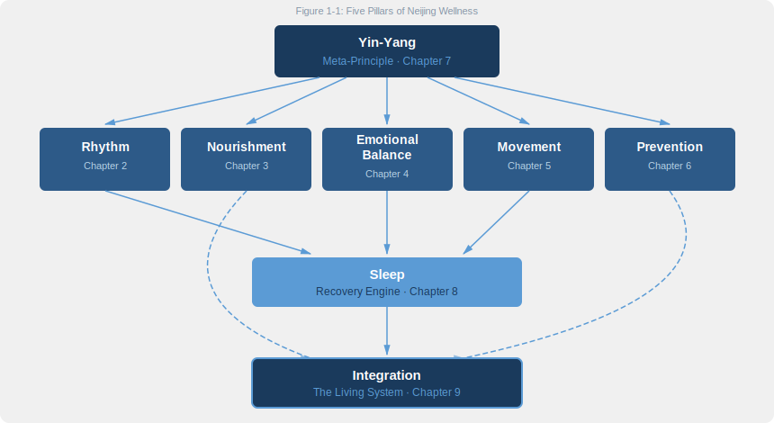

# Chapter 1: The Oldest Conversation About Health

> *I have heard that in ancient times, people all lived to be a hundred years old without their movements becoming feeble. But nowadays, people are already declining at fifty. Is this because times have changed, or because people have lost the Way?*
>
> — *Huangdi Neijing, Su Wen, Chapter 1: "The Treatise on the Heavenly Truth of Antiquity"*

## 1.1 A Question Unearthed

In the winter of 1973, archaeologists opened Tomb No. 3 at Mawangdui, near Changsha, Hunan Province. Inside, wrapped in silk that had survived over 2,100 years underground, they found a cache of medical manuscripts: *Moxibustion Canon of the Eleven Foot-Arm Meridians*, *Moxibustion Canon of the Eleven Yin-Yang Meridians*, *Recipes for Fifty-Two Ailments*, and others. The burial predated 168 BC, overlapping with the earliest compilation period of the *Huangdi Neijing*.

These Mawangdui texts are not the *Neijing* itself. But they confirmed something important: by the early Western Han dynasty, China already possessed a well-developed, systematic body of health knowledge covering meridians, pathology, dietary therapy, and life cultivation. The *Huangdi Neijing* represents the grand synthesis of that tradition.

In 762 AD, the Tang dynasty physician Wang Bing spent twelve years editing and annotating the *Su Wen*, reassembling scattered chapters and adding seven treatises on the "five movements and six qi." The *Su Wen* we read today is essentially Wang Bing's recension. That a text's core ideas could travel from the Warring States through the height of the Tang dynasty and onward to the present — surviving twenty-five centuries without being discarded — tells us it touched something fundamental about how human bodies work.

That fundamental insight is compressed into the book's very first question.

The Yellow Emperor asks his physician Qi Bo: "I have heard that in ancient times, people lived to a hundred and their bodies stayed strong. But the people of today are already deteriorating at fifty. Is this because the world has changed — or because we have lost the Way?"

In 2024, *The Lancet* published a study spanning over 200 countries and territories: over one billion people worldwide are now obese. Type 2 diabetes cases have quadrupled in three decades. The WHO reports that 17 million people die before age 70 each year from chronic non-communicable diseases (NCDs), and the majority of these deaths are classified as "preventable."

The Emperor's puzzlement is our crisis, restated in epidemiological terms. And Qi Bo's answer — a complete system covering rhythm, diet, emotion, movement, and prevention — remains largely unheeded.

## 1.2 What Is the Huangdi Neijing?

One misconception needs clearing up front: the *Huangdi Neijing* was not written by an emperor.

Like the *Analerta* attributed to Confucius (who did not write them himself), the *Huangdi Neijing* (黄帝内经, "The Yellow Emperor's Classic of Internal Medicine") was compiled collectively by multiple generations of physicians between roughly 300 BC and 100 BC, spanning the Warring States period into the early Han dynasty. "Yellow Emperor" is a literary pseudonym, borrowing the authority of a legendary sage-ruler to legitimize the text. The practice was common across the ancient world: the Greeks attributed wisdom to the Oracle of Apollo; the Egyptians credited medical arts to the god Thoth.

The entire text unfolds as a dialogue. The Emperor asks questions; his physician Qi Bo answers. This question-and-answer format predates Socrates' dialogues in the Athenian agora by at least a century, making it one of the oldest Socratic-style teaching methods on record. That the most powerful ruler in the realm sits humbly before his doctor, asking questions, carries its own message: health outranks power.

From a textual-criticism standpoint, the *Neijing* is a "living document" — revised, annotated, and supplemented across centuries. Unlike certain Western medical classics produced by a single author in a short period, it records not one individual's theory but an entire civilization's evolving collective understanding of the human body.

The text comprises two parts:

- **Su Wen** (素问, *Basic Questions*): 81 chapters on human physiology, pathology, prevention, yin-yang and five-phase theory, seasonal health, and the relationship between emotions and organ systems. The "why" of health.
- **Ling Shu** (灵枢, *Spiritual Pivot*): 81 chapters on the meridian system, acupuncture points, needling techniques, and therapeutic methods. The "how."

Together: 162 chapters. Roughly 200,000 characters. One of the most comprehensive pre-modern investigations of human health ever assembled.

The *Neijing* discusses topics with notable specificity:

- Why does spring induce drowsiness? (Liver qi's expansive surge in the wood phase.)
- How does rage damage the liver? (The emotion-organ mapping system.)
- Why does winter demand more sleep? (Yang energy enters storage mode.)
- How does excessive worry impair digestion? (The spleen governs thought.)

These read less like mysticism and more like a field manual compiled by centuries of meticulous observers who lacked microscopes but not patience.

One editorial choice deserves attention. The *Neijing* devotes very little space to traumatic injuries or acute epidemics — the deadliest health threats of its era. Instead, it pours the vast majority of its content into chronic health management and lifestyle-related decline. In its own time, this priority seemed odd. Today, it looks almost prophetic: in developed nations, chronic non-communicable diseases (cardiovascular disease, diabetes, cancer, mental health disorders) have overtaken infectious disease as the leading cause of death. The *Neijing* appears to have leapfrogged the age of acute illness, writing an operating manual for the "chronic disease era" twenty-five centuries early.

Why? If the compilers collectively chose to sideline trauma and plague — the most urgent problems of their day — the most plausible explanation is that they were operating on a longer time horizon. They were not asking "how does this person survive today?" but "how does a person live well across an entire life?"

## 1.3 Why This Book Matters Right Now

In 2017, Jeffrey Hall, Michael Rosbash, and Michael Young received the Nobel Prize in Physiology or Medicine for discovering the molecular mechanisms governing circadian rhythms.

Using fruit fly experiments, they proved that every cell in the human body runs on an internal clock. This clock governs hormone secretion rhythms, body temperature fluctuations, and immune cell activity cycles. Chronically disrupting it — through shift work, jet lag, or late-night exposure to artificial light — triggers metabolic disorder, immune suppression, and elevated cancer risk. The WHO has classified "circadian disruption caused by shift work" as a Group 2A probable carcinogen.

Open the *Su Wen*, Chapter 2 ("Treatise on the Regulation of the Spirit by the Four Seasons"), written over two millennia before the Nobel committee convened:

- Spring: "Go to bed late and rise early; walk briskly in the courtyard" (春三月…夜卧早起，广步于庭)
- Summer: "Go to bed late and rise early; do not resent the long days" (夏三月…夜卧早起，无厌于日)
- Autumn: "Go to bed early and rise early; rise with the rooster" (秋三月…早卧早起，与鸡俱兴)
- Winter: "Go to bed early and rise late; wait for the sunlight" (冬三月…早卧晚起，必待日光)

This is not poetic metaphor. It is a precise, seasonally adjusted circadian lifestyle protocol.

Circadian biology is only one convergence point. Modern science keeps meeting *Neijing* concepts on multiple fronts:

- **The gut-brain axis** (Mayer et al., 2014) confirms the ancient observation that "the spleen governs thought." Gut microbiota demonstrably influence mood, cognition, and depression risk through the vagus nerve pathway. What a person eats genuinely shapes how they think and feel.
- **Psychoneuroimmunology** validates the *Neijing*'s emotion-organ map — "anger damages the liver, joy overexcites the heart, grief injures the lungs, fear depletes the kidneys." Chronic anger measurably elevates cortisol and impairs liver metabolism. But chronically suppressing emotions causes equal damage. The *Neijing*'s keyword is "regulate" (调), not "suppress."
- **Time-restricted eating research** (Patterson & Sears, 2017) echoes "eat and drink with moderation" (食饮有节, *shí yǐn yǒu jié*). The timing of food intake may matter as much as calorie counts. Yet extreme fasting also injures the spleen-stomach system — the character 节 ("moderation") cuts both ways: not too much, and not too little.
- **Forest bathing studies** (Li, 2010) align with "model yourself on yin-yang" (法于阴阳). Two hours of natural environment exposure significantly boosts NK (natural killer) cell activity and reduces cortisol levels.

The cultural moment amplifies the scientific one. The WHO published its *Global Traditional Medicine Strategy 2025–2034*, formally integrating traditional medicine into global health governance for the first time. On social media, "Chinamaxxing" became a viral phenomenon in late 2025, with TCM-related searches doubling in the US and UK within six months. Acupuncture wait times in New York and London stretched to weeks.

A common thread runs through these developments. When modern life traps people in chronic stress, ultra-processed food, sedentary work, and late-night screen exposure, Western medicine's strengths in acute intervention — surgery, antibiotics, immunotherapy — offer limited help. Insomnia, anxiety, metabolic syndrome, chronic fatigue: these slow-burn crises of quality erode life from the inside, and they demand a fundamentally different framework.

People are searching for a holistic, prevention-first philosophy of health. The *Huangdi Neijing* offers exactly that: a 2,500-year-old framework that cutting-edge science keeps independently rediscovering.

## 1.4 What This Book Is Not

Before we proceed, four boundaries.

**This is not a translation of the Neijing.** Excellent scholarly translations already exist: Ilza Veith's pioneering 1949 edition (revised 2002), Paul Unschuld's monumental two-volume annotated translation (2011), Maoshing Ni's accessible reader (1995). This book is a *lifestyle wisdom extraction* — it distills the *Neijing*'s core principles into a practical, evidence-backed guide for modern living.

**This is not medical advice.** If you are under treatment, follow your physician's guidance. This book addresses lifestyle philosophy and prevention, not clinical prescription.

**This is not mysticism.** You will not encounter unsubstantiated metaphysical claims. Every ancient principle is paired, wherever possible, with modern scientific evidence — or an honest acknowledgment that evidence is still emerging.

**This is not exoticism.** We afford the *Neijing* the same intellectual seriousness given to Hippocrates, Galen, or Maimonides. It belongs to humanity's medical heritage — not to a cabinet of exotic curiosities.

So what *is* this book? In one sentence: **a modern-science-informed reinterpretation of the wellness wisdom in a 2,500-year-old physician-emperor dialogue, translated into a lifestyle guide you can begin practicing today.**

## 1.5 The Core Framework: Five Pillars of Neijing Wellness

Qi Bo's answer to the Emperor distills into five interconnected principles. I call them the **Five Pillars of Neijing Wellness** — the structural spine of this book.

Each pillar maps to a core chapter:

1. **Rhythm (顺时, shùn shí)**: Living in harmony with the cycles of day, season, and life stage. The *Su Wen* opens: "法于阴阳，和于术数" (*fǎ yú yīn yáng, hé yú shù shù*) — "Model yourself on yin-yang; harmonize with the patterns of nature." Not a philosophical slogan but a precise lifestyle calendar. What happens when you violate it? Shift workers face roughly 40% higher rates of metabolic syndrome than day workers — the price of fighting your own clock. → Chapter 2

2. **Nourishment (食养, shí yǎng)**: Food as the primary medicine. Not just *what* you eat, but *when*, *how much*, and *in what rhythm*. Excess damages the spleen-stomach; deficiency depletes qi and blood; imbalance skews nutrition. The four-character phrase "eat and drink with moderation" (饮食有节) packs more layers than it appears. → Chapter 3

3. **Emotional Balance (调情志, tiáo qíng zhì)**: Managing the inner landscape. The *Neijing* maps five core emotions — anger, joy, worry, grief, fear — to specific organ systems. Not moral philosophy but psychosomatic medicine, twenty-five centuries early. Counterexample: chronically suppressed anger still leads to liver qi stagnation. The keyword is "regulate" — keep emotions flowing, not bottled. → Chapter 4

4. **Movement (动形, dòng xíng)**: The body in motion. Not extreme athletics but consistent, gentle practice. "When the body does not move, essence stagnates; when essence stagnates, qi becomes blocked." The *Neijing* champions *daoyin anqiao* (导引按跷) — soft, sustained body exercises. Overtraining carries its own risks; cardiac fibrosis in marathon runners is a modern cautionary example. → Chapter 5

5. **Prevention (治未病, zhì wèi bìng)**: "上工治未病" (*shàng gōng zhì wèi bìng*) — "The superior physician prevents disease before it arises." The *Neijing*'s most radical proposition, and the one most deeply aligned with 21st-century integrative medicine. When prevention fails and minor conditions escalate, treatment costs and suffering multiply. → Chapter 6

Yin-Yang (Chapter 7) is the meta-principle unifying all five pillars — not a mystical abstraction but a systematic description of complementary opposites throughout nature.

Sleep (Chapter 8) is the body's recovery engine, deeply linked to rhythm, emotion, and movement.

The chapters that follow unfold each of these dimensions, translating twenty-five centuries of wisdom into practices you can begin today.

## 1.6 How Qi Bo Would Diagnose Modern Life

A thought experiment. Qi Bo materializes in 2026 and shadows a typical urban professional for a full day.

**6:00 AM** — An alarm clock wrenches the person from deep sleep. Outside, the winter sky is pitch dark.

Qi Bo frowns: "In winter, one must 'go to bed early and rise late, waiting for the sunlight.' You force the body awake before yang energy has risen. This depletes root vitality — like pulling a seedling from frozen soil."

**7:30 AM** — No breakfast. An iced coffee on the commute.

Qi Bo winces: "Cold liquid on an empty stomach wounds the spleen-yang, like pouring ice water on a fire just as it catches. The spleen governs transformation and transport. Damage it, and by noon your energy collapses. By three o'clock, you reach for sugar. You think you lack caffeine. In truth, you extinguished your own digestive fire."

**9 AM – 6 PM** — Nine hours of continuous sitting. Eyes fixed on a glowing screen. Lunch is delivery food, eaten in five minutes at the desk.

Qi Bo sighs: "Prolonged sitting damages the flesh. Prolonged gazing damages the blood. When the body does not move, essence stagnates and a hundred diseases arise. The ancients walked briskly in their courtyards. You are confined to a luminous box, your sinews atrophying by the hour."

**8:00 PM** — Dinner while scrolling social media. Emotions swing between work anxiety and cheap dopamine hits from short videos.

Qi Bo: "Joy scatters the qi. Anger drives it upward. Fear sends it downward. Worry knots it. Within a single hour, you cycle through multiple emotional extremes. The organs cannot stabilize. The spirit-mind will be restless tonight."

**11:30 PM** — In bed, still scrolling. Blue light floods the retinas.

Qi Bo is alarmed: "The *zi* hour — 11 PM to 1 AM — is when yang energy is reborn and the gallbladder meridian takes charge. You must be deeply asleep by now to nourish liver-blood. Instead, you assault the eyes with artificial brilliance and agitate the spirit. Persist, and vision dims, heart-blood withers, the liver-soul loses its anchor. This is 'taking recklessness as normal' — the path to self-destruction."

No blood panels. No MRI. No wearable data. Just observation of one day's habits.

Yet Qi Bo would accurately predict this person's chief complaints: chronic fatigue, digestive trouble, cervical and lumbar degeneration, insomnia, anxiety, inability to focus.

His prescription would be unglamorous: go to bed on time, eat real food, stand up and walk, manage emotional swings, act on warning signals before they become crises.

Translate Qi Bo's "diagnosis" into modern medical language and it aligns almost perfectly with the WHO's list of leading modifiable risk factors for preventable chronic disease: physical inactivity, unhealthy diet, insufficient sleep, chronic psychosocial stress. Qi Bo knew nothing of cortisol, insulin resistance, or sympathetic nervous system overdrive. Through millennia of population-level observation, he reached the same conclusions.

This is not coincidence. It is independent problem-solving across different eras and methodologies, converging on the same answer. That cross-temporal consensus is the fundamental reason the *Neijing* deserves serious attention today — not as cultural heritage alone, but as a practical source of health intelligence.

## 1.7 Reflection Moment: Your Five-Pillar Self-Assessment

Before we begin this journey, take two honest minutes with yourself.

Rate each pillar from 1 to 5 (1 = poor, 5 = excellent):

| Pillar | Self-Assessment Question | Your Score |
|--------|------------------------|------------|
| Rhythm | Do I live in sync with natural light-dark cycles? Do I wind down after sunset? | ___/5 |
| Nourishment | Do I eat regular, whole-food meals at consistent times? | ___/5 |
| Emotional Balance | Am I aware of my emotional patterns and able to regulate them? | ___/5 |
| Movement | Do I move my body for at least 30 minutes daily? | ___/5 |
| Prevention | Do I invest in prevention (regular check-ups, early signals) rather than waiting until crisis? | ___/5 |

If your total is below 15, do not despair. Most modern people score low. This is not personal failure but a systemic drift in how our species now lives.

If you scored above 20, you may already be practicing *Neijing* wisdom intuitively. This book will help you turn instinct into knowledge and scattered habits into a coherent system.

Either way, the next eight chapters provide a framework that is ancient in origin, modern in evidence, and actionable starting tomorrow morning.

Remember your scores. At the end of this book, I will ask you to rate yourself again. The change itself will be the best answer sheet.

### Today's Actions

- ⚡ Complete the Five-Pillar self-assessment above. Write the scores on paper (not a phone app — the act of writing is itself an awareness practice).
- ⚡ Answer the Emperor's question in one sentence: "Is your declining health because of the times, or because of your own choices?" Be honest.
- 🔄 For the next 7 days, observe one daily habit — when you wake, eat, exercise, or sleep — without changing anything. Just observe and record.

### Evidence Check

| Neijing Principle | Evidence Level | Notes |
|-------------------|---------------|-------|
| The ancients lived to 100 (longer-lived than moderns) | ✗ Disproven | Archaeological and demographic evidence shows ancient average lifespan was far below modern levels; however, the concept of "healthspan" merits discussion |
| 法于阴阳 — Model on yin-yang (align with natural cycles) | ✓ Confirmed | Circadian biology, seasonal physiology, and exercise/recovery balance are well-supported |
| 食饮有节 — Eat and drink with moderation | ✓ Confirmed | Caloric restriction, intermittent fasting, and time-restricted eating research extensively supports dietary moderation |
| 不妄作劳 — Do not recklessly exhaust yourself | ✓ Confirmed | Overwork → burnout, immune suppression, cardiovascular risk; confirmed by extensive occupational health research |
| 形与神俱 — Body and spirit as one | ✓ Confirmed | Psychoneuroimmunology confirms bidirectional mind-body connection; meta-analyses support health benefits of mindfulness and meditation |

## 1.8 The Emperor's Question Remains Open

Back to where we started.

The Yellow Emperor asked: "Have the times changed, or have people lost the Way?"

Qi Bo's answer was clear and unsparing: people lost it themselves.

> *Those who knew the Way in ancient times modeled themselves on yin-yang, harmonized with the arts of calculation, ate and drank with moderation, maintained regular routines, and did not recklessly exhaust themselves. Therefore, body and spirit remained whole together, and they lived out their natural span — departing only after a hundred years.*
>
> — *Su Wen, Chapter 1*

Thirty-six characters in the original Chinese. The entire wellness philosophy of the *Huangdi Neijing* compressed into a single paragraph. Every phrase maps to a dimension of wellness:

- "Modeled on yin-yang" → Rhythm (Chapter 2)
- "Ate and drank with moderation" → Nourishment (Chapter 3)
- "Maintained regular routines" → Rhythm and Sleep (Chapters 2, 8)
- "Did not recklessly exhaust themselves" → Movement and Emotional Balance (Chapters 4, 5)
- "Body and spirit remained whole together" → body-spirit unity, woven throughout the book

This passage is both manifesto and diagnosis — and the departure point for every chapter ahead.

In the pages that follow, we will unpack each keyword — yin-yang, natural patterns, dietary moderation, regular living, avoiding reckless exhaustion — and trace how each maps onto cutting-edge science and translates into habits you can begin practicing tomorrow.

Next chapter, we start with the first pillar: **Rhythm**.

Why is the clock inside your body more important than the alarm clock on your nightstand? Why does *when* you sleep matter more than *how long* you sleep? Why did three Nobel laureates in 2017 confirm something that Qi Bo described in 300 BC?

Turn the page. Qi Bo is waiting.

---

## References

1. **Huangdi Neijing, Su Wen** (c. 300–100 BC). Chapter 1 ("Treatise on the Heavenly Truth of Antiquity") and Chapter 2 ("Treatise on the Regulation of the Spirit by the Four Seasons"). Wang Bing annotated edition (762 AD) — The base text for all *Neijing* quotations in this book.

2. **Hall, J. C., Rosbash, M., Young, M. W.** (2017). "Molecular Mechanisms Controlling Circadian Rhythm." *Nobel Prize in Physiology or Medicine*. Nobel Prize Committee, Stockholm — Discovery of circadian rhythm molecular mechanisms, validating the chronobiology dimension of "model on yin-yang."

3. **Unschuld, P. U.** (2011). *Huang Di Nei Jing Su Wen: An Annotated Translation of Huang Di's Inner Classic — Basic Questions* (2 vols). University of California Press. ISBN: 978-0520266988 — The most authoritative English annotated edition of the *Su Wen*.

4. **Mayer, E. A., Knight, R., Mazmanian, S. K., Cryan, J. F., Tillisch, K.** (2014). "Gut Microbes and the Brain: Paradigm Shift in Neuroscience." *Journal of Neuroscience*, 34(46), 15490–15496. DOI: 10.1523/JNEUROSCI.3299-14.2014 — Confirmed gut microbiota influence brain function via the vagus nerve, echoing "the spleen governs thought."

5. **World Health Organization.** (2025). *WHO Traditional Medicine Global Strategy 2025–2034*. Geneva: WHO — First systematic integration of traditional medicine into global public health governance.

6. **Li, Q.** (2010). "Effect of Forest Bathing Trips on Human Immune Function." *Environmental Health and Preventive Medicine*, 15(1), 9–17. DOI: 10.1007/s12199-008-0068-3 — Experimental evidence that forest bathing boosts NK cell activity, supporting the nature-exposure dimension of "model on yin-yang."

7. **Patterson, R. E., Sears, D. D.** (2017). "Metabolic Effects of Intermittent Fasting." *Annual Review of Nutrition*, 37, 371–393. DOI: 10.1146/annurev-nutr-071816-064634 — Metabolic health effects of intermittent fasting, echoing "eat and drink with moderation."

8. **Veith, I.** (2002). *The Yellow Emperor's Classic of Internal Medicine* (new edition). University of California Press. ISBN: 978-0520229365 — The earliest English translation of the *Neijing*, first published 1949.

9. **Ni, M.** (1995). *The Yellow Emperor's Classic of Medicine: A New Translation of the Neijing Suwen with Commentary*. Shambhala Publications. ISBN: 978-1570620805 — Accessible English translation of the *Su Wen* for general readers.

10. **Mawangdui Han Tomb Silk Manuscripts Editorial Group.** (1985). *Mawangdui Han Tomb Silk Manuscripts (Volume IV)*. Wenwu Press — Medical manuscripts excavated in 1973, including the *Moxibustion Canon of the Eleven Foot-Arm Meridians* and other early medical texts.

11. **NCD Risk Factor Collaboration (NCD-RisC).** (2024). "Worldwide Trends in Underweight and Obesity from 1990 to 2022." *The Lancet*, 403(10431), 1027–1050. DOI: 10.1016/S0140-6736(23)02750-2 — Global obesity trends study covering 200+ countries and territories.
