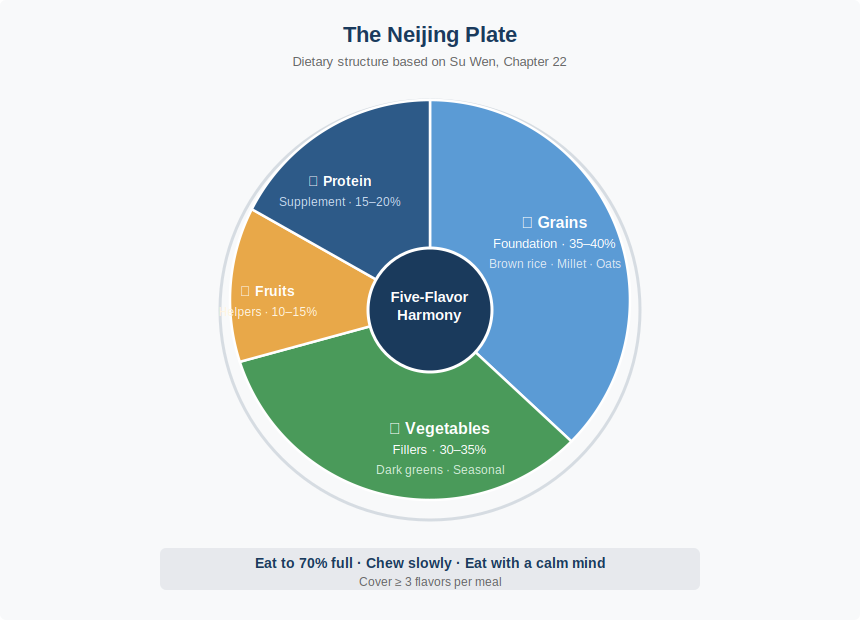

# Chapter 3 · You Are What You Eat

> 五谷为养，五果为助，五畜为益，五菜为充，气味合而服之，以补精益气。
> *Wǔ gǔ wéi yǎng, wǔ guǒ wéi zhù, wǔ chù wéi yì, wǔ cài wéi chōng, qì wèi hé ér fú zhī, yǐ bǔ jīng yì qì.*
>
> "Five grains nourish, five fruits assist, five meats benefit, five vegetables supplement. Combine their qi and flavors to replenish essence and boost vitality."
>
> — *Su Wen*, Chapter 22 (藏气法时论)

## 3.1 A Nutritional Framework in One Sentence

In April 2019, *The Lancet* published a dietary risk study spanning 195 countries. The headline finding stunned the nutrition world: roughly 11 million people die each year from poor diet, more than from smoking. The deadliest risk factor was not sugar. It was not fat. It was **structural imbalance**: too little whole grain, too much sodium, not enough fruit.

That same year, diet wars raged across social media. Keto devotees called carbohydrates poison. Vegans declared meat an ecological catastrophe. Intermittent fasting advocates said what matters is not the food but the clock. Each camp wielded peer-reviewed papers. Each had celebrity converts. Each was certain everyone else had it wrong. Ordinary people sat in restaurants staring at menus, unsure whom to believe.

Twenty-five centuries ago, Qi Bo answered the Yellow Emperor with a single sentence: grains as the foundation, fruits as helpers, meats as supplements, vegetables as fillers.

Four food categories, each with a defined role. None demonized, none deified. The core logic is **balance, not elimination**.

Michael Pollan spent an entire book — *In Defense of Food* — arriving at seven words: "Eat food. Not too much. Mostly plants." Qi Bo said essentially the same thing in one sentence, and with greater precision. He did not exclude meat; he assigned it a supporting role.

---

## 3.2 The Five Flavors: The World's First Functional Nutrition System

"Five grains nourish" answers *what* to eat. The Five Flavors — 五味 (wǔ wèi) — answer a different question: where does the food go once you swallow it?

The *Su Wen* is direct: sour enters the Liver, bitter enters the Heart, sweet enters the Spleen, pungent enters the Lung, salty enters the Kidney. Each flavor is not merely a taste on the tongue. It is a pathway to a specific organ system.

| Flavor | Organ | Effect | Modern Parallel | Examples |
|--------|-------|--------|----------------|----------|
| 酸 Sour | Liver | Astringent, gathering | Polyphenols, antioxidants | Vinegar, citrus, plums, hawthorn |
| 苦 Bitter | Heart | Draining, drying | Alkaloids, anti-inflammatory compounds | Green tea, bitter melon, lotus seed core, dark chocolate |
| 甘 Sweet | Spleen | Tonifying, harmonizing | Complex carbs, polysaccharides | Jujube dates, honey, sweet potato, rice |
| 辛 Pungent | Lung | Dispersing, circulating | Volatile oils, capsaicin | Ginger, garlic, scallion, Sichuan pepper |
| 咸 Salty | Kidney | Softening, descending | Minerals, electrolytes | Kelp, miso, soy sauce, dried shrimp |

The point is never to isolate a single flavor. It is to **harmonize all five**. The Neijing warns repeatedly: excess of any one flavor damages its corresponding organ. Too much sweet injures the Spleen. Too much salt harms the Kidney. Too much sour damages the sinews.

That 2019 *Lancet* study confirmed the same principle from the opposite direction. The world's greatest dietary danger is not the absolute excess of any single nutrient. It is structural imbalance. The logic is isomorphic with Five Flavor dysregulation.

---

## 3.3 The Thermal Nature of Food: Beyond Hot and Cold

In Chinese food culture, you hear people say "crab is cold-natured" or "lamb is hot-natured." They are not describing the serving temperature. They are invoking a core Neijing concept: the **Four Natures** (四气, sì qì) — Cold, Hot, Warm, Cool — plus a neutral middle ground.

**Cold and Cool foods** (clear heat, reduce inflammation): watermelon, mung bean, bitter melon, cucumber, green tea, pear. Best for people with heat signs — inflammation, dry mouth, constipation.

**Warm and Hot foods** (warm the body, boost circulation): ginger, cinnamon, lamb, chives, longan, chili pepper. Best for people with cold signs — cold extremities, sluggish digestion, sensitivity to cold.

**Neutral foods** (balanced, suitable for most): rice, potato, pork, yam, carrot. Safe year-round for most constitutions.

How does this work in practice? It is winter. Your hands are ice-cold, your face pale, your appetite gone. A Neijing practitioner diagnoses "yang deficiency" and adjusts your diet before reaching for any medicine: ginger-jujube porridge for breakfast, lamb stew for lunch, a cinnamon-infused drink at night. You are systematically introducing warm-natured foods to rebalance the body.

Conversely: acne, dry mouth, constipation — signs of "internal heat." The prescription shifts to mung bean soup, cucumber salad, and chrysanthemum tea, while cutting back on fried and spicy foods.

Does this sound like superstition? Translate it into biochemistry.

"Cold" foods tend to be rich in **anti-inflammatory compounds**. Green tea's EGCG, watermelon's citrulline, cucumber's cucurbitacins — they share a common signature: downregulating inflammatory pathways like NF-κB and COX-2. "Hot" foods contain **thermogenic and circulation-promoting compounds**: capsaicin activates TRPV1 receptors to generate heat, cinnamaldehyde improves peripheral blood flow, gingerols stimulate gastric motility.

The Neijing did not invent molecular biology. But through millennia of clinical observation, it built a food classification system that overlaps remarkably with the modern anti-inflammatory diet. Harvard's School of Public Health places dark vegetables, berries, green tea, and turmeric at the top of its anti-inflammatory food pyramid. Red meat and refined sugar sit at the bottom. In essence, this is a contemporary remix of the Five Flavors and Four Natures.

---

## 3.4 Food as First Medicine: 药食同源

The Neijing's therapeutic hierarchy is clear: adjust diet first, then use herbs, then resort to acupuncture. The principle of 药食同源 (yào shí tóng yuán) — "medicine and food share the same origin" — is the cornerstone of Chinese food therapy.

This is not folk wisdom. Multiple food-as-medicine ingredients have withstood modern evidence-based scrutiny.

**Ginger (生姜, shēng jiāng):** Six systematic reviews confirm its anti-nausea effects, particularly for pregnancy-related and postoperative nausea. The mechanism: gingerols antagonize the 5-HT3 receptor.

**Turmeric (姜黄, jiāng huáng):** Its active compound curcumin has over 120 randomized controlled trials supporting its anti-inflammatory effects. The main bottleneck is poor bioavailability. The traditional pairing with black pepper solves precisely this problem: piperine boosts curcumin absorption by 2,000%. Ancient cooks did not know what piperine was, but they knew turmeric needed pepper.

**Goji berries (枸杞, gǒu qǐ):** Rich in Lycium barbarum polysaccharides (LBP) and zeaxanthin. Animal studies and small human trials suggest benefits for retinal protection and immune modulation, but large-scale RCTs remain insufficient.

**Jujube dates (大枣, dà zǎo):** Traditionally used to calm the mind and tonify qi. A 2020 meta-analysis in *Nutrients* found moderate improvements in anxiety and sleep quality from jujube extracts, likely related to their cyclic adenosine monophosphate (cAMP) and saponin content.

**Green tea (绿茶, lǜ chá):** EGCG (epigallocatechin gallate) is one of the most studied natural antioxidants. Large-cohort studies associate daily green tea consumption with a 20–28% reduction in cardiovascular event risk.

Note the evidence gradient: ginger and green tea rest on strong evidence; goji berries need more validation. The Neijing's "food as medicine" framework is sound, but each ingredient must be verified individually. That is precisely the value of evidence-based medicine.

"Food as first medicine" is not uniquely Chinese. Hippocrates declared: "Let food be thy medicine." India's Ayurvedic tradition classifies foods into three gunas (sattva, rajas, tamas) and treats dietary adjustment as the first line of therapy. Three ancient medical traditions on three continents arrived at the same conclusion independently. That is not coincidence — it is a shared human recognition of something fundamental about health.

---

## 3.5 The Gut-Brain Axis: An Ancient Intuition

The Neijing makes a bold claim: the Spleen-Stomach (脾胃, pí wèi) is the "granary official," the source from which all qi and blood are transformed. Everything you eat must pass through this central processing station before the body can use it.

Twenty-five centuries later, gut microbiome research has given this claim a striking new commentary.

Your gut houses roughly 38 trillion microorganisms, comparable to the total number of human cells in your body. They are not parasites; they are collaborators. They break down fiber, synthesize vitamins K and B12, train immune cells, and produce neurotransmitters. About 70% of your immune cells reside in the gut. Approximately 95% of your serotonin is manufactured there.

The vagus nerve acts as a superhighway, transmitting gut signals directly to the brain. Anxiety gives you a stomachache. IBS patients have triple the rate of depression. The gut-brain conversation is far more intense than most people realize.

The Neijing lacked the word "microbiome," but it placed the Spleen-Stomach at the center of health. The *Su Wen* (Chapter 43) warns: "When eating doubles beyond measure, the gut is the first to suffer." Modern research supports this fully: chronic overeating increases intestinal permeability ("leaky gut"), triggering systemic low-grade inflammation — the shared upstream pathway of metabolic syndrome, type 2 diabetes, and cardiovascular disease.

The Neijing's core dietary advice is to eat fermented foods (soy paste, vinegar, fermented bean curd), whole grains, and seasonal vegetables. This aligns with what modern microbiome science recommends. A 2021 Stanford study in *Cell* found that a high-fermented-food diet (six or more servings daily) significantly increased gut microbial diversity and reduced levels of 19 inflammatory proteins. The fermented staples of traditional Chinese cuisine — soy sauce, vinegar, pickled vegetables, fermented tofu — may have been an unintentional masterclass in microbiome maintenance.

---

## 3.6 Daily Practice: The Neijing Plate

Enough theory. Here is an action guide you can start using tomorrow morning.

**Seasonal Eating Guide**

- **Spring (Liver-Wood dominant):** Add sweet, reduce sour. Favor yam, dates, and spinach. Support the Liver's upward energy without letting it become excessive.
- **Summer (Heart-Fire dominant):** Add sour, reduce bitter. Sour flavors contain the Heart's expansive qi. Cool with mung bean soup, watermelon, and cucumber.
- **Autumn (Lung-Metal dry):** Add sour, reduce pungent. Focus on moistening: pear, white fungus, honey, lily bulb. Go easy on spices to avoid worsening autumn dryness.
- **Winter (Kidney-Water storing):** Add bitter, reduce salty. Moderate bitter flavors consolidate yin. Nourish the Kidney with black sesame, black beans, and walnuts.

**Three Principles You Can Use Immediately**

First, **eat a warm breakfast**. The Neijing holds that yang qi is rising at dawn — the Spleen-Stomach needs warmth to activate. A bowl of hot congee serves this purpose better than cold cereal with ice milk. The modern explanation: warm foods reduce gastrointestinal smooth muscle spasm and enhance digestive enzyme activity.

Second, **stop at seventy percent full**. The Neijing warned: overeating injures the gut above all else. A 2023 primate caloric restriction study in *Science* found that moderate caloric restriction extends lifespan and reduces inflammatory markers. You do not need to count calories — seventy percent full is your built-in gauge.

Third, **eat in stillness**. The Neijing emphasized a calm state of mind during meals. Modern research calls this "mindful eating": no phone, no stressful conversations, thorough chewing. A 2019 RCT in the *American Journal of Clinical Nutrition* found that the mindful eating group achieved 1.8 times the BMI reduction of the control group.

---

## 3.7 Reflection Moment: Your Five-Flavor Audit

Grab a piece of paper or open a note on your phone. Recall everything you ate over the past three days. Tag each food with its dominant flavor.

Then ask yourself three questions:

1. **Which flavor dominates?** For most modern eaters, the answer is "sweet." Refined sugar, processed carbs, and ultra-processed foods have made sweetness omnipresent.
2. **Which flavor is nearly absent?** Usually "bitter" and "sour." Bitter greens (kale, radicchio, arugula) and fermented sour foods (vinegar, kimchi, yogurt) are the blind spots in most diets.
3. **Does your diet shift with the seasons?** Or do you eat the same takeout rotation in January and July?

This is not a test. It is an act of awareness.

If "sweet" dominates, try adding a small vinegar-dressed salad and a cup of unsweetened tea to your next meal. If pungent flavors are consistently absent, drop a few slices of ginger into your soup. Change does not have to be dramatic. Within a week, aim for two previously missing flavors to appear regularly on your plate.

Balancing the Five Flavors does not require a nutrition degree. It requires one question the next time you order a meal: are all five flavors accounted for?

---

## Today's Actions

Three things you can do the moment you finish this chapter:

⚡ At your next meal, consciously identify how many of the five flavors (sour, bitter, sweet, pungent, salty) are present — which one is missing?

⚡ Tomorrow, swap your cold breakfast for something warm — congee, soup, or hot oatmeal instead of cold milk or iced coffee.

🔄 This week, buy one "bitter" food you never eat (bitter melon, green tea, dark chocolate) and add it to your diet.

---

## 21-Day Micro-Experiment

**"The 70% Full Experiment"**: For 21 days, stop eating at every meal when you feel "I could eat a few more bites." No calorie counting — just body awareness. Rate your post-meal comfort (1–5) and afternoon energy (1–5) daily. Most people notice a clear shift around day 7.

---

## Evidence Check

How the Neijing principles discussed in this chapter stack up against modern science:

| Neijing Principle | Evidence Level | Explanation |
|-------------------|---------------|-------------|
| Five-Flavor Balance (sour, bitter, sweet, pungent, salty in harmony) | ✓ Confirmed | The *Lancet* GBD study confirms dietary diversity as a top predictor of health outcomes |
| Food as First Medicine (diet before drugs) | ✓ Confirmed | Pharmacological activity of ginger, turmeric, and other food-medicines supported by systematic reviews |
| Thermal Nature of Food (cold, cool, warm, hot) | ? Plausible hypothesis | "Cool" foods overlap significantly with anti-inflammatory foods, but the hot-cold classification lacks a unified biochemical definition |
| Spleen-Stomach as the Root of Health | ✓ Confirmed | Gut microbiome research confirms the digestive system as the central hub of immunity, mood, and metabolism |
| Overeating Injures the Gut (饮食自倍，肠胃乃伤) | ✓ Confirmed | Overeating drives metabolic syndrome, GERD, and systemic inflammation — extensive clinical evidence |
| Eating to 70% Full | ? Plausible hypothesis | Caloric restriction extends lifespan in animal models; long-term human RCTs remain incomplete |

---

## 3.8 Summary & Bridge to Chapter 4

Chapter 2 realigned your daily rhythm, syncing the body to the ancient clock of day and night. This chapter recalibrated your diet: Five-Flavor harmony in place of extreme food ideologies, food-as-first-medicine in place of blind supplementation, digestive health at the center instead of calorie worship.

The Neijing's dietary philosophy distills into a single character: 和 (hé) — **harmony**. Not prohibition. Not extremism. Not the tyranny of a single superfood, but the quiet coherence of diversity. A 2024 *Nature* review of global Blue Zone diets reached a similar conclusion: no single food is the key to longevity, but dietary diversity, caloric moderation, and a plant-forward structure are the common threads across every Blue Zone on Earth.

Yet the Neijing tells us that the most powerful force affecting health is neither sleep timing nor diet. It is emotion. In the next chapter, we enter the territory of 情志 (qíng zhì) — the emotional body. Anger injures the Liver. Joy scatters the Heart. Worry knots the Spleen. Grief dissolves the Lung. Fear drains the Kidney. Emotions are not mere psychology. They are physiological events written into your organs.

---

## References

1. ***Huangdi Neijing Su Wen***, Chapters 22 (藏气法时论), 23 (宣明五气篇), 43 (痹论) — Core source text for this chapter.
2. **GBD 2017 Diet Collaborators.** (2019). "Health effects of dietary risks in 195 countries, 1990–2017." *The Lancet*, 393(10184), 1958-1972. DOI: 10.1016/S0140-6736(19)30041-8 — The landmark 195-country dietary risk study; structural imbalance identified as the greatest risk.
3. **Daily, J.W. et al.** (2015). "Efficacy of ginger for alleviating the symptoms of primary dysmenorrhea." *Pain Medicine*, 16(12), 2243-2255. DOI: 10.1111/pme.12853 — Systematic review confirming ginger's anti-nausea efficacy.
4. **Hewlings, S.J. & Kalman, D.S.** (2017). "Curcumin: A review of its effects on human health." *Foods*, 6(10), 92. DOI: 10.3390/foods6100092 — Comprehensive review of curcumin's anti-inflammatory effects.
5. **Shoba, G. et al.** (1998). "Influence of piperine on the pharmacokinetics of curcumin." *Planta Medica*, 64(4), 353-356. DOI: 10.1055/s-2006-957450 — Classic study: piperine boosts curcumin absorption by 2,000%.
6. **Sender, R., Fuchs, S., & Milo, R.** (2016). "Revised estimates for the number of human and bacteria cells in the body." *Cell*, 164(3), 337-340. DOI: 10.1016/j.cell.2016.01.013 — Revised estimate of human microbiome cell counts.
7. **Pollan, Michael.** (2008). *In Defense of Food: An Eater's Manifesto*. Penguin. — The famous "Eat food. Not too much. Mostly plants." formulation.
8. **Mason, A.E. et al.** (2019). "Effects of a mindfulness-based intervention on mindful eating, sweets consumption, and fasting glucose levels." *American Journal of Clinical Nutrition*, 109(6), 1569-1578. DOI: 10.1093/ajcn/nqy325 — Mindful eating RCT.
9. **Wastyk, H.C. et al.** (2021). "Gut-microbiota-targeted diets modulate human immune status." *Cell*, 184(16), 4137-4153. DOI: 10.1016/j.cell.2021.06.019 — Stanford high-fermented-food diet study.
10. **Buettner, D. & Skemp, S.** (2016). "Blue Zones: Lessons from the world's longest lived." *American Journal of Lifestyle Medicine*, 10(5), 318-321. DOI: 10.1177/1559827616637066 — Blue Zone dietary patterns and longevity.
